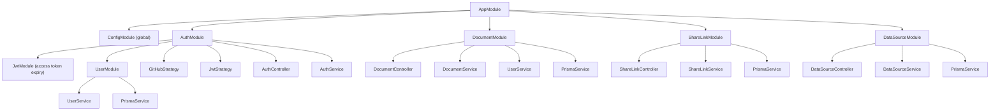
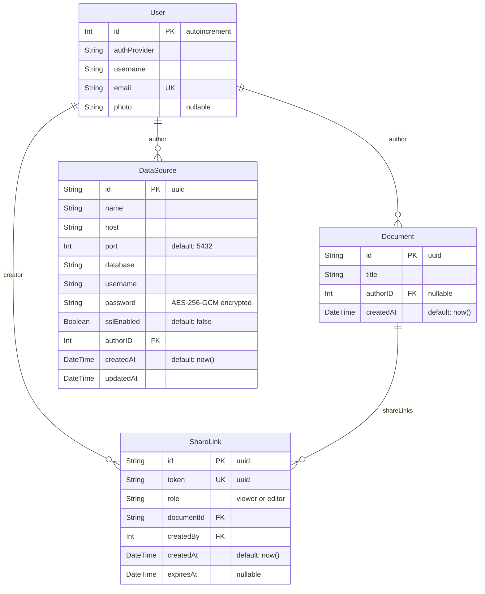

# Backend Package

## Summary

The backend is a NestJS 11 API server that provides authentication (GitHub
OAuth2 + JWT sessions) and document CRUD operations. It stores user and
document metadata in PostgreSQL via Prisma. The actual spreadsheet data lives
in Yorkie (managed by the frontend); the backend only manages document
ownership and user accounts.

### Goals

- Authenticate users via GitHub OAuth2 and issue JWT session cookies.
- Provide a REST API for creating, listing, and deleting spreadsheet documents.
- Enforce document ownership — users can only access their own documents.

### Non-Goals

- Storing or processing spreadsheet cell data — that is handled entirely by
  Yorkie and the `@wafflebase/sheet` engine in the browser.
- Real-time communication — Yorkie handles WebSocket-based sync.

## Proposal Details

### Module Architecture



| Module | Responsibility |
|--------|---------------|
| **AppModule** | Root module. Imports ConfigModule (global), AuthModule, DocumentModule, ShareLinkModule, DataSourceModule. |
| **AuthModule** | GitHub OAuth + JWT authentication. Provides AuthService, GitHubStrategy, JwtStrategy. Imports UserModule for user lookup/creation. |
| **UserModule** | User CRUD via Prisma. Exports UserService for use by AuthModule and DocumentModule. |
| **DocumentModule** | Document REST endpoints. Uses DocumentService + UserService + PrismaService. |
| **ShareLinkModule** | URL-based document sharing with token-based access. Manages share link CRUD and public token resolution for anonymous access. |
| **DataSourceModule** | External PostgreSQL connection management. CRUD for connection configs, test connection, execute SELECT queries. Passwords encrypted at rest with AES-256-GCM. |

### API Reference

#### Authentication (`/auth`)

**`GET /auth/github`**
- Guard: `AuthGuard('github')`
- Initiates GitHub OAuth flow. Redirects to GitHub's authorization page.

**`GET /auth/github/callback`**
- Guard: `AuthGuard('github')`
- GitHub redirects here after user consents. The `GitHubStrategy` validates the
  profile and returns user data. The controller then:
  1. Calls `UserService.findOrCreateUser()` to upsert the user in the database.
  2. Calls `AuthService.createTokens()` to sign access/refresh JWTs.
  3. Sets httpOnly cookies named `wafflebase_session` and
     `wafflebase_refresh`.
  4. Redirects to `FRONTEND_URL`.

**`GET /auth/me`**
- Guard: `JwtAuthGuard`
- Returns the authenticated user object from the JWT payload.

**`POST /auth/refresh`**
- Guard: none (refresh cookie required)
- Verifies `wafflebase_refresh` and rotates both auth cookies.
- Returns `401` when the refresh token is missing/invalid or user is gone.

**`POST /auth/logout`**
- Guard: none (public endpoint)
- Clears `wafflebase_session` and `wafflebase_refresh`.

#### Documents (`/documents`)

All endpoints require `JwtAuthGuard`.

**`GET /documents`**
- Returns all documents where `authorID` matches the authenticated user.

**`GET /documents/:id`**
- Returns the document if the authenticated user is the author.
- Throws `ForbiddenException` if the user is not the owner.

**`POST /documents`**
- Body: `{ title: string }`
- Creates a document with `authorID` set to the authenticated user's ID.

**`DELETE /documents/:id`**
- Deletes the document if the authenticated user is the author.
- Throws `ForbiddenException` if the user is not the owner.

#### Share Links (`/documents/:id/share-links`, `/share-links`)

**`POST /documents/:id/share-links`**
- Guard: `JwtAuthGuard`
- Body: `{ role: "viewer" | "editor", expiration: "1h" | "8h" | "24h" | "7d" | null }`
- Creates a share link for the document. Only the document owner can create links.
- Returns the created ShareLink (including `token`).

**`GET /documents/:id/share-links`**
- Guard: `JwtAuthGuard`
- Returns all share links for the document. Only the document owner can list links.

**`DELETE /share-links/:id`**
- Guard: `JwtAuthGuard`
- Revokes (deletes) a share link. Only the link creator can delete it.

**`GET /share-links/:token/resolve`** *(public — no auth required)*
- Resolves a share token to document info.
- Returns `{ documentId, role, title }` if the token is valid and not expired.
- Returns `410 Gone` if the token has expired.
- Returns `404 Not Found` if the token is invalid.

#### DataSources (`/datasources`)

All endpoints require `JwtAuthGuard`. Ownership is enforced on every request.

**`POST /datasources`**
- Body: `{ name, host, port?, database, username, password, sslEnabled? }`
- Creates a datasource connection. Password is encrypted with AES-256-GCM.

**`GET /datasources`**
- Returns all datasources owned by the authenticated user. Passwords are masked.

**`GET /datasources/:id`**
- Returns a single datasource. Password is masked.

**`PATCH /datasources/:id`**
- Body: Partial update of connection fields.
- If `password` is provided, it is re-encrypted.

**`DELETE /datasources/:id`**
- Deletes the datasource connection.

**`POST /datasources/:id/test`**
- Tests the connection by running `SELECT 1`.
- Returns `{ success: boolean, error?: string }`.

**`POST /datasources/:id/query`**
- Body: `{ query: string }`
- Validates that the query is SELECT-only (rejects INSERT/UPDATE/DELETE/DROP etc.).
- Executes the query with a 30-second timeout and 10,000 row limit.
- Returns `{ columns, rows, rowCount, truncated, executionTime }`.
- Uses an ephemeral `pg.Client` (not the app's Prisma connection).

### Auth System

#### GitHub OAuth2 Strategy

`GitHubStrategy` extends Passport's `passport-github2` strategy:

- **Scopes:** `user:email`, `user:avatar`
- **Config:** `GITHUB_CLIENT_ID`, `GITHUB_CLIENT_SECRET`, `GITHUB_CALLBACK_URL`
  from environment.
- **Validation:** Extracts `authProvider`, `githubId`, `username`, `email`,
  `photo`, and `accessToken` from the GitHub profile.

#### JWT Strategy

`JwtStrategy` extends Passport's `passport-jwt` strategy:

- **Token source:** Extracted from the `wafflebase_session` cookie
  (not the Authorization header).
- **Secret:** `JWT_SECRET` from environment.
- **Validation:** Extracts `id` (from `sub`), `username`, `email`, `photo`
  from the JWT payload and attaches to `req.user`.

#### JWT Tokens

Created by `AuthService.createTokens()`:

```typescript
{
  sub: user.id,           // User database ID
  username: user.username,
  email: user.email,
  photo: user.photo,      // nullable
  tokenType: "access" | "refresh"
}
```

- Access token default expiry: **1 hour** (`JWT_ACCESS_EXPIRES_IN`)
- Refresh token default expiry: **7 days** (`JWT_REFRESH_EXPIRES_IN`)
- Refresh token secret: `JWT_REFRESH_SECRET` (falls back to `JWT_SECRET`)

#### Cookie Configuration

| Cookie | Production | Development |
|--------|------------|-------------|
| `wafflebase_session` | httpOnly, secure, sameSite=`none`, maxAge=1h by default | httpOnly, secure=`false`, sameSite=`lax`, maxAge=1h by default |
| `wafflebase_refresh` | httpOnly, secure, sameSite=`none`, maxAge=7d by default | httpOnly, secure=`false`, sameSite=`lax`, maxAge=7d by default |

### Database Schema

PostgreSQL managed by Prisma (`prisma/schema.prisma`):



**User:**
- `id` — Auto-increment integer primary key.
- `authProvider` — OAuth provider name (currently always `"github"`).
- `email` — Unique constraint; used for `findOrCreateUser` matching.
- `photo` — Optional profile photo URL.

**Document:**
- `id` — UUID primary key (auto-generated).
- `authorID` — Nullable foreign key to User. Nullable so documents can survive
  user deletion.
- `createdAt` — Auto-set on creation.

**ShareLink:**
- `id` — UUID primary key (auto-generated).
- `token` — Unique UUID used in shareable URLs. Unguessable (122 bits of entropy).
- `role` — Access level: `"viewer"` (read-only) or `"editor"` (full access).
- `documentId` — Foreign key to Document. Cascade-deletes when document is deleted.
- `createdBy` — Foreign key to User (the document owner who created the link).
- `expiresAt` — Optional expiration timestamp. `null` means no expiration.

### Environment Configuration

| Variable | Required | Default | Description |
|----------|----------|---------|-------------|
| `FRONTEND_URL` | Yes | — | Frontend origin for CORS and OAuth redirect |
| `DATABASE_URL` | Yes | — | PostgreSQL connection string |
| `JWT_SECRET` | Yes | — | Secret for signing JWT tokens |
| `JWT_REFRESH_SECRET` | No | `JWT_SECRET` | Secret for refresh-token signing |
| `JWT_ACCESS_EXPIRES_IN` | No | `1h` | Access-token expiry passed to `jsonwebtoken` |
| `JWT_REFRESH_EXPIRES_IN` | No | `7d` | Refresh-token expiry passed to `jsonwebtoken` |
| `JWT_ACCESS_COOKIE_MAX_AGE_MS` | No | `3600000` | Access-cookie max-age in milliseconds |
| `JWT_REFRESH_COOKIE_MAX_AGE_MS` | No | `604800000` | Refresh-cookie max-age in milliseconds |
| `GITHUB_CLIENT_ID` | Yes | — | GitHub OAuth app client ID |
| `GITHUB_CLIENT_SECRET` | Yes | — | GitHub OAuth app client secret |
| `GITHUB_CALLBACK_URL` | No | `http://localhost:3000/auth/github/callback` | OAuth callback URL |
| `PORT` | No | `3000` | Server listen port |
| `NODE_ENV` | No | — | Affects cookie `secure` and `sameSite` settings |
| `DATASOURCE_ENCRYPTION_KEY` | No* | — | 64-char hex string (32 bytes) for AES-256-GCM password encryption. *Required if DataSource feature is used. |

### Testing Strategy

- **Unit tests (`pnpm backend test`)** cover SQL validation and core
  datasource behavior with mocked persistence/network clients.
- **E2E tests (`pnpm backend test:e2e`)** include:
  - controller contract tests with mocked services (`test/http.e2e-spec.ts`).
  - DB-backed integration tests (`test/database.e2e-spec.ts`) for
    datasource/share-link services using Prisma + PostgreSQL.
  - authenticated HTTP integration tests
    (`test/authenticated-http.e2e-spec.ts`) that run through JWT cookie auth,
    guards, controllers, Prisma, and PostgreSQL for core ownership flows.
- DB-backed tests are gated by `RUN_DB_INTEGRATION_TESTS=true` so local runs
  can opt in explicitly.

### Security

**CORS** — Configured in `main.ts`:
- `origin`: Only allows requests from `FRONTEND_URL`.
- `credentials: true`: Required for cookie-based auth.
- Allowed methods: GET, POST, PUT, DELETE, PATCH, OPTIONS.
- Allowed headers: Content-Type, Authorization.

**httpOnly cookies** — Access/refresh tokens are stored in httpOnly cookies,
preventing client-side JavaScript from reading them. This mitigates XSS-based
token theft.

**SameSite** — Set to `'lax'` in development and `'none'` in production
(required when frontend and backend are on different origins with HTTPS).

**Authorization checks** — Document endpoints verify that `req.user.id`
matches the document's `authorID`. Unauthorized access throws
`ForbiddenException` (HTTP 403).

**Middleware pipeline:**

```
Request
  → cookie-parser (parses cookies into req.cookies)
  → CORS check
  → Passport JwtStrategy (extracts and validates JWT from cookie)
  → Route handler
  → Response
```

## Risks and Mitigation

**Single OAuth provider** — Currently only GitHub OAuth is supported. Adding
more providers (Google, email/password) requires adding new Passport
strategies and updating the `authProvider` field. The architecture supports
this via Passport's multi-strategy pattern.

**No rate limiting** — API endpoints are not currently rate-limited. For
production use, NestJS `@nestjs/throttler` should be added to prevent abuse.

**Cookie security in development** — `secure: false` and `sameSite: 'lax'` in
development means cookies are sent over HTTP and are vulnerable to CSRF in
certain scenarios. This is acceptable for local development but must not be
used in production.
