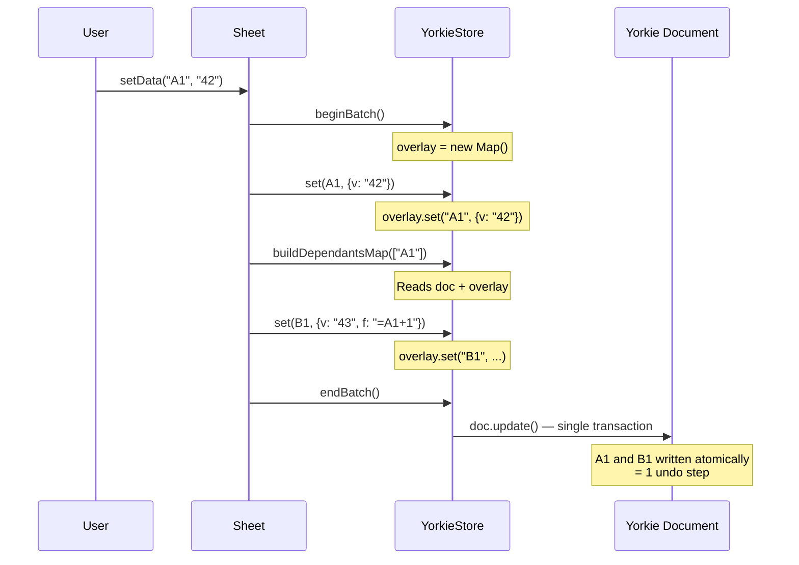

# Batch Transactions for Atomic Undo/Redo

## Summary

With undo/redo powered by Yorkie's `doc.history` API, each `doc.update()` call
creates a separate undo step. A single user action (e.g., editing a cell with
formula dependents) would produce multiple undo steps — one for the initial
mutation and one for each recalculated formula. Batch transactions group all
mutations from a single user action into one `doc.update()` call, creating a
single undo step.

### Goals

- A cell edit that triggers N formula recalculations should produce 1 undo step.
- Formatting a range of M cells should produce 1 undo step.
- Delete, paste, and other bulk operations with formula deps should produce 1
  undo step.
- Intermediate reads during a batch (e.g., formula evaluation reading a just-
  written cell) must see buffered writes.

### Non-Goals

- Full atomicity for `shiftCells` / `moveCells` — these produce 2 undo steps
  (the structural change + formula recalculation). Full atomicity requires
  deeper integration with the Yorkie proxy.
- Nested batch support — batches don't nest; calling `beginBatch()` twice
  without `endBatch()` overwrites the first batch.

## Proposal Details

### Store Interface

Two new methods on the `Store` interface:

```typescript
beginBatch(): void;
endBatch(): void;
```

**MemStore** implements both as no-ops since it has no history tracking.

### YorkieStore Batch Implementation

YorkieStore maintains two batch buffers:

```typescript
private batchOverlay: Map<Sref, Cell | null> | null = null;
private batchOps: Array<(root: Worksheet) => void> | null = null;
```

- **`batchOverlay`** — Buffers cell mutations. Maps `Sref` to `Cell` (set) or
  `null` (deleted). Serves as a read overlay so intermediate reads during the
  batch see buffered writes.
- **`batchOps`** — Buffers non-cell mutations (styles, freeze pane, dimensions)
  as deferred functions that operate on the Yorkie document root.

#### Why two buffers

Cell mutations need a read overlay because formula evaluation reads cells that
were just written (e.g., B1 depends on A1 — recalculating A1 first, then B1
must see A1's new value). Non-cell mutations (styles, freeze pane, dimensions)
don't need an overlay because `Sheet` caches these locally and reads from its
own cache, not from the store.

Separating the two also avoids a Yorkie proxy issue: if the same cell key is
deleted and re-added within a single `doc.update()`, the proxy's `ownKeys` trap
may report duplicate entries. By using the overlay's final state (which
naturally deduplicates), we write each key at most once.

#### Mutation methods during batch

| Method | Batch behavior |
|--------|---------------|
| `set()` | Write to overlay |
| `delete()` | Set overlay entry to `null` |
| `deleteRange()` | Set overlay entries to `null` |
| `setGrid()` | Write to overlay |
| `setColumnStyle()` | Push to ops list |
| `setRowStyle()` | Push to ops list |
| `setSheetStyle()` | Push to ops list |
| `setFreezePane()` | Push to ops list |
| `setDimensionSize()` | Push to ops list |

#### Read methods during batch

| Method | Batch behavior |
|--------|---------------|
| `get()` | Check overlay first; return `undefined` for `null` entries |
| `has()` | Check overlay first; `null` entry → `false` |
| `getGrid()` | For each cell in range, check overlay before document |
| `buildDependantsMap()` | Iterate document cells (skip overlay-overridden), then overlay cells (skip `null`), build combined map |

#### Methods unaffected by batch

- `shiftCells()`, `moveCells()` — Run their own `doc.update()` outside the
  batch (subsequent operations need to see the shifted state).
- `findEdge()` — Uses `cellIndex` which is kept up-to-date during batch.
- Read-only methods (`getDimensionSizes`, `getColumnStyles`, etc.) — Sheet
  caches these locally.
- `updateActiveCell()` — Presence-only, not undoable.

#### endBatch flush

`endBatch()` applies everything in a single `doc.update()`:

1. Apply cell overlay (final state for each key — no delete+re-add conflicts).
2. Apply non-cell ops sequentially.
3. Set `dirty = true` to trigger index rebuild on next query.

If neither overlay nor ops have entries, `endBatch()` is a no-op (no empty
`doc.update()` call).

### Sheet Method Wrapping

Each user-facing method wraps its store operations in `beginBatch()` /
`endBatch()` with `try/finally`:

| Method | Batch scope | Undo steps |
|--------|------------|------------|
| `setData()` | Entire method (set + buildDependantsMap + calculate) | 1 |
| `removeData()` | Entire method (deleteRange + buildDependantsMap + calculate) | 1 |
| `paste()` | setGrid + formula recalculation | 1 |
| `setRangeStyle()` | All branches (column/row/all/cell styling) | 1 |
| `shiftCells()` | Freeze pane adjustment + formula recalculation (after `store.shiftCells`) | 2 |
| `moveCells()` | Formula recalculation (after `store.moveCells`) | 2 |

```
setData(ref, value)
├── store.beginBatch()
├── store.set(ref, cell)              ← buffered in overlay
├── store.buildDependantsMap(...)     ← reads overlay + document
├── calculate(...)                    ← reads/writes via overlay
└── store.endBatch()                  ← single doc.update()
```

### Data Flow



## Risks and Mitigation

**Yorkie proxy duplicate keys** — Deleting and re-adding the same key within a
single `doc.update()` can cause the Yorkie proxy's `ownKeys` trap to report
duplicates, crashing `Object.keys()`. The overlay approach mitigates this by
writing each key's final state only once.

**Partial batching for structural operations** — `shiftCells` and `moveCells`
produce 2 undo steps. Full atomicity would require making the overlay aware of
structural changes or having Yorkie support grouping multiple `doc.update()`
calls. This is acceptable for v1 since Cmd+Z twice is a reasonable UX for
insert/delete operations.

**No nested batch support** — If a batched method calls another batched method,
the inner `beginBatch()` would overwrite the outer batch's state. Currently no
methods nest, but this is a constraint to be aware of when adding new
operations.
