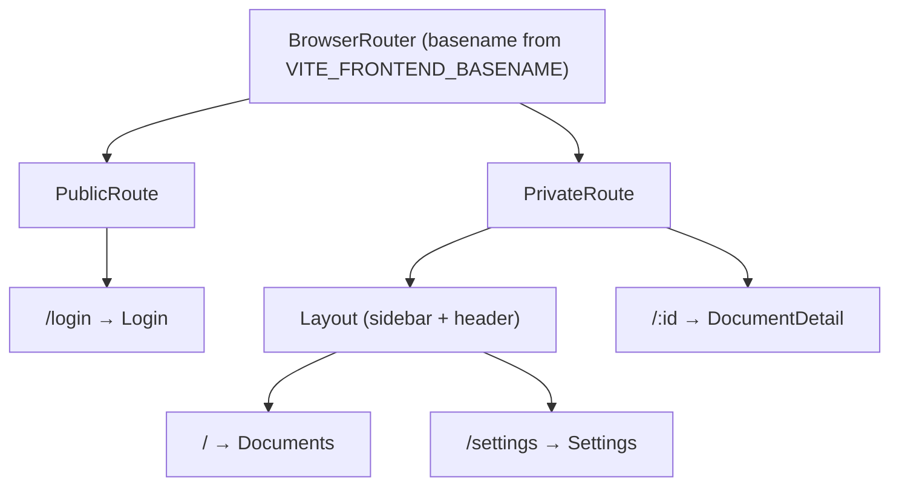
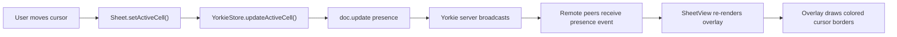

# Frontend Package

## Summary

The frontend is a React 19 single-page application built with Vite. It
provides the user-facing spreadsheet interface by mounting the
`@wafflebase/sheet` Canvas engine inside a React component and connecting it
to a Yorkie CRDT document for real-time collaboration. It also handles
authentication (GitHub OAuth via the backend), document management, and
presence (showing other users' active cells).

### Goals

- Provide a responsive spreadsheet UI backed by the `@wafflebase/sheet` engine.
- Enable real-time collaboration via Yorkie CRDT with live presence indicators.
- Handle the full auth lifecycle (login, session verification, logout).
- Support light, dark, and system-detected themes.

### Non-Goals

- Offline support — the app requires a connection to the Yorkie server and
  backend API.
- Server-side rendering — the app is a client-only SPA.

## Proposal Details

### App Architecture

#### Routing

React Router 7.5 with route guards:



- **PublicRoute** — Redirects to `/` if already authenticated.
- **PrivateRoute** — Calls `fetchMe()` to verify the JWT cookie. Wraps
  children in `YorkieProvider`. Redirects to `/login` on failure.
- Route components are loaded with `React.lazy` + `Suspense` so the login,
  list, settings, and document-detail pages are split into separate chunks.

#### Provider Hierarchy

```
StrictMode
└── QueryClientProvider (TanStack React Query)
    └── ThemeProvider (light / dark / system)
        └── BrowserRouter
            └── PrivateRoute
                └── YorkieProvider (Yorkie client connection)
                    └── DocumentProvider (per-document CRDT)
                        └── Page components
```

### Sheet Integration

`SheetView` (`src/app/spreadsheet/sheet-view.tsx`) is the bridge between
React and the `@wafflebase/sheet` engine:

1. On mount, it calls `initialize(containerDiv, { theme, store })` where
   `store` is a `YorkieStore` wrapping the current Yorkie document.
2. Subscribes to `doc.subscribe("remote-change")` and coalesces cross-sheet
   recalculation to animation frames so bursty updates do not trigger
   redundant recalculations. The sheet engine recalculates from cross-sheet
   formula roots only, and skips no-op formula writes.
3. Subscribes to `doc.subscribe("presence")` and coalesces overlay redraws
   to animation frames so rapid presence updates do not flood rerenders.
4. On unmount, calls `spreadsheet.cleanup()` to remove event listeners and
   DOM elements.
5. Fill handle drag is handled inside `Worksheet`/`Overlay`: the bottom-right
   handle on a cell selection (or merged active cell bounds when no explicit
   range exists) shows a crosshair cursor, previews the expanded fill range
   with a dashed border, and commits `Sheet.autofill(...)` on mouseup.
6. On mobile viewports, `useMobileSheetGestures` adds one-finger drag panning
   (`spreadsheet.panBy(...)`) and double-tap-to-edit
   (`spreadsheet.handleMobileDoubleTap(...)`) on the canvas container.

`FormattingToolbar` includes a function browser trigger (`fx`) that calls
`spreadsheet.toggleFunctionBrowser()`, so function discovery lives in the
frontend toolbar rather than the engine's formula bar. The `More format` menu
shows common US-format examples first, then appends current system-locale
entries for locale currency and locale date (such as KRW/date for `ko-KR`).
The toolbar also includes a `Borders` dropdown that applies border presets
(`all`, `outer`, `inner`, directional sides, `clear`) via
`spreadsheet.applyBorders(...)`. On mobile, the toolbar uses a compact set of
inline actions (undo/redo, text style, colors, merge) and moves advanced
format/alignment/border/function actions into a trailing overflow menu.
It also exposes `Paint format`, which copies the active cell's effective style
and applies it once to the next range selected with the mouse. While dragging
the target range, the source cell is highlighted as a visual indicator.
When the source cell is effectively default-styled, paint format applies a
default-style reset to the target range instead of a no-op/alert.
It also exposes `Conditional formatting` (`CF`), which opens a right-side
rules panel (same layout pattern as chart editor). Rules are applied to an A1
range and persisted through the sheet engine/store APIs.
It also exposes `Insert chart`, which creates a floating chart object from the
current cell selection. Floating chart cards include a top-right context menu
(`Edit chart`, `Delete chart`) and open a right-side chart editor panel for
configuring chart type, data range, X-axis column, and visible series columns.
It also exposes `Insert image`, which uploads an image file through the backend
asset API and creates a floating image card anchored to the selected cell.
Floating image cards include a top-right context menu (`Edit image`,
`Delete image`) and open a right-side image editor panel for title, alt text,
display fit mode, and replacement upload.
Chart series colors are derived from theme tokens (`primary` with tonal
variants), so they stay visually consistent across light and dark mode.
Chart/image overlay and editor UI is lazy-loaded, and overlay render-version
tracking is enabled only when the current tab actually has floating objects.

A `didMount` ref guards against React 19 StrictMode double-mounting in
development.

### Yorkie Integration

#### Document Shape

Each spreadsheet document is stored as a Yorkie CRDT document with a multi-tab
structure:

```typescript
type TabType = 'sheet' | 'datasource';

type TabMeta = {
  id: string;           // e.g., "tab-1"
  name: string;         // Case-insensitive unique tab name (trimmed)
  type: TabType;
  datasourceId?: string; // Backend DataSource ID (datasource tabs only)
  query?: string;        // SQL query (datasource tabs only)
};

type SheetChart = {
  id: string;
  type: 'bar' | 'line';
  title?: string;
  sourceTabId: string;   // tab that provides chart data
  sourceRange: string;   // A1 range (e.g. "A1:C20")
  xAxisColumn?: string;  // absolute column name (e.g. "A")
  seriesColumns?: string[]; // absolute column names (e.g. ["B", "C"])
  anchor: Sref;          // top-left anchor cell in current sheet
  offsetX: number;       // px offset from anchor cell left
  offsetY: number;       // px offset from anchor cell top
  width: number;         // px
  height: number;        // px
};

type SheetImage = {
  id: string;
  title?: string;
  alt?: string;
  key: string;           // object-storage key (resolved via backend API)
  contentType: string;   // e.g. "image/png"
  anchor: Sref;          // top-left anchor cell in current sheet
  offsetX: number;       // px offset from anchor cell left
  offsetY: number;       // px offset from anchor cell top
  width: number;         // px
  height: number;        // px
  fit: 'cover' | 'contain';
};

type WorksheetFilterState = {
  startRow: number;
  endRow: number;
  startCol: number;
  endCol: number;
  columns: {
    [key: string]: {
      op:
        | 'contains'
        | 'notContains'
        | 'equals'
        | 'notEquals'
        | 'isEmpty'
        | 'isNotEmpty'
        | 'in';
      value?: string;
      values?: string[];
    };
  };
  hiddenRows: number[];
};

type ConditionalFormatRule = {
  id: string;
  range: [{ r: number; c: number }, { r: number; c: number }];
  op:
    | 'isEmpty'
    | 'isNotEmpty'
    | 'textContains'
    | 'greaterThan'
    | 'between'
    | 'dateBefore'
    | 'dateAfter';
  value?: string;
  value2?: string;
  style: {
    b?: boolean;
    i?: boolean;
    u?: boolean;
    tc?: string;
    bg?: string;
  };
};

type Worksheet = {
  sheet: { [sref: Sref]: Cell };
  rowHeights: { [index: string]: number };
  colWidths: { [index: string]: number };
  colStyles: { [index: string]: CellStyle };
  rowStyles: { [index: string]: CellStyle };
  sheetStyle?: CellStyle;
  conditionalFormats?: ConditionalFormatRule[];
  merges?: { [anchor: Sref]: { rs: number; cs: number } };
  filter?: WorksheetFilterState;
  charts?: { [id: string]: SheetChart };
  images?: { [id: string]: SheetImage };
  frozenRows: number;
  frozenCols: number;
};

type SpreadsheetDocument = {
  tabs: { [id: string]: TabMeta };
  tabOrder: string[];
  sheets: { [tabId: string]: Worksheet };
};
```

Tab metadata and sheet data are synced via Yorkie. Datasource query results
are fetched from the backend on demand and displayed using `ReadOnlyStore`.
Chart and image objects are stored in each worksheet and rendered as floating
DOM cards above the sheet canvas. Object geometry and editor fields are
updated through `doc.update()` so floating-object edits are collaborative in
real time. Rendering is clipped to the unfrozen scrollable quadrant, so
floating objects are hidden underneath frozen rows/columns. Anchor layout also
uses scrollable-quadrant coordinates, so objects continue moving with scroll
even if their anchor refs fall inside frozen rows/columns.

**Migration:** Old documents (flat `Worksheet` format with `root.sheet`) are
automatically migrated to the new `SpreadsheetDocument` structure on load,
wrapping existing data into a single tab.

#### YorkieStore

`YorkieStore` (`src/app/spreadsheet/yorkie-store.ts`) implements the `Store`
interface from `@wafflebase/sheet`. It accepts a `tabId` parameter and scopes
all reads/writes to `root.sheets[tabId]`. Each store method maps to a Yorkie
`doc.update()` call that mutates the CRDT document:

| Store method | Yorkie operation |
|-------------|-----------------|
| `set(ref, cell)` | `root.sheet[sref] = cell` |
| `get(ref)` | Read `root.sheet[sref]` |
| `delete(ref)` | `delete root.sheet[sref]` |
| `deleteRange(range)` | Use CellIndex to find cells in range, delete in single `doc.update()` |
| `setGrid(grid)` | Batch write to `root.sheet` |
| `getGrid(range)` | Use CellIndex to iterate only populated cells in range |
| `findEdge(ref, direction, dimension)` | Delegate to `findEdgeWithIndex` using CellIndex |
| `shiftCells(axis, index, count)` | Remap sheet refs/formulas in place (delete removed keys, upsert remapped keys); also remap chart/image anchors and conditional-format ranges |
| `moveCells(axis, src, count, dst)` | Remap sheet refs/formulas in place (delete removed keys, upsert remapped keys); also remap chart/image anchors and conditional-format ranges |
| `setDimensionSize(axis, index, size)` | Write to `root.rowHeights` or `root.colWidths` |
| `getDimensionSizes(axis)` | Read from `root.rowHeights` or `root.colWidths` |
| `addRangeStyle(patch)` | Append to `root.sheets[tabId].rangeStyles` |
| `setRangeStyles(patches)` | Replace/delete `root.sheets[tabId].rangeStyles` |
| `getRangeStyles()` | Read `root.sheets[tabId].rangeStyles` (fallback `[]`) |
| `setConditionalFormats(rules)` | Replace/delete `root.sheets[tabId].conditionalFormats` |
| `getConditionalFormats()` | Read `root.sheets[tabId].conditionalFormats` (fallback `[]`) |
| `setMerge(anchor, span)` | Write to `root.sheets[tabId].merges[anchorSref]` |
| `deleteMerge(anchor)` | Delete `root.sheets[tabId].merges[anchorSref]` |
| `getMerges()` | Read all merge anchors from `root.sheets[tabId].merges` |
| `setFilterState(state)` | Write/delete `root.sheets[tabId].filter` |
| `getFilterState()` | Read `root.sheets[tabId].filter` |
| `updateActiveCell(ref)` | `doc.update((_, presence) => presence.set({ activeCell, activeTabId }))` |
| `getPresences()` | `doc.getPresences()` filtered to other clients in the same `activeTabId` |

All mutations go through `doc.update()`, which automatically syncs to the
Yorkie server and broadcasts to all connected peers.

Cell payloads are normalized before persistence. `YorkieStore` drops default
empty values (`v: ""`) and empty style/formula fields; if a cell has no
remaining meaningful payload, it is removed from `sheet` instead of stored.
Range-style patches are stored separately in optional `rangeStyles`; documents
without that field remain valid and are treated as having no patches.

**Batch transactions** — YorkieStore implements `beginBatch()` / `endBatch()`
to group multiple mutations into a single `doc.update()` call, creating one
undo step. Cell mutations are buffered in an overlay `Map<Sref, Cell | null>`
that also serves as a read-through cache for intermediate reads during formula
recalculation. Non-cell mutations (styles, dimensions, freeze pane) are
buffered as deferred functions. See
[batch-transactions.md](batch-transactions.md) for the full design.

#### CellIndex (Dirty Flag + Lazy Rebuild)

YorkieStore maintains a `CellIndex` (from `@wafflebase/sheet`) for efficient
range queries and Ctrl+Arrow navigation. Because remote peers can modify the
document at any time, YorkieStore uses a lazy rebuild strategy:

1. **Constructor** subscribes to `doc.subscribe()` — on `"remote-change"`
   events, sets `dirty = true`.
2. **`ensureIndex()`** — Called before any query that uses the index
   (`getGrid`, `deleteRange`, `findEdge`). If dirty, rebuilds the index from
   sheet keys and clears the flag. If Yorkie proxy key enumeration throws
   duplicate-key `ownKeys` errors, YorkieStore falls back to
   `sheet.toJSON()` + `JSON.parse(...)` snapshot enumeration so rendering
   and navigation stay stable.
3. **Local mutations** (`set`, `delete`, `setGrid`) update the index
   incrementally with a `if (!this.dirty)` guard — skip incremental update
   if the index is already stale.
4. **Bulk operations** (`shiftCells`, `moveCells`) set `dirty = true` at the
   end after key/formula remapping.

### Presence System

Presence tracks which cell each connected user is viewing:



**UserPresence type:**

```typescript
type UserPresence = {
  activeCell?: Sref;   // e.g. "C5"
  activeTabId?: string; // current tab id, e.g. "tab-1"
  username: string;
  email: string;
  photo: string;
};
```

The `UserPresence` component (`src/components/user-presence.tsx`) displays up
to 4 user avatars in the header. It uses the `usePresences()` hook from
`@yorkie-js/react` to reactively track connected users, and each avatar is
clickable to jump the local sheet selection to that peer's `activeCell`.
The current user's own avatar is intentionally non-clickable.
Presence entries are keyed by Yorkie `clientID` (not username), so multiple
anonymous users are shown as separate avatars instead of collapsing into one.
When there are more than 4 users, the component shows a `+N` overflow button
with a dropdown list of the remaining users (including jump actions where
available).

`DocumentDetail` wires this through a lightweight request object
(`{ activeCell, targetTabId, requestId }`) passed to `SheetView`, and
`SheetView` consumes it by calling
`spreadsheet.focusCell(parseRef(activeCell))` once per request on the matching
tab.

The `usePresenceUpdater` hook syncs the current user's profile information
(username, email, photo) into the Yorkie presence when the document or user
data changes.

### Auth Flow

Authentication is handled entirely via the backend (GitHub OAuth + JWT
cookies). The frontend's role is:

1. **Login page** — Renders a link to `VITE_BACKEND_API_URL/auth/github`.
2. **Session check** — `PrivateRoute` calls `fetchMe()` (GET `/auth/me` with
   `credentials: "include"`) on mount. If the cookie is valid, the backend
   returns the user object.
3. **Anonymous-safe session checks** — Public contexts like `PublicRoute` and
   shared-link pages call `fetchMeOptional()`, which treats `401` as
   unauthenticated (`null`) instead of redirecting.
4. **Logout** — POST `/auth/logout` clears the cookie; frontend redirects to
   `/login`.
5. **401 handling** — `fetchWithAuth()` wraps authenticated API calls. On
   `401`, it performs best-effort logout cleanup, redirects to `/login`, and
   throws `AuthExpiredError` so UI handlers can avoid showing generic API toasts.

### Document Management

Documents are managed via the backend REST API with TanStack React Query for
caching and mutations.

**API layer** (`src/api/documents.ts`):

| Function | Method | Endpoint |
|----------|--------|----------|
| `fetchDocuments()` | GET | `/documents` |
| `fetchDocument(id)` | GET | `/documents/:id` |
| `createDocument({ title })` | POST | `/documents` |
| `deleteDocument(id)` | DELETE | `/documents/:id` |

**Document list** uses TanStack Table with sorting, filtering, and pagination.
Row click navigates to `/:id`.

**Document detail** wraps `SheetView` in a `DocumentProvider` that connects to
the Yorkie document with key `sheet-{id}`. The sheet and datasource tab views
are lazy-loaded per active tab, and the datasource selector dialog is loaded
on demand when adding datasource tabs.

### Type Definitions

```typescript
// src/types/documents.ts
type Document = {
  id: number;
  title: string;
  description: string;
  createdAt: string;
  updatedAt: string;
};

// src/types/users.ts
type User = {
  authProvider: string;
  username: string;
  email: string;
  photo: string;
};

// src/types/worksheet.ts — See Document Shape section above for full types

// src/types/datasource.ts
type DataSource = {
  id: string;
  name: string;
  host: string;
  port: number;
  database: string;
  username: string;
  password: string;  // Always masked from API
  sslEnabled: boolean;
  authorID: number;
  createdAt: string;
  updatedAt: string;
};

type QueryResult = {
  columns: QueryColumn[];
  rows: Record<string, unknown>[];
  rowCount: number;
  truncated: boolean;
  executionTime: number;
};
```

### Theme System

The `ThemeProvider` (`src/components/theme-provider.tsx`) manages three modes:
`"light"`, `"dark"`, and `"system"`.

- Persists the user's choice in `localStorage` under `"vite-ui-theme"`.
- Applies the resolved theme as a class on `<html>` (either `light` or
  `dark`).
- Listens to `matchMedia("prefers-color-scheme: dark")` for system mode.
- The `useTheme()` hook exposes `{ theme, resolvedTheme, setTheme }`.
- The resolved theme string is passed to `@wafflebase/sheet`'s `initialize()`
  so the Canvas renderer uses matching colors.

Styling uses Tailwind CSS v4 with custom CSS variables in OKLch color space
defined in `src/index.css`. UI components are Radix UI primitives styled with
Tailwind (shadcn/ui pattern).

## Risks and Mitigation

**React 19 StrictMode double-mount** — `SheetView` uses a `didMount` ref to
prevent initializing the Canvas engine twice in development. This is necessary
because `@wafflebase/sheet` manages its own DOM and event listeners outside of
React's lifecycle.

**Yorkie connection failures** — If the Yorkie server is unreachable, the
`DocumentProvider` will fail to connect. Currently this surfaces as a loading
state. A future improvement could add offline fallback to `MemStore`.

**Cookie-based auth and CORS** — All API calls use `credentials: "include"`,
which requires the backend to set `Access-Control-Allow-Credentials: true`
and an explicit origin (not `*`). The backend's CORS config handles this, but
misconfiguration will silently break auth.
