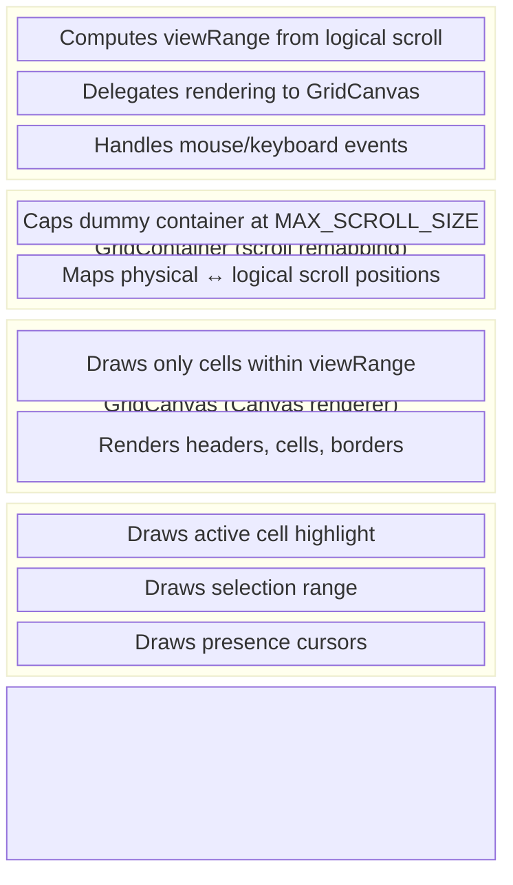
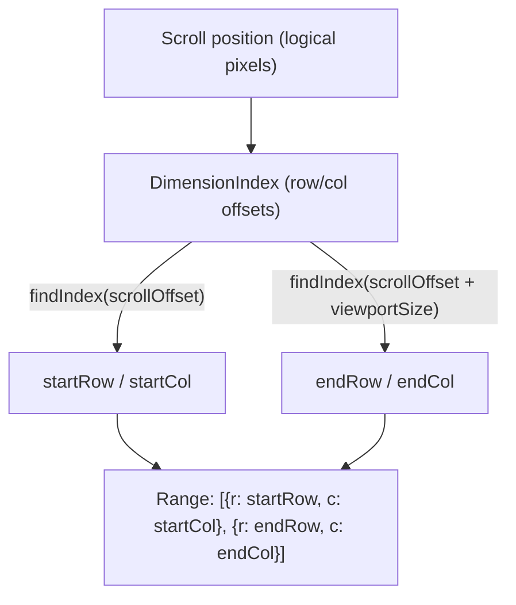
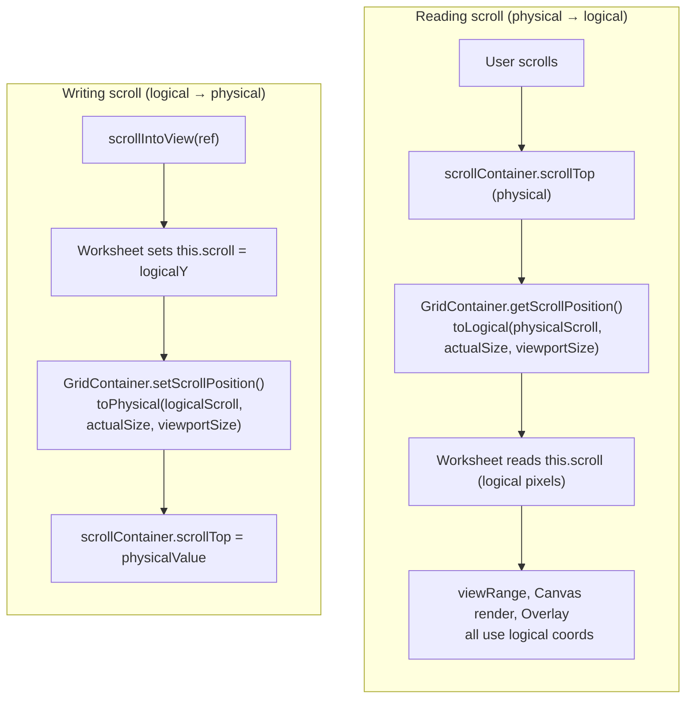

# Infinite Scroll and Rendering

## Summary

Wafflebase supports a grid of up to 729,443 rows x 18,278 columns (A1 to
ZZZ729443). Rendering this grid requires two mechanisms working together:
viewport-based Canvas rendering that only draws visible cells, and proportional
scroll remapping that maps a browser-safe scroll area to the full logical grid.

### Goals

- Render arbitrarily large grids without degrading performance.
- Support smooth scrolling across the full grid extent on all major browsers.
- Keep the remapping layer transparent to the rest of the codebase.

### Non-Goals

- Virtualizing DOM elements (we use Canvas, not DOM nodes for cells).
- Infinite data loading / pagination from the backend (handled separately by
  the store layer).

## Proposal Details

### Architecture Overview

The rendering pipeline has four layers:



### Viewport-Based Canvas Rendering

Only the cells visible in the current viewport are rendered on each frame.

**View range calculation** (`Worksheet.viewRange`):



`DimensionIndex` maintains a sorted array of cumulative offsets, supporting
variable row heights and column widths. `findIndex()` performs a binary search
to find which row/column a pixel offset falls into.

**Rendering flow** (`Worksheet.renderSheet` → `GridCanvas.render`):

1. `Worksheet` computes the `viewRange` from the logical scroll position.
2. `Sheet.fetchGrid(viewRange)` returns only the cell data within that range.
3. `GridCanvas.render()` iterates over the range and draws each cell using
   `toBoundingRect()` to compute viewport-relative pixel coordinates.
4. Row and column headers are drawn separately for the visible range.

The canvas is sized to the viewport dimensions (not the full grid), so memory
usage is constant regardless of grid size.

### Proportional Scroll Remapping

Browsers impose maximum CSS element sizes:

| Browser        | Max element size |
| -------------- | ---------------- |
| Safari         | 2^24 = 16,777,216 px |
| Chrome/Firefox | 2^25 = 33,554,432 px |

At default dimensions, the full grid height is 729,443 x 23px = 16,777,189 px,
which is at Safari's limit. Adding rows or increasing row heights would exceed
it.

**Solution**: `GridContainer` caps the dummy scroll container at
`MAX_SCROLL_SIZE = 10,000,000 px` and linearly maps between physical (capped)
and logical (actual) scroll positions.

**Remapping formula**:

```
Physical → Logical:
  logicalScroll = physicalScroll * (actualSize - viewportSize)
                                / (cappedSize - viewportSize)

Logical → Physical:
  physicalScroll = logicalScroll * (cappedSize - viewportSize)
                                / (actualSize - viewportSize)
```

When `actualSize <= MAX_SCROLL_SIZE`, no remapping occurs (identity mapping).

**Data flow**:



**Key design decisions**:

- The remapping is fully contained in `GridContainer`. All downstream code
  (`viewRange`, `GridCanvas`, `Overlay`, `scrollIntoView`) works exclusively
  with logical pixel offsets and is unaware of the capping.
- The dummy container has `pointer-events: none`, ensuring mouse events target
  the scroll container. This makes `e.offsetX/Y` viewport-relative, which is
  the coordinate space mouse handlers expect.
- `scrollBy()` converts logical deltas to physical deltas using the same ratio,
  so auto-scroll during drag selection works correctly.

### Mouse Event Coordinate Flow

With `pointer-events: none` on the dummy container, all mouse events have the
scroll container as their target. `e.offsetX/Y` are therefore viewport-relative.

| Handler | Coordinate handling |
| --- | --- |
| `handleMouseDown` (selectStart) | `e.offsetX + scroll.left`, `e.offsetY + scroll.top` → absolute grid coords |
| `onMove` (selectEnd) | `offsetX + scroll.left`, `offsetY + scroll.top` → absolute grid coords |
| `handleContextMenu` | `e.offsetX` for header detection, `+ scroll` for `findIndex` |
| `detectResizeEdge` | `e.offsetX` for header threshold, `+ scroll` for edge detection |
| `handleMouseMove` | Delegates to `detectResizeEdge` |

### Risks and Mitigation

**Scroll precision loss at extreme positions**: When the remapping ratio is
large (e.g., actual 100M px mapped to 10M px), each physical pixel maps to ~10
logical pixels, making it harder to scroll to an exact row. This is acceptable
because keyboard navigation and `scrollIntoView` bypass the scroll remapping
(they set the logical position directly). Users can scroll approximately, then
use arrow keys or click to select the exact cell.

**Browser scroll rounding**: Browsers may round `scrollLeft/scrollTop` to
integers, which can cause small drift after round-tripping through
`toLogical`/`toPhysical`. The effect is sub-pixel and imperceptible in practice.

**Mobile rubber-band overscroll**: On mobile Safari, pulling past the top/left
edge can briefly produce negative `scrollTop`/`scrollLeft`. `GridContainer`
clamps physical and logical scroll values to `[0, max]`, and
`DimensionIndex.findIndex()` clamps negative offsets to index `1`, so rendering
never shows row/column `0` or negative indices.

When freeze panes are active, `Worksheet.viewRange` and `GridCanvas` also clamp
the scrolled (unfrozen) start indices to at least `frozenRows+1` and
`frozenCols+1`. This prevents frozen rows/columns from being drawn again in the
bottom/right panes during transient scroll anomalies.
