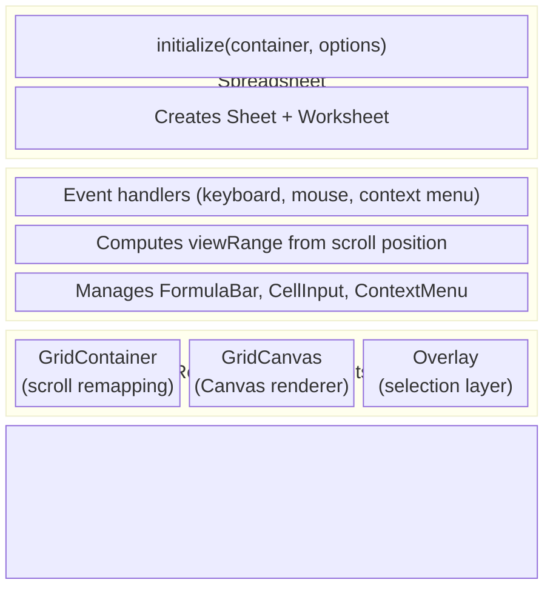

# Sheet Package

## Summary

The `@wafflebase/sheet` package is the core spreadsheet engine. It owns the data
model, formula evaluation, Canvas-based rendering, and the store abstraction that
decouples the engine from any specific persistence backend. The frontend package
depends on it and provides a `YorkieStore` for real-time collaboration.

### Goals

- Provide a self-contained spreadsheet engine that can run with any `Store`
  implementation (in-memory, CRDT-backed, server-backed, etc.).
- Support large grids (up to 1,000,000 rows x 182,780 columns) with
  viewport-only Canvas rendering.
- Evaluate formulas with correct dependency ordering and cycle detection.
- Handle row/column insert and delete with automatic formula reference shifting.

### Non-Goals

- Providing a UI framework — the engine renders on a raw `<canvas>` and
  `<div>` container; layout integration is the consumer's responsibility.
- Server-side execution — the engine runs entirely in the browser.

## Proposal Details

### Data Model

#### Core Types

```typescript
type Sref = string;                        // "A1"
type Srng = string;                        // "A1:B2"
type Reference = Sref | Srng;

type Ref = { r: number; c: number };       // 1-based numeric coordinate
type Range = [Ref, Ref];                   // [topLeft, bottomRight]
type MergeSpan = { rs: number; cs: number }; // merged block size from anchor
type FilterCondition = {
  op: 'contains' | 'notContains' | 'equals' | 'notEquals' | 'isEmpty' | 'isNotEmpty' | 'in';
  value?: string;
  values?: string[];
};
type FilterState = {
  range: Range;                            // header row + data rows
  columns: Record<string, FilterCondition>; // absolute col index as string
  hiddenRows: number[];                    // 1-based rows hidden by filter
};

type Cell = { v?: string; f?: string; s?: CellStyle }; // v = value, f = formula, s = style
type Grid = Map<Sref, Cell>;              // Sparse cell map

type Direction = 'up' | 'down' | 'left' | 'right';
type Axis = 'row' | 'column';
```

#### Sheet Class

`Sheet` is the central data model. It owns the `Store` reference and provides
all cell, selection, and navigation operations.

**Key responsibilities:**

- **Cell access** — `getCell`, `setCell`, `setData` (trims input, infers
  formula/boolean/number/date/text, normalizes value, and attaches inferred
  format metadata), `removeData`, `fetchGrid`
- **Formula recalculation** — When a cell is set via `setData`, the sheet
  builds a dependants map from the store and invokes the `Calculator` to
  recalculate all affected cells in topological order.
- **Selection** — `activeCell`, `range`, `selectStart`/`selectEnd`,
  `selectAll` (expands until empty border using value/formula cells;
  style-only cells are ignored)
- **Merged cells** — `mergeSelection`, `unmergeSelection`,
  `toggleMergeSelection` with top-left anchor semantics. Covered cells resolve
  to the anchor for read/write/formula lookups.
- **Navigation** — `move`, `moveToEdge` (Ctrl+Arrow), `moveInRange`
  (Tab/Enter within selection, wraps around)
- **Row/column operations** — `insertRows`, `deleteRows`, `insertColumns`,
  `deleteColumns`. These delegate to the store and then recalculate shifted
  formulas. `moveRows` and `moveColumns` reorder rows/columns by remapping
  all cell positions and formula references. Merge metadata is shifted/moved
  in lockstep with cells, and split-inducing move operations are blocked.
- **Selection model** — `selectRow`, `selectColumn`, `selectRowRange`,
  `selectColumnRange` support whole-row/column selection.
  `getSelectionType()` returns `'cell' | 'row' | 'column'`.
  `getSelectedIndices()` returns the selected range for row/column selections.
- **Copy/paste** — `copy` serializes the selection as a tab/newline string;
  `paste` parses it back and recalculates dependants from all changed refs
  (including plain-value pastes). External pastes (TSV/HTML) run through the
  same conservative input inference as `setData` before persistence.
- **Autofill (fill handle)** — dragging the selection handle repeats the source
  pattern across the expanded range. Formula cells are relocated per target
  offset (same reference-shift semantics as internal paste), then dependants are
  recalculated from all changed destination refs. With freeze panes, the handle
  is hidden (and non-interactive) when the selection is in the unfrozen
  scrollable quadrant but the handle position would fall under frozen panes.
- **Filtering** — `createFilterFromSelection`, `setColumnFilter`, and
  `clearFilter` persist filter metadata and compute hidden row indices.
  If the selection is header-only (single row), filter creation auto-expands
  downward through contiguous data rows in the selected columns.
  On successful creation, the current selection is updated to the final filter
  range so users can see the table area that filtering applies to.
  Value-checklist filtering is represented as `{ op: 'in', values: [...] }`.
  Hidden
  rows are rendered as zero-height rows in `Worksheet` while preserving
  user-defined row heights for restore.
- **Dimensions** — `setRowHeight`, `setColumnWidth`, persisted to the store.

**Grid dimensions:** `1,000,000 rows x 182,780 columns` (constants in the
Sheet class). The `dimensionRange` property returns this as a `Range`.

### Store Interface

The `Store` interface is the abstraction boundary between the engine and
persistence. Every method is async to support both local and networked
implementations.

```typescript
interface Store {
  // Cell CRUD
  set(ref: Ref, value: Cell): Promise<void>;
  get(ref: Ref): Promise<Cell | undefined>;
  has(ref: Ref): Promise<boolean>;
  delete(ref: Ref): Promise<boolean>;

  // Bulk operations
  setGrid(grid: Grid): Promise<void>;
  getGrid(range: Range): Promise<Grid>;
  deleteRange(range: Range): Promise<Set<Sref>>;

  // Navigation
  findEdge(ref: Ref, direction: Direction, dimension: Range): Promise<Ref>;

  // Formula dependencies
  buildDependantsMap(srefs: Iterable<Sref>): Promise<Map<Sref, Set<Sref>>>;

  // Dimension management
  setDimensionSize(axis: Axis, index: number, size: number): Promise<void>;
  getDimensionSizes(axis: Axis): Promise<Map<number, number>>;

  // Row/column insert/delete
  shiftCells(axis: Axis, index: number, count: number): Promise<void>;

  // Row/column move
  moveCells(axis: Axis, srcIndex: number, count: number, dstIndex: number): Promise<void>;

  // Freeze panes
  setFreezePane(frozenRows: number, frozenCols: number): Promise<void>;
  getFreezePane(): Promise<{ frozenRows: number; frozenCols: number }>;

  // Merged cells
  setMerge(anchor: Ref, span: MergeSpan): Promise<void>;
  deleteMerge(anchor: Ref): Promise<boolean>;
  getMerges(): Promise<Map<Sref, MergeSpan>>;

  // Filter state
  setFilterState(state: FilterState | undefined): Promise<void>;
  getFilterState(): Promise<FilterState | undefined>;

  // Batch transactions
  beginBatch(): void;
  endBatch(): void;

  // Undo/Redo
  undo(): Promise<boolean>;
  redo(): Promise<boolean>;
  canUndo(): boolean;
  canRedo(): boolean;

  // Presence (sync, not async)
  getPresences(): Array<{ clientID: string; presence: { activeCell: string } }>;
  updateActiveCell(activeCell: Ref): void;
}
```

**Batch transactions** — `beginBatch()` / `endBatch()` group multiple store
mutations into a single undo step. The `Sheet` class wraps user-facing methods
(`setData`, `removeData`, `paste`, `setRangeStyle`, and the post-shift part of
`shiftCells`/`moveCells`) in batch calls. Filter mutations (`setFilterRange`,
`setColumnFilter`, `clearColumnFilter`, `setColumnIncludedValues`, `clearFilter`)
and filter-range sorting (`sortFilterByColumn`) are also wrapped so each action
is a single undo step. See
[batch-transactions.md](batch-transactions.md) for the full design.

**MemStore** is the built-in in-memory implementation. It stores cells in a
`Map<Sref, Cell>`, dimension overrides in separate maps, and implements
`buildDependantsMap` by scanning all formulas in the grid to extract
references. It maintains a `CellIndex` for efficient range queries and
navigation (see below).

**ReadOnlyStore** (`src/store/readonly.ts`) is a read-only Store implementation
for displaying external data (e.g., SQL query results). Data is loaded via
`loadQueryResults(columns, rows)` which populates row 0 with bold column
headers and subsequent rows with data. All write operations are no-ops.

### Merged Cell Model

Merged cells are stored as sheet-level metadata: `Map<Sref, MergeSpan>`,
where the key is the anchor cell (top-left of the merged block), and
`MergeSpan` stores `{ rs, cs }`.

- Covered cells are not persisted as merge metadata entries.
- Cell reads/writes normalize covered refs to anchor refs.
- Formula evaluation resolves covered references through this normalization.
- Rendering draws only anchor cells for merged blocks and skips covered cells.
- Merges that cross freeze pane boundaries are disallowed.

### Filter Model

Filter state is stored as worksheet-level metadata (`FilterState`):
- `range` is the table range (header row included).
- `columns` stores per-column criteria keyed by absolute column index.
- `hiddenRows` stores computed row indices hidden by current criteria.

`Sheet.recomputeFilterHiddenRows()` evaluates each data row (`range.startRow +
1` through `range.endRow`) and persists the result through `Store`. `Worksheet`
maps hidden rows to zero-height rows in `DimensionIndex` so rendering, hit
testing, and scrolling all stay consistent without deleting underlying data.

#### CellIndex

`CellIndex` (`src/store/cell-index.ts`) is a spatial index that tracks which
cells are populated using two `Map<number, Set<number>>`:

- **`rowIndex`**: row → set of occupied columns
- **`colIndex`**: col → set of occupied rows

This enables range queries and navigation that scale with the number of
populated cells rather than the total grid size.

**Key methods:**

| Method | Complexity | Description |
|--------|-----------|-------------|
| `add(row, col)` | O(1) | Register a cell |
| `remove(row, col)` | O(1) | Unregister a cell, clean up empty sets |
| `has(row, col)` | O(1) | Existence check |
| `cellsInRange(range)` | O(populated rows in range × cols per row) | Generator yielding `[row, col]` pairs |
| `getOccupiedColsInRow(row)` | O(1) | Returns the set of columns with data in a row |
| `getOccupiedRowsInCol(col)` | O(1) | Returns the set of rows with data in a column |
| `rebuild(entries)` | O(N) | Rebuild from an iterable of `[row, col]` pairs |

`cellsInRange` only iterates `rowIndex` entries (rows that have data), not
every row number in the range. On a 1M-row sheet with 50 populated cells,
this checks ~50 row entries, not 1M.

**Store integration:**

- **MemStore** — Maintains the index incrementally: `set` calls `add`,
  `delete` calls `remove`, `shiftCells`/`moveCells` call `rebuild` after
  grid replacement.
- **YorkieStore** — Uses a dirty flag with lazy rebuild. Remote changes set
  `dirty = true`; queries call `ensureIndex()` which rebuilds if dirty. Local
  mutations update the index incrementally when not dirty. Before persisting,
  cell payloads are compacted: empty-string values and empty style/formula
  fields are dropped, and cells with no remaining data are deleted.

#### findEdgeWithIndex

`findEdgeWithIndex` (`src/store/find-edge.ts`) replaces the O(distance)
step-by-step `findEdge` algorithm with O(k) jumps using sorted occupied
positions from the `CellIndex`.

**Algorithm** (preserves standard Ctrl+Arrow behavior):

1. Get sorted occupied positions along the movement axis from the index.
2. If current and next cells are both occupied (inside a data block): walk to
   end of the consecutive run.
3. Otherwise (at edge of data or in empty space): jump to the start of the
   next data block, or to the boundary if there is no more data.

| Scenario | Before (step-by-step) | After (index) |
|----------|----------------------|---------------|
| Empty row/col | O(distance to boundary), up to 1M | O(1) |
| Sparse data | O(distance) | O(k) where k = cells in row/col |
| Dense block | O(block length) | O(block length) |

### Formula Engine

#### ANTLR Grammar

The grammar (`src/formula/antlr/Formula.g4`) defines:

```
formula: expr+
expr: FUNCNAME '(' args? ')'   // Function call
    | expr (MUL|DIV) expr      // Multiplication / division
    | expr (ADD|SUB) expr       // Addition / subtraction
    | NUM                       // Number literal
    | BOOL                      // TRUE / FALSE
    | REFERENCE                 // Cell ref (A1) or range (A1:B2)
    | '(' expr ')'             // Parentheses
```

Operator precedence: `* /` binds tighter than `+ -`. Cell references support
up to 3 letters and arbitrary row numbers (e.g., `ZZZ729443`).

#### Evaluation Pipeline

1. **Parse** — The formula string (minus the `=` prefix) is tokenized and
   parsed by the ANTLR-generated lexer/parser into an AST.
2. **Visit** — An `Evaluator` class (implementing the ANTLR visitor pattern)
   walks the AST. Each node evaluates to an `EvalNode`:
   - `NumNode { t: 'num', v: number }`
   - `StrNode { t: 'str', v: string }`
   - `BoolNode { t: 'bool', v: boolean }`
   - `RefNode { t: 'ref', v: Reference }`
   - `ErrNode { t: 'err', v: '#VALUE!' | '#REF!' | '#N/A!' | '#ERROR!' }`
3. **Resolve** — If the final result is a `RefNode`, its value is looked up
   from the provided `Grid`. Otherwise the result is converted to a string.

#### Built-in Functions

Functions are registered in `FunctionMap`. Currently implemented:

- **Math** — `SUM`, `ABS`, `ROUND`, `ROUNDUP`, `ROUNDDOWN`, `INT`, `MOD`,
  `SQRT`, `POWER`, `PRODUCT`, `MEDIAN`, `AVERAGE`, `MIN`, `MAX`, `COUNT`,
  `COUNTA`, `COUNTBLANK`, `COUNTIF`, `SUMIF`, `COUNTIFS`, `SUMIFS`, `RAND`,
  `RANDBETWEEN`.
- **Logical** — `IF`, `IFS`, `SWITCH`, `AND`, `OR`, `NOT`, `IFERROR`, `IFNA`.
- **Lookup/Reference** — `MATCH`, `INDEX`, `VLOOKUP`, `HLOOKUP`.
- **Text** — `TRIM`, `LEN`, `LEFT`, `RIGHT`, `MID`, `CONCATENATE`, `CONCAT`,
  `FIND`, `SEARCH`, `TEXTJOIN`, `LOWER`, `UPPER`, `PROPER`, `SUBSTITUTE`.
- **Date/Time** — `TODAY`, `NOW`, `DATE`, `TIME`, `DAYS`, `YEAR`, `MONTH`,
  `DAY`, `HOUR`, `MINUTE`, `SECOND`, `WEEKDAY`.
- **Information** — `ISBLANK`, `ISNUMBER`, `ISTEXT`, `ISERROR`, `ISERR`,
  `ISNA`, `ISLOGICAL`, `ISNONTEXT`.

Ranges are expanded to individual cells where relevant. Numeric coercion uses
`NumberArgs` (booleans → 0/1, strings → `parseFloat`, refs → looked up and
converted).

#### Error Types

| Error | Meaning |
|-------|---------|
| `#VALUE!` | Type mismatch (e.g., arithmetic on non-numeric) |
| `#REF!` | Invalid cell reference (deleted cell, or out-of-range) |
| `#N/A!` | Function returned no applicable result |
| `#ERROR!` | Catch-all for unexpected evaluation errors |

### Calculator

The `Calculator` module (`src/model/calculator.ts`) recalculates formulas
after a cell change.

**Algorithm:**

1. `Sheet.setData` calls `store.buildDependantsMap(srefs)` to get a map of
   `Sref → Set<Sref>` (which cells depend on which).
2. `topologicalSort` performs a DFS on the dependants graph:
   - Tracks visited and in-stack nodes to detect cycles.
   - Returns `[sortedRefs, cycledRefs]`.
3. For each ref in topological order:
   - If the ref is in `cycledRefs`, its value is set to `#REF!`.
   - Otherwise, the formula is evaluated with the current grid state and the
     cell is updated.

### Shifting (Insert/Delete Rows and Columns)

When rows or columns are inserted or deleted, all affected data must be
adjusted:

- **`shiftRef`** — Adjusts a `Ref` coordinate. On insert (count > 0), refs at
  or after the index shift forward. On delete (count < 0), refs in the deleted
  zone become `null`; refs after shift backward.
- **`shiftFormula`** — Tokenizes a formula, shifts each `REFERENCE` token
  using `shiftRef`, and replaces deleted refs with `#REF!`.
- **`shiftGrid`** — Shifts all cells and their formulas in a `Grid`.
- **`shiftDimensionMap`** — Shifts keys in the row-height or column-width map.

The `Sheet.shiftCells` method orchestrates: it calls `store.shiftCells` (which
handles the actual data movement), then shifts the local `DimensionIndex`,
and finally recalculates all formulas that contain shifted references.

### Moving (Reorder Rows and Columns)

When rows or columns are moved to a new position, all affected data is
remapped rather than shifted:

- **`remapIndex(i, src, count, dst)`** — Pure function mapping an old 1-based
  index to its new position after moving `count` items from `src` to before
  `dst`. Moving forward: source goes to `dst-count`, items between shift back.
  Moving backward: source goes to `dst`, items between shift forward.
- **`moveRef`** — Remaps a `Ref` using `remapIndex` for a given axis.
- **`moveFormula`** — Tokenizes a formula, remaps each `REFERENCE` token.
- **`moveGrid`** — Remaps all cell keys and their formulas.
- **`moveDimensionMap`** — Remaps dimension size map keys.

The `Sheet.moveCells` method orchestrates: it calls `store.moveCells`, then
moves the local `DimensionIndex`, remaps `activeCell` and `range`, and
recalculates all formulas.

### Selection Model

`SelectionType = 'cell' | 'row' | 'column'` tracks whether individual cells
or entire rows/columns are selected.

- **`selectRow(row)`** / **`selectColumn(col)`** — Selects a single row/column.
- **`selectRowRange(from, to)`** / **`selectColumnRange(from, to)`** — Extends
  to multi-row/column selection (for drag-select on headers).
- **`getSelectedIndices()`** — Returns `{ axis, from, to }` or `null` for cell
  selections.
- **`selectStart()`** — Resets `selectionType` to `'cell'`.

The view layer uses selection state for:
- Header highlighting (blue tint on selected row/column headers)
- Full-viewport-width/height selection rectangles in the overlay
- Drag-to-move interaction (grab cursor on selected headers, drop indicator line)

### Rendering Pipeline

See also [scroll-and-rendering.md](scroll-and-rendering.md) for the scroll
remapping details.



For touch-first hosts, `Spreadsheet` exposes mobile-friendly imperative hooks:
`panBy(deltaX, deltaY)` to scroll the logical viewport and
`handleMobileDoubleTap(clientX, clientY)` to trigger edit-mode behavior at a
tapped point without wiring DOM-level double-click synthesis in the app layer.
It also exposes `focusCell(ref)` so host apps can programmatically move
selection (for example, jumping to a collaborator's active cell) while reusing
the same edit-commit and scroll-into-view behavior as native grid navigation.

**GridContainer** — Wraps a scrollable `<div>` with a dummy sized child. When
the logical grid size exceeds `MAX_SCROLL_SIZE` (10M px), scroll positions are
linearly remapped. All downstream code works in logical coordinates.

**GridCanvas** — Draws visible cells on a `<canvas>` sized to the viewport.
For each cell in `viewRange`, it computes pixel coordinates via
`DimensionIndex.getOffset` and renders borders, background, and text. Row and
column headers are drawn separately.
Rendering uses a two-pass cell pipeline (background/borders first, then text).
For single-line left-aligned text, the renderer extends clipping into adjacent
empty cells; when overflow happens, internal vertical boundaries in that span
are suppressed so glyphs are not visually cut by grid lines. This overflow span
logic is independent from persisted merge metadata.

**Overlay** — A second `<canvas>` (z-index: 1, pointer-events: none) that
draws:
- Active cell border (2px stroke)
- Selection range (semi-transparent fill + border; full-width for row
  selections, full-height for column selections)
- Peer cursors (colored borders, one per remote user)
- Resize hover indicator (line on header edge; suppressed while primary-button
  drag selection is active, and cleared on pointer leave)
- Resize drag UX:
  - Wider header-edge hit tolerance for easier grabbing
  - Live width/height tooltip during drag (includes multi-selection count)
  - `requestAnimationFrame`-coalesced worksheet rendering so scroll/resize
    bursts collapse to one frame and stale async grid fetch results are dropped
- Move drop indicator (bold blue line at drop position during drag-to-move)

### DimensionIndex

`DimensionIndex` manages variable row heights or column widths. It stores only
non-default sizes in a `Map<number, number>` and provides:

- `getSize(index)` — Returns custom or default size.
- `getOffset(index)` — Pixel offset of the start of a 1-based row/column.
  Uses cached sorted custom indices plus prefix deltas to resolve in
  `O(log customCount)`.
- `findIndex(offset)` — Uses cached custom start offsets with binary search to
  find which row/column a pixel offset falls into.
- `shift(index, count)` — Adjusts keys when rows/columns are inserted or
  deleted.
- `move(src, count, dst)` — Remaps keys when rows/columns are moved.

Default sizes: **24px** row height, **100px** column width.

### Freeze Panes

Freeze panes lock header rows/columns in place while scrolling. The Sheet class
stores `frozenRows` and `frozenCols` (both default to 0). When enabled, the
viewport splits into four quadrants:

| Quadrant | Rows | Columns | Scrolls H | Scrolls V |
|----------|------|---------|-----------|-----------|
| A (top-left) | `1..frozenRows` | `1..frozenCols` | No | No |
| B (top-right) | `1..frozenRows` | `frozenCols+1..` | Yes | No |
| C (bottom-left) | `frozenRows+1..` | `1..frozenCols` | No | Yes |
| D (bottom-right) | `frozenRows+1..` | `frozenCols+1..` | Yes | Yes |

**Rendering**: Uses `ctx.save()`/`ctx.clip()`/`ctx.restore()` per quadrant on
the single GridCanvas and Overlay canvases. Draw order: D → B → C → A
(frozen regions overlay scrollable content). Freeze line separators drawn last.

**Scroll**: `scroll.left`/`scroll.top` are relative to the first unfrozen
row/column. The scroll container dummy size excludes the frozen region.

**Mouse events**: `toRefWithFreeze()` determines which quadrant a click is in
and applies scroll=0 for frozen axes, `scroll.left`/`scroll.top` for unfrozen.

**Insert/delete near boundary**: Inserting within frozen area expands the frozen
count. Deleting within frozen area shrinks it. Operations outside the frozen
area leave the freeze count unchanged. Matches Excel behavior.

**Store**: `setFreezePane(frozenRows, frozenCols)` and `getFreezePane()` on the
Store interface. Yorkie document stores `frozenRows` and `frozenCols` as
top-level fields with `?? 0` fallback for backward compatibility.

### Coordinate System

Cell coordinates are **1-based** (`A1` = `{r: 1, c: 1}`). Column labels use
base-26 encoding: A=1, Z=26, AA=27, up to ZZZ=18278.

Key functions in `src/model/coordinates.ts`:

- `parseRef("A1")` → `{r: 1, c: 1}`
- `toSref({r: 1, c: 1})` → `"A1"`
- `toColumnLabel(1)` → `"A"`, `toColumnLabel(27)` → `"AA"`
- `toRefs(range)` — Generator yielding all `Ref`s in a range
- `inRange(ref, range)` — Check if a ref is within a range
- `toRange(ref1, ref2)` — Normalize two refs into a `[min, max]` range

### Cell Formatting (CellStyle)

Style logic was extracted to [`sheet-style.md`](sheet-style.md).

Key points:

- Style precedence: `sheet -> column -> row -> range patch -> cell`.
- Merge semantics: `undefined` means inherit/no-op, explicit `false/0/""`
  remain valid overrides.
- Cell-selection formatting uses `rangeStyles` patches with compaction/pruning
  to avoid style-only cell explosion in Yorkie.
- Default-style reset clears cell-level `s` payloads in range and only appends
  minimal default overrides when higher-priority style layers conflict.
- Structural operations remap range patches consistently; inserts inside a style
  range expand it.
- Internal copy/paste carries and relocates `rangeStyles` so empty-range
  formatting is preserved.
- Rendering resolves effective style from all layers.
- Conditional formatting rules (`conditionalFormats`) are stored per worksheet
  and evaluated at render time in list order; later matches override earlier
  ones for supported keys (`b`, `i`, `u`, `tc`, `bg`).

**Layout helpers for floating objects:** The `Spreadsheet` facade now exposes
`getSelectionType()`, `getSelectionRangeOrActiveCell()`,
`getGridViewportRect()`, `getScrollableGridViewportRect()`, and
`getCellRect(ref)`, `getCellRectInScrollableViewport(ref)` so frontend
features (such as floating chart cards) can align DOM overlays with
canvas-rendered cells while respecting scroll remapping and freeze panes.

## Risks and Mitigation

**Formula function coverage** — 69 built-in functions are implemented. New functions
are added to `FunctionMap` following the same pattern: accept a
`FunctionContext`, visitor, and optional grid; return an `EvalNode`.

**Function discoverability UI** — The engine exposes a function browser dialog
that is backed by `formula/function-catalog.ts` and supports search by
name/signature/description, with functions grouped by Google Sheets-style
categories (`Date`, `Info`, `Logical`, `Lookup`, `Math`, `Statistical`,
`Text`).
Consumers can toggle it via
`Spreadsheet.toggleFunctionBrowser()`. Insertion writes `FUNCTION(` using the
formula cursor context and then focuses the in-cell editor (`CellInput`) so the
user can continue editing directly in the active cell. Existing autocomplete
and argument hints remain active after insertion.

**Large grid performance** — The rendering pipeline only draws visible cells,
and `DimensionIndex.findIndex` uses binary search, so performance is O(visible
cells) per frame regardless of total grid size. Scroll remapping handles
browser element-size limits. The `CellIndex` spatial index ensures that range
queries (`getGrid`, `deleteRange`) and navigation (`findEdge`) scale with the
number of populated cells, not the total grid size or query range span.

**Circular references** — The calculator's topological sort detects cycles and
marks affected cells with `#REF!` rather than entering an infinite loop.

### Interactive Formula Range Selection

When editing a formula (value starts with `=`), clicking or dragging on the
grid inserts cell references at the cursor position instead of navigating. This
mirrors the behavior of Google Sheets and Excel.

**Entry conditions** — The system enters "formula range mode" when all of:
1. CellInput or FormulaBar is focused
2. The value starts with `=`
3. The cursor is at a valid insertion position (after `=`, `(`, `,`, an
   operator, or on an existing REFERENCE token)

**Mouse interaction** — Clicking a grid cell inserts a reference (e.g. `A1`).
Dragging expands it to a range (e.g. `A1:B5`). The insertion replaces any
existing reference at the cursor, or inserts at the cursor position.

**Arrow keys** — When in formula range mode and not in edit mode, arrow keys
insert/update a cell reference based on the last referenced cell rather than
moving the active cell. Viewport scrolling follows that referenced target so
Shift+Arrow range expansion stays visible while editing.

**Editor placement while ranging** — The in-cell editor keeps tracking the
active cell while the viewport scrolls to inspect formula references. If the
active cell is offscreen, the editor is pinned inside the viewport edge nearest
to that cell and shows the active cell address (for example `C12`).

**Autocomplete anchoring** — When the formula autocomplete popup is visible, its
anchor is repositioned together with the focused editor so suggestion/hint UI
stays aligned during scroll and keyboard-driven viewport movement.

**Range completion scroll restore** — After finishing a formula range drag, the
viewport scrolls back to the active cell so editing can continue in context.

**F4 absolute toggle** — Pressing F4 while the cursor is on a reference cycles
through absolute modes: `A1` → `$A$1` → `A$1` → `$A1` → `A1`. The ANTLR
grammar's `REF` rule supports optional `$` prefixes.

**State management** — `Worksheet` tracks `formulaRangeAnchor` (drag origin),
`activeFormulaInput`, `formulaRefInsertPos` (current insertion span for drag
updates), and `lastFormulaRefTarget` (for arrow key navigation). All state is
reset in `finishEditing()` and `focusGrid()`.

**Event lifecycle** — `Worksheet` centralizes DOM listener management in two
tiers: long-lived listeners (window resize, grid container events, document
key handlers) and interaction-scoped drag sessions (document mousemove/mouseup
bindings). Interaction sessions are registered through a shared helper and are
force-cleaned during `cleanup()` to avoid leaked handlers during unmount.
