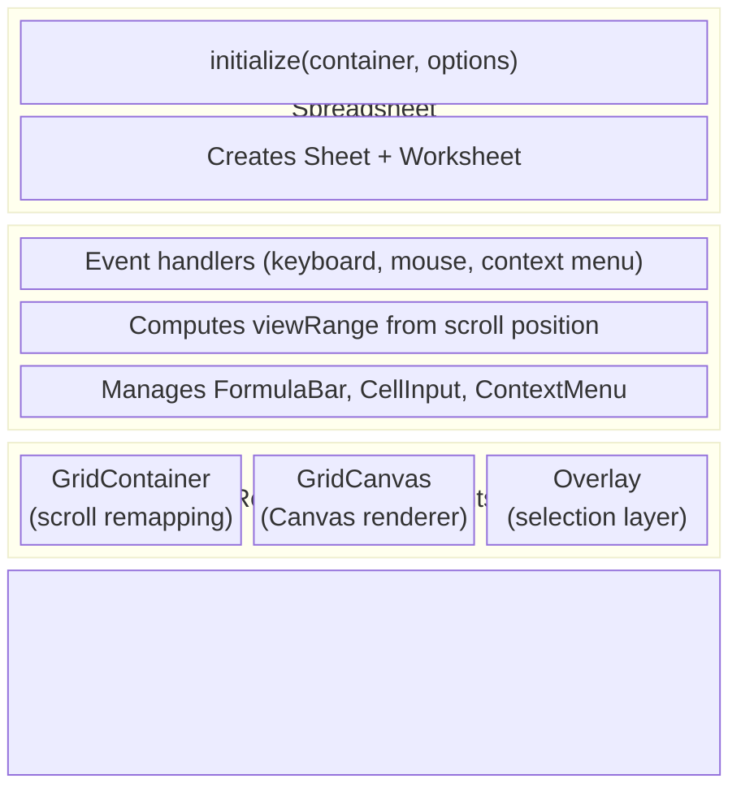

# Sheet Package

## Summary

The `@wafflebase/sheet` package is the core spreadsheet engine. It owns the data
model, formula evaluation, Canvas-based rendering, and the store abstraction that
decouples the engine from any specific persistence backend. The frontend package
depends on it and provides a `YorkieStore` for real-time collaboration.

### Goals

- Provide a self-contained spreadsheet engine that can run with any `Store`
  implementation (in-memory, CRDT-backed, server-backed, etc.).
- Support large grids (up to 1,000,000 rows x 182,780 columns) with
  viewport-only Canvas rendering.
- Evaluate formulas with correct dependency ordering and cycle detection.
- Handle row/column insert and delete with automatic formula reference shifting.

### Non-Goals

- Providing a UI framework — the engine renders on a raw `<canvas>` and
  `<div>` container; layout integration is the consumer's responsibility.
- Server-side execution — the engine runs entirely in the browser.

## Proposal Details

### Data Model

#### Core Types

```typescript
type Sref = string;                        // "A1"
type Srng = string;                        // "A1:B2"
type Reference = Sref | Srng;

type Ref = { r: number; c: number };       // 1-based numeric coordinate
type Range = [Ref, Ref];                   // [topLeft, bottomRight]

type Cell = { v?: string; f?: string };    // v = display value, f = formula
type Grid = Map<Sref, Cell>;              // Sparse cell map

type Direction = 'up' | 'down' | 'left' | 'right';
type Axis = 'row' | 'column';
```

#### Sheet Class

`Sheet` is the central data model. It owns the `Store` reference and provides
all cell, selection, and navigation operations.

**Key responsibilities:**

- **Cell access** — `getCell`, `setCell`, `setData` (detects formulas by `=`
  prefix), `removeData`, `fetchGrid`
- **Formula recalculation** — When a cell is set via `setData`, the sheet
  builds a dependants map from the store and invokes the `Calculator` to
  recalculate all affected cells in topological order.
- **Selection** — `activeCell`, `range`, `selectStart`/`selectEnd`,
  `selectAll` (expands until empty border)
- **Navigation** — `move`, `moveToEdge` (Ctrl+Arrow), `moveInRange`
  (Tab/Enter within selection, wraps around)
- **Row/column operations** — `insertRows`, `deleteRows`, `insertColumns`,
  `deleteColumns`. These delegate to the store and then recalculate shifted
  formulas. `moveRows` and `moveColumns` reorder rows/columns by remapping
  all cell positions and formula references.
- **Selection model** — `selectRow`, `selectColumn`, `selectRowRange`,
  `selectColumnRange` support whole-row/column selection.
  `getSelectionType()` returns `'cell' | 'row' | 'column'`.
  `getSelectedIndices()` returns the selected range for row/column selections.
- **Copy/paste** — `copy` serializes the selection as a tab/newline string;
  `paste` parses it back.
- **Dimensions** — `setRowHeight`, `setColumnWidth`, persisted to the store.

**Grid dimensions:** `1,000,000 rows x 182,780 columns` (constants in the
Sheet class). The `dimensionRange` property returns this as a `Range`.

### Store Interface

The `Store` interface is the abstraction boundary between the engine and
persistence. Every method is async to support both local and networked
implementations.

```typescript
interface Store {
  // Cell CRUD
  set(ref: Ref, value: Cell): Promise<void>;
  get(ref: Ref): Promise<Cell | undefined>;
  has(ref: Ref): Promise<boolean>;
  delete(ref: Ref): Promise<boolean>;

  // Bulk operations
  setGrid(grid: Grid): Promise<void>;
  getGrid(range: Range): Promise<Grid>;
  deleteRange(range: Range): Promise<Set<Sref>>;

  // Navigation
  findEdge(ref: Ref, direction: Direction, dimension: Range): Promise<Ref>;

  // Formula dependencies
  buildDependantsMap(srefs: Iterable<Sref>): Promise<Map<Sref, Set<Sref>>>;

  // Dimension management
  setDimensionSize(axis: Axis, index: number, size: number): Promise<void>;
  getDimensionSizes(axis: Axis): Promise<Map<number, number>>;

  // Row/column insert/delete
  shiftCells(axis: Axis, index: number, count: number): Promise<void>;

  // Row/column move
  moveCells(axis: Axis, srcIndex: number, count: number, dstIndex: number): Promise<void>;

  // Presence (sync, not async)
  getPresences(): Array<{ clientID: string; presence: { activeCell: string } }>;
  updateActiveCell(activeCell: Ref): void;
}
```

**MemStore** is the built-in in-memory implementation. It stores cells in a
`Map<Sref, Cell>`, dimension overrides in separate maps, and implements
`buildDependantsMap` by scanning all formulas in the grid to extract
references.

### Formula Engine

#### ANTLR Grammar

The grammar (`src/formula/antlr/Formula.g4`) defines:

```
formula: expr+
expr: FUNCNAME '(' args? ')'   // Function call
    | expr (MUL|DIV) expr      // Multiplication / division
    | expr (ADD|SUB) expr       // Addition / subtraction
    | NUM                       // Number literal
    | BOOL                      // TRUE / FALSE
    | REFERENCE                 // Cell ref (A1) or range (A1:B2)
    | '(' expr ')'             // Parentheses
```

Operator precedence: `* /` binds tighter than `+ -`. Cell references support
up to 3 letters and arbitrary row numbers (e.g., `ZZZ729443`).

#### Evaluation Pipeline

1. **Parse** — The formula string (minus the `=` prefix) is tokenized and
   parsed by the ANTLR-generated lexer/parser into an AST.
2. **Visit** — An `Evaluator` class (implementing the ANTLR visitor pattern)
   walks the AST. Each node evaluates to an `EvalNode`:
   - `NumNode { t: 'num', v: number }`
   - `StrNode { t: 'str', v: string }`
   - `BoolNode { t: 'bool', v: boolean }`
   - `RefNode { t: 'ref', v: Reference }`
   - `ErrNode { t: 'err', v: '#VALUE!' | '#REF!' | '#N/A!' | '#ERROR!' }`
3. **Resolve** — If the final result is a `RefNode`, its value is looked up
   from the provided `Grid`. Otherwise the result is converted to a string.

#### Built-in Functions

Functions are registered in `FunctionMap`. Currently implemented:

- **SUM** — Sums numeric arguments. Ranges are expanded to individual cells.
  Non-numeric values are coerced via `NumberArgs` (booleans → 0/1, strings →
  `parseFloat`, refs → looked up and converted).

#### Error Types

| Error | Meaning |
|-------|---------|
| `#VALUE!` | Type mismatch (e.g., arithmetic on non-numeric) |
| `#REF!` | Invalid cell reference (deleted cell, or out-of-range) |
| `#N/A!` | Function returned no applicable result |
| `#ERROR!` | Catch-all for unexpected evaluation errors |

### Calculator

The `Calculator` module (`src/model/calculator.ts`) recalculates formulas
after a cell change.

**Algorithm:**

1. `Sheet.setData` calls `store.buildDependantsMap(srefs)` to get a map of
   `Sref → Set<Sref>` (which cells depend on which).
2. `topologicalSort` performs a DFS on the dependants graph:
   - Tracks visited and in-stack nodes to detect cycles.
   - Returns `[sortedRefs, cycledRefs]`.
3. For each ref in topological order:
   - If the ref is in `cycledRefs`, its value is set to `#REF!`.
   - Otherwise, the formula is evaluated with the current grid state and the
     cell is updated.

### Shifting (Insert/Delete Rows and Columns)

When rows or columns are inserted or deleted, all affected data must be
adjusted:

- **`shiftRef`** — Adjusts a `Ref` coordinate. On insert (count > 0), refs at
  or after the index shift forward. On delete (count < 0), refs in the deleted
  zone become `null`; refs after shift backward.
- **`shiftFormula`** — Tokenizes a formula, shifts each `REFERENCE` token
  using `shiftRef`, and replaces deleted refs with `#REF!`.
- **`shiftGrid`** — Shifts all cells and their formulas in a `Grid`.
- **`shiftDimensionMap`** — Shifts keys in the row-height or column-width map.

The `Sheet.shiftCells` method orchestrates: it calls `store.shiftCells` (which
handles the actual data movement), then shifts the local `DimensionIndex`,
and finally recalculates all formulas that contain shifted references.

### Moving (Reorder Rows and Columns)

When rows or columns are moved to a new position, all affected data is
remapped rather than shifted:

- **`remapIndex(i, src, count, dst)`** — Pure function mapping an old 1-based
  index to its new position after moving `count` items from `src` to before
  `dst`. Moving forward: source goes to `dst-count`, items between shift back.
  Moving backward: source goes to `dst`, items between shift forward.
- **`moveRef`** — Remaps a `Ref` using `remapIndex` for a given axis.
- **`moveFormula`** — Tokenizes a formula, remaps each `REFERENCE` token.
- **`moveGrid`** — Remaps all cell keys and their formulas.
- **`moveDimensionMap`** — Remaps dimension size map keys.

The `Sheet.moveCells` method orchestrates: it calls `store.moveCells`, then
moves the local `DimensionIndex`, remaps `activeCell` and `range`, and
recalculates all formulas.

### Selection Model

`SelectionType = 'cell' | 'row' | 'column'` tracks whether individual cells
or entire rows/columns are selected.

- **`selectRow(row)`** / **`selectColumn(col)`** — Selects a single row/column.
- **`selectRowRange(from, to)`** / **`selectColumnRange(from, to)`** — Extends
  to multi-row/column selection (for drag-select on headers).
- **`getSelectedIndices()`** — Returns `{ axis, from, to }` or `null` for cell
  selections.
- **`selectStart()`** — Resets `selectionType` to `'cell'`.

The view layer uses selection state for:
- Header highlighting (blue tint on selected row/column headers)
- Full-viewport-width/height selection rectangles in the overlay
- Drag-to-move interaction (grab cursor on selected headers, drop indicator line)

### Rendering Pipeline

See also [scroll-and-rendering.md](scroll-and-rendering.md) for the scroll
remapping details.



**GridContainer** — Wraps a scrollable `<div>` with a dummy sized child. When
the logical grid size exceeds `MAX_SCROLL_SIZE` (10M px), scroll positions are
linearly remapped. All downstream code works in logical coordinates.

**GridCanvas** — Draws visible cells on a `<canvas>` sized to the viewport.
For each cell in `viewRange`, it computes pixel coordinates via
`DimensionIndex.getOffset` and renders borders, background, and text. Row and
column headers are drawn separately.

**Overlay** — A second `<canvas>` (z-index: 1, pointer-events: none) that
draws:
- Active cell border (2px stroke)
- Selection range (semi-transparent fill + border; full-width for row
  selections, full-height for column selections)
- Peer cursors (colored borders, one per remote user)
- Resize hover indicator (line on header edge during drag-to-resize)
- Move drop indicator (bold blue line at drop position during drag-to-move)

### DimensionIndex

`DimensionIndex` manages variable row heights or column widths. It stores only
non-default sizes in a `Map<number, number>` and provides:

- `getSize(index)` — Returns custom or default size.
- `getOffset(index)` — Pixel offset of the start of a 1-based row/column.
  Computed by summing default sizes for gaps and custom sizes for overrides.
- `findIndex(offset)` — Binary search to find which row/column a pixel offset
  falls into. Used by `viewRange` calculation.
- `shift(index, count)` — Adjusts keys when rows/columns are inserted or
  deleted.
- `move(src, count, dst)` — Remaps keys when rows/columns are moved.

Default sizes: **24px** row height, **100px** column width.

### Coordinate System

Cell coordinates are **1-based** (`A1` = `{r: 1, c: 1}`). Column labels use
base-26 encoding: A=1, Z=26, AA=27, up to ZZZ=18278.

Key functions in `src/model/coordinates.ts`:

- `parseRef("A1")` → `{r: 1, c: 1}`
- `toSref({r: 1, c: 1})` → `"A1"`
- `toColumnLabel(1)` → `"A"`, `toColumnLabel(27)` → `"AA"`
- `toRefs(range)` — Generator yielding all `Ref`s in a range
- `inRange(ref, range)` — Check if a ref is within a range
- `toRange(ref1, ref2)` — Normalize two refs into a `[min, max]` range

## Risks and Mitigation

**Formula function coverage** — Currently only `SUM` is implemented. New
functions are added to `FunctionMap` following the same pattern: accept a
`FunctionContext`, visitor, and optional grid; return an `EvalNode`.

**Large grid performance** — The rendering pipeline only draws visible cells,
and `DimensionIndex.findIndex` uses binary search, so performance is O(visible
cells) per frame regardless of total grid size. Scroll remapping handles
browser element-size limits.

**Circular references** — The calculator's topological sort detects cycles and
marks affected cells with `#REF!` rather than entering an infinite loop.
