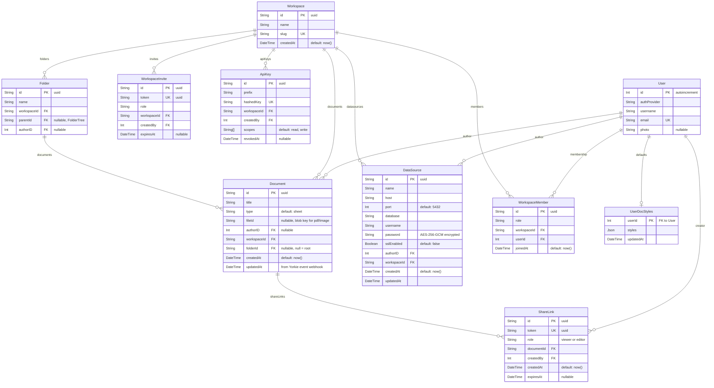

# Backend Package

## Summary

The backend is a NestJS 11 API server that provides authentication (GitHub
OAuth2 + JWT sessions) and document CRUD operations. It stores user and
document metadata in PostgreSQL via Prisma. The actual spreadsheet data lives
in Yorkie (managed by the frontend); the backend only manages document
ownership and user accounts.

### Goals

- Authenticate users via GitHub OAuth2 and issue JWT session cookies.
- Provide a REST API for creating, listing, and deleting spreadsheet documents.
- Enforce workspace-based access — members share their workspace's documents;
  deleting or moving a document is reserved to its manager (owner or author).

### Non-Goals

- Storing or processing spreadsheet cell data — that is handled entirely by
  Yorkie and the `@wafflebase/sheets` engine in the browser.
- Real-time communication — Yorkie handles WebSocket-based sync.

## Proposal Details

### Module Architecture

```mermaid
flowchart TD
  APP["AppModule"]
  APP --> CONFIG["ConfigModule (global)"]
  APP --> AUTH["AuthModule"]
  APP --> DOC["DocumentModule"]
  APP --> SHARE["ShareLinkModule"]
  APP --> DSRC["DataSourceModule"]
  APP --> WS["WorkspaceModule"]
  APP --> AK["ApiKeyModule"]
  APP --> YK["YorkieModule"]
  APP --> V1["ApiV1Module"]
  APP --> IMG["ImageModule"]
  APP --> FILE["FileModule"]
  APP --> HEALTH["HealthModule"]
  APP --> UDS["UserDocStylesModule"]
  APP --> ANL["AnalyticsModule"]
  APP --> FLD["FolderModule"]
  APP --> MIRO["MiroModule"]

  AUTH --> JWT_MOD["JwtModule (access token expiry)"]
  AUTH --> USER_MOD["UserModule"]
  AUTH --> GH["GitHubStrategy"]
  AUTH --> JW["JwtStrategy"]
  AUTH --> AC["AuthController"]
  AUTH --> AS["AuthService"]

  USER_MOD --> US["UserService"]
  USER_MOD --> PS1["PrismaService"]

  DOC --> DC["DocumentController"]
  DOC --> DS["DocumentService"]
  DOC --> US2["UserService"]
  DOC --> PS2["PrismaService"]

  SHARE --> SLC["ShareLinkController"]
  SHARE --> SLS["ShareLinkService"]
  SHARE --> PS3["PrismaService"]

  DSRC --> DSC["DataSourceController"]
  DSRC --> DSS["DataSourceService"]
  DSRC --> PS4["PrismaService"]
```



The diagram highlights the auth/document/share/datasource spine; `AppModule`
imports the full module set listed below.

| Module | Responsibility |
|--------|---------------|
| **AppModule** | Root module. Imports ConfigModule (global), LoggerModule (nestjs-pino), ThrottlerModule, plus the feature modules: AuthModule, DocumentModule, ShareLinkModule, DataSourceModule, WorkspaceModule, ApiKeyModule, YorkieModule, ApiV1Module, ImageModule, FileModule, HealthModule, UserDocStylesModule, AnalyticsModule, FolderModule, MiroModule. |
| **AuthModule** | GitHub OAuth + JWT authentication. Provides AuthService, GitHubStrategy, JwtStrategy, CliAuthStore. Imports UserModule for user lookup/creation. Configures one middleware, `CliLoginConfirmMiddleware`, on `GET /auth/github`. |
| **UserModule** | User CRUD via Prisma. Exports UserService for use by AuthModule and DocumentModule. |
| **DocumentModule** | Document REST endpoints. Uses DocumentService + UserService + PrismaService. |
| **ShareLinkModule** | URL-based document sharing with token-based access. Manages share link CRUD and public token resolution for anonymous access. |
| **DataSourceModule** | External PostgreSQL connection management. CRUD for connection configs, test connection, execute SELECT queries. Passwords encrypted at rest with AES-256-GCM. |
| **WorkspaceModule** | Workspaces, members, invites, and role resolution — the backbone of the workspace access model. |
| **ApiKeyModule** | Workspace-scoped API keys (`wfb_…`) for external/CLI access; generation, hashing, validation. |
| **YorkieModule** | Global Yorkie client (`withDocument(id, cb)`), the auth/event webhook surface, and server-side document reads. |
| **ApiV1Module** | REST API v1 (`/api/v1/…`) documents/tabs/cells over Yorkie, accepting JWT or API-key auth. |
| **ImageModule** / **FileModule** | Blob storage for embedded images and static file document types (pdf/image). |
| **HealthModule** | Liveness/readiness probes (`/health`, `/health/ready`). |
| **UserDocStylesModule** | Per-user default docs named styles. |
| **AnalyticsModule** | View-event Kafka producer + StarRocks reader (share-link analytics). |
| **FolderModule** | Workspace folder tree (organizational document grouping). |
| **MiroModule** | Miro board import support. |

### API Reference

#### Authentication (`/auth`)

**`GET /auth/github`**
- Middleware: `CliLoginConfirmMiddleware` · Guard: `GitHubAuthGuard`
- Initiates GitHub OAuth flow. Redirects to GitHub's authorization page.
- Refuses a **`?mode=cli`** start another site navigated the browser into,
  before any `state` is minted: a `Sec-Fetch-Site` of `cross-site` is a
  `400`. `none` (opened by `wafflebase login`), `same-origin` (the
  confirmation-page click), `same-site` and a client that sends no such
  header are served. Neither state mechanism covers this direction on its
  own — the navigation carrying the attack is also the one that mints the
  state and sets its cookie. A **browser** login is not checked: the login
  link lives on the frontend origin and points at `VITE_BACKEND_API_URL`,
  which need not share a site with it, so refusing `cross-site` would
  `400` every sign-in on such a deployment. The web flow's double-submit
  `state` cookie is set and read on the backend's own origin and covers it
  without help; the CLI's loopback code delivery has no such equivalent.
- Every login gets a `state`, minted by the guard and attached to the
  request as `__oauthState` — the single key `GitHubStrategy.authenticate`
  reads to put `state` on the wire. The two flows mint it differently:
  - **Browser** — a double-submit pair (`oauth-state.ts`): a random secret
    goes into the `__Host-wafflebase_oauth_state` cookie (unprefixed
    outside production, where the browser will not honour `__Host-`
    without `Secure`), its SHA-256 goes to
    GitHub as `web.<hash>`. No server-side map, so it survives a restart
    and works across replicas. The hash, not the secret, is what travels
    through GitHub, referrers and access logs.
  - **CLI** (`?mode=cli&port=…`) — a `CliAuthStore` token, because this
    flow also has to carry the loopback port and the CLI's per-attempt
    nonce. It is bound to the browser the same way: the guard mints a
    secret alongside it into the `__Host-wafflebase_cli_state` cookie and
    keeps only `sha256(secret)` beside the entry, and the callback
    consumes the state only against a matching cookie. Without that, the
    token is transferable — the confirmation click gates the *mint*, and
    an attacker can perform it in their own browser, lift the `state` out
    of the redirect to GitHub, and hand the victim a bare `authorize`
    URL, at which point the callback would mint a code for the victim's
    account bound to the attacker's challenge and loopback port.
- `?mode=cli` is unauthenticated and takes the loopback port off the query
  string, so a page the victim visits could otherwise navigate them to it
  and have the backend mint an auth code for the *victim* at a port the
  attacker chose. The loopback nonce cannot cover that direction (the
  attacker picked the nonce), so `CliLoginConfirmMiddleware` gates it on a
  click the attacker cannot forge: an interstitial page whose Continue
  link carries a `wafflebase_cli_confirm` cookie secret back as
  `?confirm=`, and which re-encodes `mode`/`port`/`nonce` so the login's
  parameters survive the hop.
- Because that gate *is* a cookie, a deployment where cookies cannot be
  `Secure` has no gate at all: anything on the network path or on a sibling
  subdomain can plant `wafflebase_cli_confirm` and click itself through. So
  `?mode=cli` is refused there outright — `400 Command-line sign-in requires
  an https server` (`cliLoginAvailable()`), and the middleware shows no
  confirmation page rather than one that proves nothing. The predicate asks
  for positive evidence that the cookie can be *trusted*, not for evidence
  that it cannot: `useSecureCookies()` (`COOKIE_SECURE` first, then
  `GITHUB_CALLBACK_URL`'s scheme, then `NODE_ENV`), or a loopback callback
  host — a secure context in the browser, and how the flow is developed.
  Everything else is refused, including an install that configures **no**
  callback URL: passport passes `callbackURL: undefined` and GitHub falls
  back to the URL registered on the OAuth app, so that is a working
  deployment whose scheme the backend cannot see, and exempting it turned the
  gate off on exactly the cleartext origin it exists for. Such an install
  says which it is with `GITHUB_CALLBACK_URL` or `COOKIE_SECURE=true`; with
  `NODE_ENV=production` it is already answered, since the cookie then really
  does go out `Secure` and a cleartext origin makes the browser drop it —
  failing the gate closed. The browser login stays available, since its
  failure mode is a refused login rather than a stolen one and refusing it
  would leave such a deployment with no way in.
- The same predicate names the downgrade the other way round: a
  `NODE_ENV=production` install whose origin reads as cleartext non-loopback
  is issuing **session** cookies without `Secure`, and the guard logs one
  warning about it at the first login. An explicit `COOKIE_SECURE=false`
  does not silence it — that variable states the origin's scheme, which is
  the finding, not a waiver.

**`GET /auth/github/callback`**
- Guard: `AuthGuard('github')`
- GitHub redirects here after user consents. The `GitHubStrategy` validates the
  profile and returns user data. The controller then:
  1. Calls `UserService.findOrCreateUser()` to upsert the user in the database.
  2. Requires a `state`. A callback without one is never a login this
     server started; accepting it is login CSRF — an attacker replays a
     code obtained for *their* account through the victim's browser and
     the victim is silently signed into it (session fixation).
     - Browser `state` must match the `__Host-wafflebase_oauth_state`
       cookie, which is cleared on use. Only that name is read — an
       unprefixed leftover is not accepted in production.
     - Otherwise it is consumed as a CLI state token, which likewise
       requires the `__Host-wafflebase_cli_state` cookie minted with it
       (cleared on use, single-use, spent even on a mismatch). Only then
       does the callback redirect to `http://127.0.0.1:<port>/callback`
       echoing the CLI's nonce as `state`; a state completed in another
       browser is refused.
  3. Calls `AuthService.createTokens()` to sign access/refresh JWTs.
  4. Sets httpOnly cookies named `wafflebase_session` and
     `wafflebase_refresh` — `__Host-` prefixed wherever cookies are
     `Secure`, like every other login cookie.
  5. Redirects to `FRONTEND_URL`.
- A browser login that fails the state check is **redirected** to
  `FRONTEND_URL/login?error=oauth_state`, not answered with a 400. Losing
  the state needs no attacker — the cookie lives ten minutes, which a
  first-time sign-up with 2FA can outlast, and a second login tab
  overwrites the first tab's — and a thrown error would leave the user on
  the backend origin looking at raw JSON with no way back. Refusing the
  login and returning the user somewhere they can retry are independent:
  no session is issued on either path.

**`GET /auth/me`**
- Guard: `JwtAuthGuard`
- Returns the authenticated user object from the JWT payload.

**`POST /auth/refresh`**
- Guard: none (refresh cookie required)
- Verifies `wafflebase_refresh` and rotates both auth cookies.
- Returns `401` when the refresh token is missing/invalid or user is gone.

**`POST /auth/logout`**
- Guard: none (public endpoint)
- Clears `wafflebase_session` and `wafflebase_refresh`, in both their
  prefixed and unprefixed names and with and without `Secure`, so a cookie
  written under a previous configuration is expired too.

**`GET /auth/yorkie-token`**
- Guard: `JwtAuthGuard`
- Mints a short-lived token for the Yorkie client's `authTokenInjector` — the
  session JWT lives in an httpOnly cookie the browser can't read, so the
  frontend fetches this instead. The Yorkie auth webhook resolves per-document
  access from the returned token (see [yorkie-auth-webhook.md](yorkie-auth-webhook.md)).

**`POST /auth/yorkie-token/share`**
- Guard: none (public — no session)
- Body: `{ token }` (a share token). Returns a short-lived Yorkie token that
  wraps the share token; the webhook does the real validation (existence,
  expiry, document match, role). POST keeps the access-granting token out of
  request URLs and access logs.

**`POST /auth/cli/exchange`**
- Guard: none (public — one-time CLI auth code)
- Body: `{ code, verifier }`. Exchanges a one-time code minted during the CLI
  OAuth flow for `{ accessToken, refreshToken }`. Rate-limited to 10 req/60s/IP.
- The `verifier` is **required**: the code travels to the CLI as plaintext in a
  loopback redirect URL, so on its own it would be a bearer credential worth a
  full session. `CliAuthStore.createCode` binds it to the login attempt's
  `sha256(verifier)` challenge (PKCE S256, registered at
  `GET /auth/github?...&challenge=`), and `consumeCode` spends the entry on any
  attempt and releases the user id only on a constant-time challenge match. A
  CLI login carrying no challenge is refused at the callback — no unbound code
  is ever minted.

#### Documents (`/documents`)

All endpoints require `JwtAuthGuard`.

Access follows the **workspace** model, not document authorship alone: every
member of a document's workspace has `rw` on it. A document's **manager** —
the workspace owner **or** the document's `authorID` — is additionally the tier
allowed to delete or move it (`DocumentController.resolveDocManager`).

**`GET /documents`**
- Returns all documents across every workspace the user belongs to, each row
  annotated with `canManage` (owner-of-workspace or author) so the client can
  gate Delete/Move without re-deriving roles.

**`GET /documents/:id`**
- Returns the document if the user is a member of its workspace.
- Throws `ForbiddenException` (403) otherwise.

**`POST /documents` / `POST /workspaces/:workspaceId/documents`**
- Body: `{ title: string, type?, workspaceId }`
- Requires workspace membership. Creates a document with `authorID` set to the
  caller.

**`PATCH /documents/:id`**
- Rename (`{ title }`) — any workspace member.
- Move (`{ workspaceId }`) — manager only (owner or author); the caller must
  also be a member of the destination workspace. `403` otherwise.

**`POST /documents/:id/copy`**
- Duplicates the document into the same workspace and folder as
  `<title> (copy)`, owned by the caller — see
  [document-copy.md](document-copy.md).
- Requires workspace membership only, **not** the manager gate: copying neither
  modifies, moves, nor destroys the source. This is the one document action
  where the two gates diverge.

**`DELETE /documents/:id`**
- Deletes the document if the caller is its manager (workspace owner or author).
- Throws `ForbiddenException` (403) for a non-manager member. Best-effort blob
  cleanup for `pdf` documents.

The REST v1 `DELETE /api/v1/workspaces/:wid/documents/:did` applies the same
manager gate to every caller. An API key carries the authority of the user who
minted it, resolved against that user's membership at request time: a key is
mintable only by a workspace owner (`assertOwner`), so a live owner's key is
unaffected, while a key whose minter was demoted or removed is refused —
`WorkspaceScopeGuard` requires the minting user still be a member. It must
also carry the `write` scope — a read-only key is rejected.

#### Share Links (`/documents/:id/share-links`, `/share-links`)

Share-link authority mirrors the document model — see
[sharing.md](sharing.md) for the full matrix. `isManager = isOwner || isAuthor`.

**`POST /documents/:id/share-links`**
- Guard: `JwtAuthGuard`
- Body: `{ role: "viewer" | "editor", expiration: "1h" | "8h" | "24h" | "7d" | null }`
- Any workspace member may create a `viewer` link; only a manager may create an
  `editor` link. Returns the created ShareLink (including `token`).

**`GET /documents/:id/share-links`**
- Guard: `JwtAuthGuard`
- Any workspace member may list. Returns `{ links, permissions:
  { canCreateEditorLink } }`, each link annotated with `canDelete`. Editor
  links a non-manager did not create are omitted (a token is redistributable).

**`DELETE /share-links/:id`**
- Guard: `JwtAuthGuard`
- Revokes a share link. The link's creator may always revoke it; a manager may
  revoke any link on the document.

**`GET /share-links/:token/resolve`** *(public — no auth required)*
- Resolves a share token to document info.
- Returns `{ documentId, role, title, type }` if the token is valid and not expired.
- Returns `410 Gone` if the token has expired.
- Returns `404 Not Found` if the token is invalid.

#### DataSources (`/datasources`)

All endpoints require `JwtAuthGuard`. Access is **workspace-scoped**: each
route resolves the datasource's `workspaceId` and calls
`WorkspaceService.assertMember`, so any member of the owning workspace has full
access (datasources are owned by a workspace, not by their author). Companion
workspace-scoped routes (`POST`/`GET /workspaces/:workspaceId/datasources`, plus
`POST /workspaces/:workspaceId/datasources/test`) list, create, and test within
one workspace; those resolve the workspace from the path instead.

**`POST /datasources`**
- Body: `{ name, host, port?, database, username, password, sslEnabled? }`
- Creates a datasource connection. Password is encrypted with AES-256-GCM.

**`GET /datasources`**
- Returns all datasources across every workspace the authenticated user is a
  member of. Passwords are masked.

**`GET /datasources/:id`**
- Returns a single datasource. Password is masked.

**`PATCH /datasources/:id`**
- Body: Partial update of connection fields.
- If `password` is provided, it is re-encrypted.

**`DELETE /datasources/:id`**
- Deletes the datasource connection.

**`POST /datasources/:id/test`**
- Tests a saved connection by running `SELECT 1`.
- Returns `{ success: boolean, error?: string }`.

**`POST /workspaces/:workspaceId/datasources/test`**
- Body: `{ host, port?, database, username, password, sslEnabled? }`
- Tests connection settings that have not been saved, so the creation dialog
  can validate before anything is written. Persists nothing.
- Returns `{ success: boolean, error?: string }`.

**`POST /datasources/:id/query`**
- Body: `{ query: string }`
- Validates that the query is SELECT-only (rejects INSERT/UPDATE/DELETE/DROP etc.).
- Executes the query with a 30-second timeout and 10,000 row limit.
- Returns `{ columns, rows, rowCount, truncated, executionTime }`.
- Uses an ephemeral `pg.Client` (not the app's Prisma connection).

### Auth System

#### GitHub OAuth2 Strategy

`GitHubStrategy` extends Passport's `passport-github2` strategy:

- **Scopes:** `user:email`, `user:avatar`
- **Config:** `GITHUB_CLIENT_ID`, `GITHUB_CLIENT_SECRET`, `GITHUB_CALLBACK_URL`
  from environment.
- **Validation:** Extracts `authProvider`, `githubId`, `username`, `email`,
  `photo`, and `accessToken` from the GitHub profile.

#### JWT Strategy

`JwtStrategy` extends Passport's `passport-jwt` strategy:

- **Token source:** Extracted from the `wafflebase_session` cookie
  (not the Authorization header) — under the `__Host-` prefixed name
  wherever cookies are `Secure`, and only that name.
- **Secret:** `JWT_SECRET` from environment.
- **Validation:** Extracts `id` (from `sub`), `username`, `email`, `photo`
  from the JWT payload and attaches to `req.user`.

#### JWT Tokens

Created by `AuthService.createTokens()`:

```typescript
{
  sub: user.id,           // User database ID
  username: user.username,
  email: user.email,
  photo: user.photo,      // nullable
  tokenType: "access" | "refresh"
}
```

- Access token default expiry: **1 hour** (`JWT_ACCESS_EXPIRES_IN`)
- Refresh token default expiry: **7 days** (`JWT_REFRESH_EXPIRES_IN`)
- Refresh token secret: `JWT_REFRESH_SECRET` (falls back to `JWT_SECRET`)

#### Cookie Configuration

"Production" below means an **https** origin. Every cookie's `Secure` flag —
session, refresh and the three login cookies alike — comes from one predicate
(`secureCookies`), which reads the scheme of the configured
`GITHUB_CALLBACK_URL` and only falls back to `NODE_ENV=production` when no
callback URL is configured at all. `NODE_ENV` is not an override: the shipped
image sets it while a self-hosted install may be served over plain http, and a
`Secure` cookie sent from an http origin is discarded by the browser — which
is a login that dead-ends, not a login that is safer.

| Cookie | Production | Development |
|--------|------------|-------------|
| `__Host-wafflebase_session` | httpOnly, secure, sameSite=`lax`, path=`/`, maxAge=1h by default | `wafflebase_session` (unprefixed), secure=`false` |
| `__Host-wafflebase_refresh` | httpOnly, secure, sameSite=`lax`, path=`/`, maxAge=7d by default | `wafflebase_refresh` (unprefixed), secure=`false` |
| `__Host-wafflebase_oauth_state` | httpOnly, secure, sameSite=`lax`, path=`/`, maxAge=10m | `wafflebase_oauth_state` (unprefixed), secure=`false` |
| `__Host-wafflebase_cli_confirm` | httpOnly, secure, sameSite=`lax`, path=`/`, short-lived | `wafflebase_cli_confirm` (unprefixed), secure=`false` |

The two OAuth cookies are single-use: they exist only for the duration
of one login and are cleared when consumed.

The **session and refresh cookies take the prefix too**, from the same
helper. `Secure` covers only the read side; the cookies worth stealing were
the only login cookies whose *write* side was unrestricted, so a foothold on
any sibling subdomain could set `wafflebase_session=<its own JWT>;
Domain=<parent>` and the victim would browse as the attacker (session
fixation). `JwtStrategy` reads only the name this deployment mints — an
unprefixed leftover is ignored, which is what makes the prefix worth
anything — so a session issued before a deployment turned `Secure` on is not
recognised and the browser is sent through the login again.

`clearAuthCookies` is deliberately blunter than that: sign-out expires both
names and emits each with **and** without `Secure`. A `Set-Cookie` carrying
`Secure` is discarded on a plain-http connection, so clearing only with the
configured flag would answer `200` and leave the session alive on an origin
served over http whose config says otherwise (`COOKIE_SECURE=true`, or a
proxy that is no longer in front). A deletion carries no credential, so
sweeping every shape is free where *accepting* every shape would not be.

The state cookie carries the **`__Host-` prefix** in production, which
costs it the narrower `path=/auth` (the prefix is honoured only on a
`Secure` cookie with `Path=/` and no `Domain`). That trade is the point:
a double-submit pair is only as strong as the browser's guarantee that
nothing but this exact origin can write the cookie, and without the
prefix a foothold on any sibling subdomain can set
`wafflebase_oauth_state=<attacker secret>; Domain=<parent>` and restore
the login CSRF the state exists to close. An HMAC would not help — the
attacker can mint a legitimate pair by starting their own login — so the
write restriction is the only property that does. The callback reads
**only** the name it would mint now, with no fallback to the unprefixed
one. The prefix requires `Secure`, which a plain-HTTP dev server cannot
set, hence the unprefixed development name.

The CLI confirmation cookie is prefixed on the same terms and for the
same reason: the click it stands for is proven by possession of that
cookie alone, so a sibling subdomain able to write it holds both halves
of the `?confirm=` pair and can walk itself through the consent gate.
Both names come from one helper (`hostPrefixedCookieName`), so a
deployment cannot end up with one cookie hardened and the other not.
Both are `lax` rather than `strict` for the same reason as the session
cookies — GitHub redirects the browser back to us, and a `strict` cookie
is withheld on that cross-site navigation, so every login would fail its
own state check.

**"Production" here means an https origin, not `NODE_ENV`.**
`useSecureCookies()` reads `GITHUB_CALLBACK_URL`'s scheme — that URL is
where GitHub redirects the login, so it *is* this server's public scheme,
and a configured value gives the same answer on the request that sets the
cookie and the callback that reads it, which a per-request `req.secure`
behind a proxy would not. `NODE_ENV` is only the fallback for a
deployment that configures no callback URL at all. Keying on it instead
got the rule wrong in both directions: it dropped the prefix — the only
thing stopping a sibling subdomain from planting the browser's half — on
every https deployment that did not happen to set the variable, and it
set `Secure`/`__Host-` cookies on plain-http origins, where the browser
discards them, leaving the callback unable to find its own state cookie.
`COOKIE_SECURE=true` is the escape hatch for a TLS-terminating edge in
front of an `http://` callback URL, which would otherwise downgrade the
session cookie too. One answer serves the session cookies, the OAuth
state cookies and the CLI confirmation cookie, so they cannot drift
apart.

**The confirmation is bound to the parameters it displayed.** The
`?confirm=` on the Continue link is not a copy of the cookie but
`HMAC(cookie secret, port | nonce | challenge)` (`cliConfirmToken`,
length-prefixed parts), recomputed by the middleware from the request's
*own* parameters. A bare copy would prove only that this browser was
shown *some* confirmation page recently — which is the wrong claim, since
the whole defence is that a person read the port on the page they
clicked. Binding it means a confirmation obtained once cannot be replayed
against a different loopback port or a different PKCE challenge without a
second page being shown. A crafted link still cannot pre-supply the
token: computing it needs the httpOnly cookie that page set.

SameSite=`lax` blocks third-party cross-site requests from carrying the
session — the common CSRF vector — while still letting the OAuth
callback redirect and same-eTLD+1 XHR through. The deployment assumption
is that frontend and backend share an eTLD+1 (e.g. `*.wafflebase.com`).
Cross-eTLD deployments would need SameSite=`none` paired with a CSRF
token, not introduced yet.

### Observability

Structured request/response logs via [`nestjs-pino`](https://github.com/iamolegga/nestjs-pino),
configured in `packages/backend/src/app.module.ts`:

- Log level controlled by `LOG_LEVEL` (default `info`).
- Custom serializers slim each access log to `{ method, url,
  remoteAddress, userAgent, statusCode, responseTime }` — pino-http's
  default would dump every request header (`sec-ch-ua-*`,
  `accept-encoding`, `if-none-match`, etc.) on every line and inflate
  log volume by ~5×. Full headers remain reachable at `debug`.
- `customLogLevel`:
  - `5xx | err → error`, `4xx → warn`.
  - Every mutation (`POST`/`PUT`/`PATCH`/`DELETE`) → `info`. Covers
    doc create, content import, share-link create, invite, api-key
    rotation, datasource CRUD, etc. without needing per-endpoint
    instrumentation.
  - Two high-volume paths drop to `debug` regardless of method:
    image upload/fetch (`/images/*`) and cell-level CRUD
    (`/cells/*`) — both are bursty and not individually
    audit-worthy.
  - Reads (`GET`/`HEAD`/`OPTIONS`) → `debug`.
- Set `LOG_LEVEL=debug` in incident response when full access logs
  are needed temporarily.
- `/health` and `/health/ready` are skipped — orchestrator probes
  would otherwise dominate the log stream.
- `req.headers.authorization`, `req.headers.cookie`, and outgoing
  `set-cookie` are redacted.
- URLs are filtered by `logSafeUrl`
  (`packages/backend/src/logging/log-safe-url.ts`) before the `url` field is
  logged: an `/auth` request loses its whole query (the CLI's `nonce` and
  `code_challenge` outbound, GitHub's `code`/`state` inbound), and everywhere
  else the *values* of granting parameters — `token` (the share-link
  credential on `GET /documents/:id/file`), `code`, `api_key`, … — become
  `<redacted>` while the names stay. A credential that rides in the **path**
  rather than the query is redacted by segment shape, and there are two:
  `GET /share-links/:token/resolve` carries the same share token as `?token=`
  does, and `POST /invites/:token/accept` carries the token that grants
  workspace membership; they log as `/share-links/<redacted>/resolve` and
  `/invites/<redacted>/accept`. The invite is the stricter case — being a
  mutation it is logged at `info` on *success*, so an ordinary accept would
  otherwise park a live invite in the log. Both predicates match every
  spelling the router accepts (case-insensitive, percent-decoded, collapsed
  slashes), because every 4xx is logged at `warn`.
- Production emits raw JSON (one line per event); non-production pipes
  through `pino-pretty` for readability.
- `autoLogging` is disabled entirely under `NODE_ENV=test`.

`/health` endpoints live in `packages/backend/src/health/health.controller.ts` and are
exempt from the rate limiter via `@SkipThrottle()`:

| Route | Purpose | Behavior |
|-------|---------|----------|
| `GET /health` | Liveness probe | Always 200 with `{ status: 'ok' }`. No dependencies touched. |
| `GET /health/ready` | Readiness probe | Runs `SELECT 1` through Prisma. 503 with `{ status: 'unhealthy', database: 'unreachable' }` on failure; full error is logged via Pino, not returned to the caller. |

Readiness intentionally probes Postgres only. Yorkie is on the request
path for most doc/sheet/slides interactions, so a Yorkie reachability
check should be added before this endpoint is wired into kubelet
readiness gating — tracked as a follow-up.

### Rate Limiting

Per-IP throttling via [`@nestjs/throttler`](https://docs.nestjs.com/security/rate-limiting),
registered as an `APP_GUARD` in `packages/backend/src/app.module.ts`:

| Route group | Limit | Source |
|-------------|-------|--------|
| All routes (implicit) | 120 req / 60s / IP | `default` bucket |
| `/auth/github/callback`, `/auth/refresh`, `/auth/cli/exchange` | 10 req / 60s / IP | `@Throttle({ default: { limit: 10, ttl: 60_000 } })` |
| `/images/**`, `/api/v1/workspaces/:id/images/**` | 600 req / 60s / IP | controller-level `@Throttle` — opening a doc with many embedded images bursts past the global cap |
| `/health`, `/health/ready` | exempt | `@SkipThrottle()` |

A single named bucket on purpose — adding a second strict bucket stacks
across every route and silently caps all traffic at the lowest limit.
Auth routes opt into a stricter limit by overriding the `default`
bucket per-route. Per-API-key throttling for `/api/v1/*` (currently
sharing the global IP bucket) is a planned follow-up.

`req.ip` is derived from the proxy hop count configured via
`BACKEND_TRUST_PROXY` (default 0 — direct connections only). Set to
`1` behind a single edge proxy (nginx, Cloudflare). Enabling
`trust proxy` without a real proxy in front would let any client spoof
`X-Forwarded-For` to bypass per-IP limits. The limiter is bypassed
under `NODE_ENV=test` so unit and e2e suites can burst without 429s.

### Database Schema

PostgreSQL managed by Prisma (`packages/backend/prisma/schema.prisma`):



**User:**
- `id` — Auto-increment integer primary key.
- `authProvider` — OAuth provider name (currently always `"github"`).
- `email` — Unique constraint; used for `findOrCreateUser` matching.
- `photo` — Optional profile photo URL.

**Document:**
- `id` — UUID primary key (auto-generated).
- `type` — Document type, default `"sheet"` (sheet/doc/slide/note/board/pdf/image).
- `fileId` — Nullable blob-storage key for static file types (pdf/image).
- `authorID` — Nullable foreign key to User. Nullable so documents can survive
  user deletion.
- `workspaceId` — Foreign key to Workspace (cascade). Every document belongs to a
  workspace — the basis of the access model.
- `folderId` — Nullable foreign key to Folder (`SetNull`); `null` = workspace root.
- `createdAt` — Auto-set on creation.
- `updatedAt` — Last-modified time, set explicitly from Yorkie's
  `DocumentRootChanged` event webhook (not Prisma's `@updatedAt`, since content
  edits never pass through this backend). Used to order the documents list.

**ShareLink:**
- `id` — UUID primary key (auto-generated).
- `token` — Unique UUID used in shareable URLs. Unguessable (122 bits of entropy).
- `role` — Access level: `"viewer"` (read-only) or `"editor"` (full access).
- `documentId` — Foreign key to Document. Cascade-deletes when document is deleted.
- `createdBy` — Foreign key to User (the document owner who created the link).
- `expiresAt` — Optional expiration timestamp. `null` means no expiration.

**Workspace / WorkspaceMember / WorkspaceInvite:**
- `Workspace` — Top-level tenant (unique `slug`) owning documents, folders,
  datasources, and API keys.
- `WorkspaceMember` — Join row carrying a per-user `role` (unique on
  `[workspaceId, userId]`); this is what `WorkspaceService.assertMember` and the
  manager checks resolve against.
- `WorkspaceInvite` — Tokenized, optionally-expiring invitation to join a
  workspace with a given `role`.

**ApiKey:**
- Workspace-scoped external credential (`wfb_…`). Stores only `prefix` +
  unique `hashedKey` (SHA-256), a `scopes` array (default `["read", "write"]`),
  and a nullable `revokedAt` soft-revoke timestamp.

**Folder / UserDocStyles:**
- `Folder` — Workspace-scoped organizational tree (self-referential `parentId`
  via the `FolderTree` relation); purely organizational, no permission effect.
- `UserDocStyles` — Per-user default docs named styles, a single `Json` blob
  keyed by `userId`.

### Environment Configuration

| Variable | Required | Default | Description |
|----------|----------|---------|-------------|
| `FRONTEND_URL` | Yes | — | Frontend origin for CORS and OAuth redirect |
| `DATABASE_URL` | Yes | — | PostgreSQL connection string |
| `JWT_SECRET` | Yes | — | Secret for signing JWT tokens |
| `JWT_REFRESH_SECRET` | No | `JWT_SECRET` | Secret for refresh-token signing |
| `OAUTH_STATE_SECRET` | No | HKDF of `JWT_SECRET` | Key the OAuth login bindings are signed with. Unset, it is derived from `JWT_SECRET` with a fixed label, so no deployment has to configure it; set it to an independent value to remove any relation between the `state` an unauthenticated `GET /auth/github` publishes and the session-signing key. |
| `JWT_ACCESS_EXPIRES_IN` | No | `1h` | Access-token expiry passed to `jsonwebtoken` |
| `JWT_REFRESH_EXPIRES_IN` | No | `7d` | Refresh-token expiry passed to `jsonwebtoken` |
| `JWT_ACCESS_COOKIE_MAX_AGE_MS` | No | `3600000` | Access-cookie max-age in milliseconds |
| `JWT_REFRESH_COOKIE_MAX_AGE_MS` | No | `604800000` | Refresh-cookie max-age in milliseconds |
| `GITHUB_CLIENT_ID` | Yes | — | GitHub OAuth app client ID |
| `GITHUB_CLIENT_SECRET` | Yes | — | GitHub OAuth app client secret |
| `GITHUB_CALLBACK_URL` | No | `http://localhost:3000/auth/github/callback` | OAuth callback URL |
| `PORT` | No | `3000` | Server listen port |
| `NODE_ENV` | No | — | Affects log transport and rate-limiter skip, and is the *fallback* for the cookie `secure` flag when `GITHUB_CALLBACK_URL` is unset (an explicit `http://` or `https://` callback wins). `production` enables JSON Pino logs; `test` disables the limiter and autoLogging. |
| `LOG_LEVEL` | No | `info` | Pino log level (`trace`/`debug`/`info`/`warn`/`error`/`fatal`/`silent`). |
| `BACKEND_TRUST_PROXY` | No | `0` | Number of upstream proxy hops to trust for `req.ip`. Set to `1` behind a single edge proxy (nginx, Cloudflare). Leave at `0` for direct exposure to prevent `X-Forwarded-For` spoofing. |
| `BACKEND_JSON_BODY_LIMIT` | No | `25mb` | Max JSON request body. Passed verbatim to `body-parser`. |
| `DATASOURCE_ENCRYPTION_KEY` | No* | — | 64-char hex string (32 bytes) for AES-256-GCM password encryption. *Required if DataSource feature is used. |

### Testing Strategy

- **Unit tests (`pnpm backend test`)** cover SQL validation and core
  datasource behavior with mocked persistence/network clients.
- **E2E tests (`pnpm backend test:e2e`)** include:
  - controller contract tests with mocked services (`packages/backend/test/http.e2e-spec.ts`).
  - DB-backed integration tests (`packages/backend/test/database.e2e-spec.ts`) for
    datasource/share-link services using Prisma + PostgreSQL.
  - authenticated HTTP integration tests
    (`packages/backend/test/authenticated-http.e2e-spec.ts`) that run through JWT cookie auth,
    guards, controllers, Prisma, and PostgreSQL for core ownership flows.
- DB-backed tests are gated by `RUN_DB_INTEGRATION_TESTS=true` so local runs
  can opt in explicitly.

### Security

**CORS** — Configured in `packages/backend/src/main.ts`:
- `origin`: Only allows requests from `FRONTEND_URL`.
- `credentials: true`: Required for cookie-based auth.
- Allowed methods: GET, POST, PUT, DELETE, PATCH, OPTIONS.
- Allowed headers: Content-Type, Authorization.

**httpOnly cookies** — Access/refresh tokens are stored in httpOnly cookies,
preventing client-side JavaScript from reading them. This mitigates XSS-based
token theft.

**SameSite** — Set to `'lax'` in every environment. Blocks third-party
cross-site requests from carrying the session (the common CSRF vector).
Deployment assumes frontend and backend share an eTLD+1
(e.g. `*.wafflebase.com`). Cross-eTLD deployments would need
`SameSite=None` paired with a CSRF token, not yet implemented.

**Authorization checks** — Document endpoints verify workspace membership
(`WorkspaceService.assertMember`) for read/edit, and additionally require the
caller to be the document's **manager** (workspace owner or `authorID`) to
delete or move it. Unauthorized access throws `ForbiddenException` (HTTP 403).

**Middleware pipeline:**

```
Request
  → cookie-parser (parses cookies into req.cookies)
  → CORS check
  → Passport JwtStrategy (extracts and validates JWT from cookie)
  → Route handler
  → Response
```

## Risks and Mitigation

**Single OAuth provider** — Currently only GitHub OAuth is supported. Adding
more providers (Google, email/password) requires adding new Passport
strategies and updating the `authProvider` field. The architecture supports
this via Passport's multi-strategy pattern.

**Single-bucket rate limiting** — A single `default` bucket (120 req/min/IP)
guards every route, with `@Throttle({ default: { limit: 10, ttl: 60_000 } })`
overrides on auth endpoints. `/api/v1/*` and authenticated app traffic
currently share this bucket; a per-API-key bucket is a planned follow-up.
Behind a multi-hop proxy edge, `trust proxy: 1` (in `packages/backend/src/main.ts`) must be
revisited so `req.ip` resolves correctly.

**Cookie security in development** — `secure: false` in development means
cookies are sent over HTTP. Acceptable for local-only testing; the
production build sets `secure: true` automatically.
