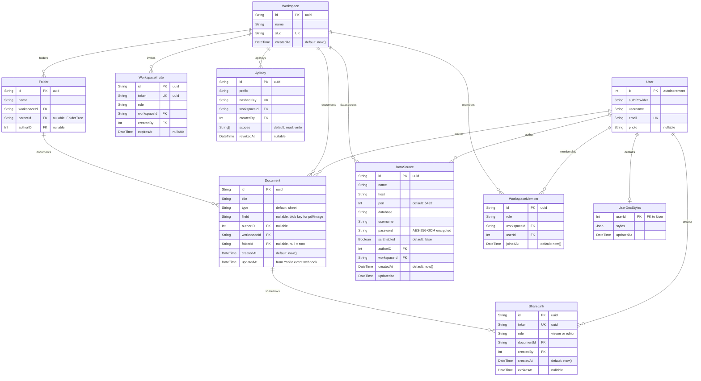

# Backend Package

## Summary

The backend is a NestJS 11 API server that provides authentication (GitHub
OAuth2 + JWT sessions) and document CRUD operations. It stores user and
document metadata in PostgreSQL via Prisma. The actual spreadsheet data lives
in Yorkie (managed by the frontend); the backend only manages document
ownership and user accounts.

### Goals

- Authenticate users via GitHub OAuth2 and issue JWT session cookies.
- Provide a REST API for creating, listing, and deleting spreadsheet documents.
- Enforce workspace-based access — members share their workspace's documents;
  deleting or moving a document is reserved to its manager (owner or author).

### Non-Goals

- Storing or processing spreadsheet cell data — that is handled entirely by
  Yorkie and the `@wafflebase/sheets` engine in the browser.
- Real-time communication — Yorkie handles WebSocket-based sync.

## Proposal Details

### Module Architecture

```mermaid
flowchart TD
  APP["AppModule"]
  APP --> CONFIG["ConfigModule (global)"]
  APP --> AUTH["AuthModule"]
  APP --> DOC["DocumentModule"]
  APP --> SHARE["ShareLinkModule"]
  APP --> DSRC["DataSourceModule"]
  APP --> WS["WorkspaceModule"]
  APP --> AK["ApiKeyModule"]
  APP --> YK["YorkieModule"]
  APP --> V1["ApiV1Module"]
  APP --> IMG["ImageModule"]
  APP --> FILE["FileModule"]
  APP --> HEALTH["HealthModule"]
  APP --> UDS["UserDocStylesModule"]
  APP --> ANL["AnalyticsModule"]
  APP --> FLD["FolderModule"]
  APP --> MIRO["MiroModule"]

  AUTH --> JWT_MOD["JwtModule (access token expiry)"]
  AUTH --> USER_MOD["UserModule"]
  AUTH --> GH["GitHubStrategy"]
  AUTH --> JW["JwtStrategy"]
  AUTH --> AC["AuthController"]
  AUTH --> AS["AuthService"]

  USER_MOD --> US["UserService"]
  USER_MOD --> PS1["PrismaService"]

  DOC --> DC["DocumentController"]
  DOC --> DS["DocumentService"]
  DOC --> US2["UserService"]
  DOC --> PS2["PrismaService"]

  SHARE --> SLC["ShareLinkController"]
  SHARE --> SLS["ShareLinkService"]
  SHARE --> PS3["PrismaService"]

  DSRC --> DSC["DataSourceController"]
  DSRC --> DSS["DataSourceService"]
  DSRC --> PS4["PrismaService"]
```



The diagram highlights the auth/document/share/datasource spine; `AppModule`
imports the full module set listed below.

| Module | Responsibility |
|--------|---------------|
| **AppModule** | Root module. Imports ConfigModule (global), LoggerModule (nestjs-pino), ThrottlerModule, plus the feature modules: AuthModule, DocumentModule, ShareLinkModule, DataSourceModule, WorkspaceModule, ApiKeyModule, YorkieModule, ApiV1Module, ImageModule, FileModule, HealthModule, UserDocStylesModule, AnalyticsModule, FolderModule, MiroModule. |
| **AuthModule** | GitHub OAuth + JWT authentication. Provides AuthService, GitHubStrategy, JwtStrategy. Imports UserModule for user lookup/creation. |
| **UserModule** | User CRUD via Prisma. Exports UserService for use by AuthModule and DocumentModule. |
| **DocumentModule** | Document REST endpoints. Uses DocumentService + UserService + PrismaService. |
| **ShareLinkModule** | URL-based document sharing with token-based access. Manages share link CRUD and public token resolution for anonymous access. |
| **DataSourceModule** | External PostgreSQL connection management. CRUD for connection configs, test connection, execute SELECT queries. Passwords encrypted at rest with AES-256-GCM. |
| **WorkspaceModule** | Workspaces, members, invites, and role resolution — the backbone of the workspace access model. |
| **ApiKeyModule** | Workspace-scoped API keys (`wfb_…`) for external/CLI access; generation, hashing, validation. |
| **YorkieModule** | Global Yorkie client (`withDocument(id, cb)`), the auth/event webhook surface, and server-side document reads. |
| **ApiV1Module** | REST API v1 (`/api/v1/…`) documents/tabs/cells over Yorkie, accepting JWT or API-key auth. |
| **ImageModule** / **FileModule** | Blob storage for embedded images and static file document types (pdf/image). |
| **HealthModule** | Liveness/readiness probes (`/health`, `/health/ready`). |
| **UserDocStylesModule** | Per-user default docs named styles. |
| **AnalyticsModule** | View-event Kafka producer + StarRocks reader (share-link analytics). |
| **FolderModule** | Workspace folder tree (organizational document grouping). |
| **MiroModule** | Miro board import support. |

### API Reference

#### Authentication (`/auth`)

**`GET /auth/github`**
- Guard: `GitHubAuthGuard` (extends `AuthGuard('github')`)
- Initiates GitHub OAuth flow. Every authorization request carries a `state`,
  so the callback always has something to validate:
  - **Browser login** — the guard mints a random value, sets it in a
    short-lived (5 min) httpOnly cookie (`wafflebase_oauth_state`,
    `__Host-`-prefixed on any https deployment, `SameSite=Lax`, `Path=/`) and
    sends `w.<HMAC(JWT_SECRET, value)>` to GitHub as `state`. The signature
    means a `state` this server never issued cannot be invented; it is **not**
    a defence against cookie planting, because one unauthenticated
    `GET /auth/github` hands the caller a matching (cookie, `state`) pair.
    What closes cookie planting is `__Host-`, and nothing else here.
  - **CLI login** (`?mode=cli&port=&nonce=&code_challenge=`) — `port`
    (integer, 1024–65535), `nonce` (≤128 chars) and `code_challenge`
    (RFC 7636 S256, 43–128 base64url chars) are all **required**; missing or
    malformed is a `400`, never a login started without the binding and never
    a silent fall-through to the browser flow (which would issue the person
    real session cookies while the CLI waited out a callback that was never
    coming). The guard stores them with its own browser-binding cookie
    (`wafflebase_cli_state` — deliberately *not* the browser flow's name, so
    the two can be in flight in one browser without overwriting each other)
    in `CliAuthStore` and sends the opaque state token to GitHub. Anyone can
    write a `?mode=cli&port=` link, so a CLI start does **not** redirect to
    GitHub on its own: it renders a consent page naming the loopback port, and
    continuing echoes a token bound to the `wafflebase_cli_confirm` cookie
    that page set (so a crafted link cannot pre-supply it). The token is an
    HMAC over that cookie **and** the `port`, `nonce` and `code_challenge` the
    page displayed, recomputed on the confirmed request from its own
    parameters — so it says "this browser was shown the page naming port
    9876", not "this browser saw some consent page recently", and a
    confirmation cannot be carried across to a different loopback listener
    without the person being asked again. That page is the one
    response in this app that carries its own security headers — there is no
    helmet here — because its whole defence is a deliberate click, and a
    click is what a framing overlay steals: `X-Frame-Options: DENY` and
    `Content-Security-Policy: frame-ancestors 'none'` (`SameSite=Lax` on the
    confirm cookie only covers a cross-site framer, not a same-site page on
    a deployment where frontend and backend share eTLD+1), plus
    `Cache-Control: no-store` for the single-use token in its markup.
    Because that cookie is the whole gate, `?mode=cli` is a `400` on a
    plain-http origin that is not loopback: there the cookie cannot carry
    `__Host-`, so anything on the origin can plant it and skip the page —
    and such a deployment was already handing the code and the token over
    the wire in the clear. Loopback (`localhost`, `127.0.0.0/8`) is exempt,
    since planting a cookie there means already being on the machine.

**`GET /auth/github/callback`**
- Guard: `AuthGuard('github')`
- GitHub redirects here after user consents. The `GitHubStrategy` validates the
  profile and returns user data. The controller then:
  1. Validates `state` **before touching any user record**. A `w.`-prefixed
     state must equal the HMAC of the `wafflebase_oauth_state` cookie; a CLI
     state must resolve in `CliAuthStore` *and* match the
     `wafflebase_cli_state` cookie. Only the flow's own cookie is read and
     cleared (single use), so a failed or completed login of one kind leaves
     the other's in-flight binding alone. A callback with no `state` did not
     come from a login this server started.
  2. Calls `UserService.findOrCreateUser()` to upsert the user in the database.
  3. Calls `AuthService.createTokens()` to sign access/refresh JWTs.
  4. Sets httpOnly cookies named `wafflebase_session` and
     `wafflebase_refresh`.
  5. Redirects to `FRONTEND_URL`.
- CLI flow instead mints a one-time code (carrying the login's PKCE
  challenge) and redirects to `http://127.0.0.1:<port>/callback?code=&state=`,
  where `state` echoes the CLI's nonce. A failed CLI validation is a `400`.
- A failed **browser** validation redirects to `FRONTEND_URL/login?error=login_state`
  rather than rendering a JSON `401` the visitor cannot act on — the usual
  cause is a consent screen left open past the five-minute cookie. No session
  is issued either way.

**`GET /auth/me`**
- Guard: `JwtAuthGuard`
- Returns the authenticated user object from the JWT payload.

**`POST /auth/refresh`**
- Guard: none (refresh cookie required)
- Verifies `wafflebase_refresh` and rotates both auth cookies.
- Returns `401` when the refresh token is missing/invalid or user is gone.

**`POST /auth/logout`**
- Guard: none (public endpoint)
- Clears `wafflebase_session` and `wafflebase_refresh`.

**`GET /auth/yorkie-token`**
- Guard: `JwtAuthGuard`
- Mints a short-lived token for the Yorkie client's `authTokenInjector` — the
  session JWT lives in an httpOnly cookie the browser can't read, so the
  frontend fetches this instead. The Yorkie auth webhook resolves per-document
  access from the returned token (see [yorkie-auth-webhook.md](yorkie-auth-webhook.md)).

**`POST /auth/yorkie-token/share`**
- Guard: none (public — no session)
- Body: `{ token }` (a share token). Returns a short-lived Yorkie token that
  wraps the share token; the webhook does the real validation (existence,
  expiry, document match, role). POST keeps the access-granting token out of
  request URLs and access logs.

**`POST /auth/cli/exchange`**
- Guard: none (public — one-time CLI auth code)
- Body: `{ code, codeVerifier? }`. Exchanges a one-time code minted during the
  CLI OAuth flow for `{ accessToken, refreshToken }`. Rate-limited to
  10 req/60s/IP. A code minted from a PKCE login only redeems against the
  verifier whose S256 hash is the stored challenge; a failed attempt burns the
  code. Presenting a verifier against a code minted *without* a challenge is
  refused (RFC 7636 §4.6), so an unchallenged login cannot be passed off to a
  PKCE-capable CLI.

#### Documents (`/documents`)

All endpoints require `JwtAuthGuard`.

Access follows the **workspace** model, not document authorship alone: every
member of a document's workspace has `rw` on it. A document's **manager** —
the workspace owner **or** the document's `authorID` — is additionally the tier
allowed to delete or move it (`DocumentController.resolveDocManager`).

**`GET /documents`**
- Returns all documents across every workspace the user belongs to, each row
  annotated with `canManage` (owner-of-workspace or author) so the client can
  gate Delete/Move without re-deriving roles.

**`GET /documents/:id`**
- Returns the document if the user is a member of its workspace.
- Throws `ForbiddenException` (403) otherwise.

**`POST /documents` / `POST /workspaces/:workspaceId/documents`**
- Body: `{ title: string, type?, workspaceId }`
- Requires workspace membership. Creates a document with `authorID` set to the
  caller.

**`PATCH /documents/:id`**
- Rename (`{ title }`) — any workspace member.
- Move (`{ workspaceId }`) — manager only (owner or author); the caller must
  also be a member of the destination workspace. `403` otherwise.

**`POST /documents/:id/copy`**
- Duplicates the document into the same workspace and folder as
  `<title> (copy)`, owned by the caller — see
  [document-copy.md](document-copy.md).
- Requires workspace membership only, **not** the manager gate: copying neither
  modifies, moves, nor destroys the source. This is the one document action
  where the two gates diverge.

**`DELETE /documents/:id`**
- Deletes the document if the caller is its manager (workspace owner or author).
- Throws `ForbiddenException` (403) for a non-manager member. Best-effort blob
  cleanup for `pdf` documents.

The REST v1 `DELETE /api/v1/workspaces/:wid/documents/:did` applies the same
manager gate for JWT callers; API-key callers (workspace-scoped credentials
minted by an owner) act with workspace authority but must carry the `write`
scope — a read-only key is rejected.

#### Share Links (`/documents/:id/share-links`, `/share-links`)

Share-link authority mirrors the document model — see
[sharing.md](sharing.md) for the full matrix. `isManager = isOwner || isAuthor`.

**`POST /documents/:id/share-links`**
- Guard: `JwtAuthGuard`
- Body: `{ role: "viewer" | "editor", expiration: "1h" | "8h" | "24h" | "7d" | null }`
- Any workspace member may create a `viewer` link; only a manager may create an
  `editor` link. Returns the created ShareLink (including `token`).

**`GET /documents/:id/share-links`**
- Guard: `JwtAuthGuard`
- Any workspace member may list. Returns `{ links, permissions:
  { canCreateEditorLink } }`, each link annotated with `canDelete`. Editor
  links a non-manager did not create are omitted (a token is redistributable).

**`DELETE /share-links/:id`**
- Guard: `JwtAuthGuard`
- Revokes a share link. The link's creator may always revoke it; a manager may
  revoke any link on the document.

**`GET /share-links/:token/resolve`** *(public — no auth required)*
- Resolves a share token to document info.
- Returns `{ documentId, role, title, type }` if the token is valid and not expired.
- Returns `410 Gone` if the token has expired.
- Returns `404 Not Found` if the token is invalid.

#### DataSources (`/datasources`)

All endpoints require `JwtAuthGuard`. Access is **workspace-scoped**: each
route resolves the datasource's `workspaceId` and calls
`WorkspaceService.assertMember`, so any member of the owning workspace has full
access (datasources are owned by a workspace, not by their author). Companion
workspace-scoped routes (`POST`/`GET /workspaces/:workspaceId/datasources`, plus
`POST /workspaces/:workspaceId/datasources/test`) list, create, and test within
one workspace; those resolve the workspace from the path instead.

**`POST /datasources`**
- Body: `{ name, host, port?, database, username, password, sslEnabled? }`
- Creates a datasource connection. Password is encrypted with AES-256-GCM.

**`GET /datasources`**
- Returns all datasources across every workspace the authenticated user is a
  member of. Passwords are masked.

**`GET /datasources/:id`**
- Returns a single datasource. Password is masked.

**`PATCH /datasources/:id`**
- Body: Partial update of connection fields.
- If `password` is provided, it is re-encrypted.

**`DELETE /datasources/:id`**
- Deletes the datasource connection.

**`POST /datasources/:id/test`**
- Tests a saved connection by running `SELECT 1`.
- Returns `{ success: boolean, error?: string }`.

**`POST /workspaces/:workspaceId/datasources/test`**
- Body: `{ host, port?, database, username, password, sslEnabled? }`
- Tests connection settings that have not been saved, so the creation dialog
  can validate before anything is written. Persists nothing.
- Returns `{ success: boolean, error?: string }`.

**`POST /datasources/:id/query`**
- Body: `{ query: string }`
- Validates that the query is SELECT-only (rejects INSERT/UPDATE/DELETE/DROP etc.).
- Executes the query with a 30-second timeout and 10,000 row limit.
- Returns `{ columns, rows, rowCount, truncated, executionTime }`.
- Uses an ephemeral `pg.Client` (not the app's Prisma connection).

### Auth System

#### GitHub OAuth2 Strategy

`GitHubStrategy` extends Passport's `passport-github2` strategy:

- **Scopes:** `user:email`, `user:avatar`
- **Config:** `GITHUB_CLIENT_ID`, `GITHUB_CLIENT_SECRET`, `GITHUB_CALLBACK_URL`
  from environment.
- **Validation:** Extracts `authProvider`, `githubId`, `username`, `email`,
  `photo`, and `accessToken` from the GitHub profile.

#### JWT Strategy

`JwtStrategy` extends Passport's `passport-jwt` strategy:

- **Token source:** Extracted from the `wafflebase_session` cookie
  (not the Authorization header).
- **Secret:** `JWT_SECRET` from environment.
- **Validation:** Extracts `id` (from `sub`), `username`, `email`, `photo`
  from the JWT payload and attaches to `req.user`.

#### JWT Tokens

Created by `AuthService.createTokens()`:

```typescript
{
  sub: user.id,           // User database ID
  username: user.username,
  email: user.email,
  photo: user.photo,      // nullable
  tokenType: "access" | "refresh"
}
```

- Access token default expiry: **1 hour** (`JWT_ACCESS_EXPIRES_IN`)
- Refresh token default expiry: **7 days** (`JWT_REFRESH_EXPIRES_IN`)
- Refresh token secret: `JWT_REFRESH_SECRET` (falls back to `JWT_SECRET`)

#### Cookie Configuration

"Production" below means an **https** origin. Every cookie's `Secure` flag —
session, refresh and the three login cookies alike — comes from one predicate
(`secureCookies`), which reads the scheme of the configured
`GITHUB_CALLBACK_URL` and only falls back to `NODE_ENV=production` when no
callback URL is configured at all. `NODE_ENV` is not an override: the shipped
image sets it while a self-hosted install may be served over plain http, and a
`Secure` cookie sent from an http origin is discarded by the browser — which
is a login that dead-ends, not a login that is safer.

| Cookie | Production | Development |
|--------|------------|-------------|
| `wafflebase_session` | httpOnly, secure, sameSite=`lax`, maxAge=1h by default | httpOnly, secure=`false`, sameSite=`lax`, maxAge=1h by default |
| `wafflebase_refresh` | httpOnly, secure, sameSite=`lax`, maxAge=7d by default | httpOnly, secure=`false`, sameSite=`lax`, maxAge=7d by default |
| `wafflebase_oauth_state` | `__Host-`-prefixed, httpOnly, secure, sameSite=`lax`, path=`/`, maxAge=5m | unprefixed (the prefix requires `Secure`), httpOnly, secure=`false`, sameSite=`lax`, path=`/`, maxAge=5m |
| `wafflebase_cli_state` | same attributes; the CLI login's browser binding | same attributes |
| `wafflebase_cli_confirm` | same attributes; set by the CLI consent page, spent on the click | same attributes |

The three login cookies are single-use and live only as long as a consent
screen. The browser and CLI flows keep **separate** state cookie names: one
browser can hold both logins at once (`wafflebase login` run while a browser
sign-in waits on GitHub), and a shared name meant the second start silently
overwrote the first's binding, failing that callback as a forgery.

Two logins of the *same* flow — two `wafflebase login` runs, or the login page
opened in two tabs — hit that same problem one level down, and are covered
without a third cookie name: each cookie carries up to
`MAX_CONCURRENT_LOGINS` (3) dot-separated bindings, a start appends (dropping
the oldest once full), and a callback matches one and writes the rest back.
A cookie *name* per login would have to be derivable from the callback, and
anything the callback can derive a crafted start can also plant. A callback
matching none of the bindings still clears the cookie outright — a failed
callback must not be retriable against the same half.

`__Host-` is what stops a sibling subdomain from writing the browser's half of
the OAuth double submit, and it is the *only* thing that stops it: the HMAC
binding proves the server issued the `state`, but one unauthenticated
`GET /auth/github` hands any caller a matching (cookie, `state`) pair, so
signing is no obstacle to an attacker who can plant cookies.

That published pair is also why the binding is **not** signed with
`JWT_SECRET`. An anonymous request that returns both a MAC's input and its
output is a verified pair under whatever key signed it, and using the
session-signing key there makes that request an oracle for sessions. The key
is HKDF-derived from `JWT_SECRET` with a fixed label instead — deterministic,
so replicas still agree and no deployment has to configure anything, while
nothing else depends on the key that is published. Derivation separates the
uses; it does not add entropy, so a guessable `JWT_SECRET` can still be
tested through it (as it can against any HS256 token the server has issued).
`OAUTH_STATE_SECRET` removes even that relation for a deployment that wants
it. Because the
prefix carries the whole load it is not keyed to `NODE_ENV`: it applies
whenever `GITHUB_CALLBACK_URL` is `https://` — i.e. on every https
deployment, whether or not that variable happens to be set — and it is
*withheld* whenever that URL is `http://`, even under `NODE_ENV=production`,
because the browser would drop the cookie and the login would fail with no
visible reason. A plain-http origin (localhost development, or a self-hosted
install behind no TLS) gets the unprefixed name, and with it no defence
against cookie planting on that origin — which is why the CLI login, whose
consent gate is exactly such a cookie, refuses to start on a plain-http
origin unless it is loopback.

SameSite=`lax` blocks third-party cross-site requests from carrying the
session — the common CSRF vector — while still letting the OAuth
callback redirect and same-eTLD+1 XHR through. The deployment assumption
is that frontend and backend share an eTLD+1 (e.g. `*.wafflebase.com`).
Cross-eTLD deployments would need SameSite=`none` paired with a CSRF
token, not introduced yet.

### Observability

Structured request/response logs via [`nestjs-pino`](https://github.com/iamolegga/nestjs-pino),
configured in `packages/backend/src/app.module.ts`:

- Log level controlled by `LOG_LEVEL` (default `info`).
- Custom serializers slim each access log to `{ method, url,
  remoteAddress, userAgent, statusCode, responseTime }` — pino-http's
  default would dump every request header (`sec-ch-ua-*`,
  `accept-encoding`, `if-none-match`, etc.) on every line and inflate
  log volume by ~5×. Full headers remain reachable at `debug`.
- `customLogLevel`:
  - `5xx | err → error`, `4xx → warn`.
  - Every mutation (`POST`/`PUT`/`PATCH`/`DELETE`) → `info`. Covers
    doc create, content import, share-link create, invite, api-key
    rotation, datasource CRUD, etc. without needing per-endpoint
    instrumentation.
  - Two high-volume paths drop to `debug` regardless of method:
    image upload/fetch (`/images/*`) and cell-level CRUD
    (`/cells/*`) — both are bursty and not individually
    audit-worthy.
  - Reads (`GET`/`HEAD`/`OPTIONS`) → `debug`.
- Set `LOG_LEVEL=debug` in incident response when full access logs
  are needed temporarily.
- `/health` and `/health/ready` are skipped — orchestrator probes
  would otherwise dominate the log stream.
- `req.headers.authorization`, `req.headers.cookie`, and outgoing
  `set-cookie` are redacted.
- URLs are filtered by `logSafeUrl`
  (`packages/backend/src/logging/log-safe-url.ts`) before the `url` field is
  logged: an `/auth` request loses its whole query (the CLI's `nonce` and
  `code_challenge` outbound, GitHub's `code`/`state` inbound), and everywhere
  else the *values* of granting parameters — `token` (the share-link
  credential on `GET /documents/:id/file`), `code`, `api_key`, … — become
  `<redacted>` while the names stay. A credential that rides in the **path**
  rather than the query is redacted by segment shape, and there are two:
  `GET /share-links/:token/resolve` carries the same share token as `?token=`
  does, and `POST /invites/:token/accept` carries the token that grants
  workspace membership; they log as `/share-links/<redacted>/resolve` and
  `/invites/<redacted>/accept`. The invite is the stricter case — being a
  mutation it is logged at `info` on *success*, so an ordinary accept would
  otherwise park a live invite in the log. Both predicates match every
  spelling the router accepts (case-insensitive, percent-decoded, collapsed
  slashes), because every 4xx is logged at `warn`.
- Production emits raw JSON (one line per event); non-production pipes
  through `pino-pretty` for readability.
- `autoLogging` is disabled entirely under `NODE_ENV=test`.

`/health` endpoints live in `packages/backend/src/health/health.controller.ts` and are
exempt from the rate limiter via `@SkipThrottle()`:

| Route | Purpose | Behavior |
|-------|---------|----------|
| `GET /health` | Liveness probe | Always 200 with `{ status: 'ok' }`. No dependencies touched. |
| `GET /health/ready` | Readiness probe | Runs `SELECT 1` through Prisma. 503 with `{ status: 'unhealthy', database: 'unreachable' }` on failure; full error is logged via Pino, not returned to the caller. |

Readiness intentionally probes Postgres only. Yorkie is on the request
path for most doc/sheet/slides interactions, so a Yorkie reachability
check should be added before this endpoint is wired into kubelet
readiness gating — tracked as a follow-up.

### Rate Limiting

Per-IP throttling via [`@nestjs/throttler`](https://docs.nestjs.com/security/rate-limiting),
registered as an `APP_GUARD` in `packages/backend/src/app.module.ts`:

| Route group | Limit | Source |
|-------------|-------|--------|
| All routes (implicit) | 120 req / 60s / IP | `default` bucket |
| `/auth/github/callback`, `/auth/refresh`, `/auth/cli/exchange` | 10 req / 60s / IP | `@Throttle({ default: { limit: 10, ttl: 60_000 } })` |
| `/images/**`, `/api/v1/workspaces/:id/images/**` | 600 req / 60s / IP | controller-level `@Throttle` — opening a doc with many embedded images bursts past the global cap |
| `/health`, `/health/ready` | exempt | `@SkipThrottle()` |

A single named bucket on purpose — adding a second strict bucket stacks
across every route and silently caps all traffic at the lowest limit.
Auth routes opt into a stricter limit by overriding the `default`
bucket per-route. Per-API-key throttling for `/api/v1/*` (currently
sharing the global IP bucket) is a planned follow-up.

`req.ip` is derived from the proxy hop count configured via
`BACKEND_TRUST_PROXY` (default 0 — direct connections only). Set to
`1` behind a single edge proxy (nginx, Cloudflare). Enabling
`trust proxy` without a real proxy in front would let any client spoof
`X-Forwarded-For` to bypass per-IP limits. The limiter is bypassed
under `NODE_ENV=test` so unit and e2e suites can burst without 429s.

### Database Schema

PostgreSQL managed by Prisma (`packages/backend/prisma/schema.prisma`):



**User:**
- `id` — Auto-increment integer primary key.
- `authProvider` — OAuth provider name (currently always `"github"`).
- `email` — Unique constraint; used for `findOrCreateUser` matching.
- `photo` — Optional profile photo URL.

**Document:**
- `id` — UUID primary key (auto-generated).
- `type` — Document type, default `"sheet"` (sheet/doc/slide/note/board/pdf/image).
- `fileId` — Nullable blob-storage key for static file types (pdf/image).
- `authorID` — Nullable foreign key to User. Nullable so documents can survive
  user deletion.
- `workspaceId` — Foreign key to Workspace (cascade). Every document belongs to a
  workspace — the basis of the access model.
- `folderId` — Nullable foreign key to Folder (`SetNull`); `null` = workspace root.
- `createdAt` — Auto-set on creation.
- `updatedAt` — Last-modified time, set explicitly from Yorkie's
  `DocumentRootChanged` event webhook (not Prisma's `@updatedAt`, since content
  edits never pass through this backend). Used to order the documents list.

**ShareLink:**
- `id` — UUID primary key (auto-generated).
- `token` — Unique UUID used in shareable URLs. Unguessable (122 bits of entropy).
- `role` — Access level: `"viewer"` (read-only) or `"editor"` (full access).
- `documentId` — Foreign key to Document. Cascade-deletes when document is deleted.
- `createdBy` — Foreign key to User (the document owner who created the link).
- `expiresAt` — Optional expiration timestamp. `null` means no expiration.

**Workspace / WorkspaceMember / WorkspaceInvite:**
- `Workspace` — Top-level tenant (unique `slug`) owning documents, folders,
  datasources, and API keys.
- `WorkspaceMember` — Join row carrying a per-user `role` (unique on
  `[workspaceId, userId]`); this is what `WorkspaceService.assertMember` and the
  manager checks resolve against.
- `WorkspaceInvite` — Tokenized, optionally-expiring invitation to join a
  workspace with a given `role`.

**ApiKey:**
- Workspace-scoped external credential (`wfb_…`). Stores only `prefix` +
  unique `hashedKey` (SHA-256), a `scopes` array (default `["read", "write"]`),
  and a nullable `revokedAt` soft-revoke timestamp.

**Folder / UserDocStyles:**
- `Folder` — Workspace-scoped organizational tree (self-referential `parentId`
  via the `FolderTree` relation); purely organizational, no permission effect.
- `UserDocStyles` — Per-user default docs named styles, a single `Json` blob
  keyed by `userId`.

### Environment Configuration

| Variable | Required | Default | Description |
|----------|----------|---------|-------------|
| `FRONTEND_URL` | Yes | — | Frontend origin for CORS and OAuth redirect |
| `DATABASE_URL` | Yes | — | PostgreSQL connection string |
| `JWT_SECRET` | Yes | — | Secret for signing JWT tokens |
| `JWT_REFRESH_SECRET` | No | `JWT_SECRET` | Secret for refresh-token signing |
| `OAUTH_STATE_SECRET` | No | HKDF of `JWT_SECRET` | Key the OAuth login bindings are signed with. Unset, it is derived from `JWT_SECRET` with a fixed label, so no deployment has to configure it; set it to an independent value to remove any relation between the `state` an unauthenticated `GET /auth/github` publishes and the session-signing key. |
| `JWT_ACCESS_EXPIRES_IN` | No | `1h` | Access-token expiry passed to `jsonwebtoken` |
| `JWT_REFRESH_EXPIRES_IN` | No | `7d` | Refresh-token expiry passed to `jsonwebtoken` |
| `JWT_ACCESS_COOKIE_MAX_AGE_MS` | No | `3600000` | Access-cookie max-age in milliseconds |
| `JWT_REFRESH_COOKIE_MAX_AGE_MS` | No | `604800000` | Refresh-cookie max-age in milliseconds |
| `GITHUB_CLIENT_ID` | Yes | — | GitHub OAuth app client ID |
| `GITHUB_CLIENT_SECRET` | Yes | — | GitHub OAuth app client secret |
| `GITHUB_CALLBACK_URL` | No | `http://localhost:3000/auth/github/callback` | OAuth callback URL |
| `PORT` | No | `3000` | Server listen port |
| `NODE_ENV` | No | — | Affects log transport and rate-limiter skip, and is the *fallback* for the cookie `secure` flag when `GITHUB_CALLBACK_URL` is unset (an explicit `http://` or `https://` callback wins). `production` enables JSON Pino logs; `test` disables the limiter and autoLogging. |
| `LOG_LEVEL` | No | `info` | Pino log level (`trace`/`debug`/`info`/`warn`/`error`/`fatal`/`silent`). |
| `BACKEND_TRUST_PROXY` | No | `0` | Number of upstream proxy hops to trust for `req.ip`. Set to `1` behind a single edge proxy (nginx, Cloudflare). Leave at `0` for direct exposure to prevent `X-Forwarded-For` spoofing. |
| `BACKEND_JSON_BODY_LIMIT` | No | `25mb` | Max JSON request body. Passed verbatim to `body-parser`. |
| `DATASOURCE_ENCRYPTION_KEY` | No* | — | 64-char hex string (32 bytes) for AES-256-GCM password encryption. *Required if DataSource feature is used. |

### Testing Strategy

- **Unit tests (`pnpm backend test`)** cover SQL validation and core
  datasource behavior with mocked persistence/network clients.
- **E2E tests (`pnpm backend test:e2e`)** include:
  - controller contract tests with mocked services (`packages/backend/test/http.e2e-spec.ts`).
  - DB-backed integration tests (`packages/backend/test/database.e2e-spec.ts`) for
    datasource/share-link services using Prisma + PostgreSQL.
  - authenticated HTTP integration tests
    (`packages/backend/test/authenticated-http.e2e-spec.ts`) that run through JWT cookie auth,
    guards, controllers, Prisma, and PostgreSQL for core ownership flows.
- DB-backed tests are gated by `RUN_DB_INTEGRATION_TESTS=true` so local runs
  can opt in explicitly.

### Security

**CORS** — Configured in `packages/backend/src/main.ts`:
- `origin`: Only allows requests from `FRONTEND_URL`.
- `credentials: true`: Required for cookie-based auth.
- Allowed methods: GET, POST, PUT, DELETE, PATCH, OPTIONS.
- Allowed headers: Content-Type, Authorization.

**httpOnly cookies** — Access/refresh tokens are stored in httpOnly cookies,
preventing client-side JavaScript from reading them. This mitigates XSS-based
token theft.

**SameSite** — Set to `'lax'` in every environment. Blocks third-party
cross-site requests from carrying the session (the common CSRF vector).
Deployment assumes frontend and backend share an eTLD+1
(e.g. `*.wafflebase.com`). Cross-eTLD deployments would need
`SameSite=None` paired with a CSRF token, not yet implemented.

**Authorization checks** — Document endpoints verify workspace membership
(`WorkspaceService.assertMember`) for read/edit, and additionally require the
caller to be the document's **manager** (workspace owner or `authorID`) to
delete or move it. Unauthorized access throws `ForbiddenException` (HTTP 403).

**Middleware pipeline:**

```
Request
  → cookie-parser (parses cookies into req.cookies)
  → CORS check
  → Passport JwtStrategy (extracts and validates JWT from cookie)
  → Route handler
  → Response
```

## Risks and Mitigation

**Single OAuth provider** — Currently only GitHub OAuth is supported. Adding
more providers (Google, email/password) requires adding new Passport
strategies and updating the `authProvider` field. The architecture supports
this via Passport's multi-strategy pattern.

**Single-bucket rate limiting** — A single `default` bucket (120 req/min/IP)
guards every route, with `@Throttle({ default: { limit: 10, ttl: 60_000 } })`
overrides on auth endpoints. `/api/v1/*` and authenticated app traffic
currently share this bucket; a per-API-key bucket is a planned follow-up.
Behind a multi-hop proxy edge, `trust proxy: 1` (in `packages/backend/src/main.ts`) must be
revisited so `req.ip` resolves correctly.

**Cookie security in development** — `secure: false` in development means
cookies are sent over HTTP. Acceptable for local-only testing; the
production build sets `secure: true` automatically.
