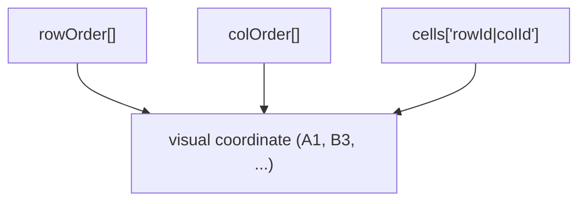
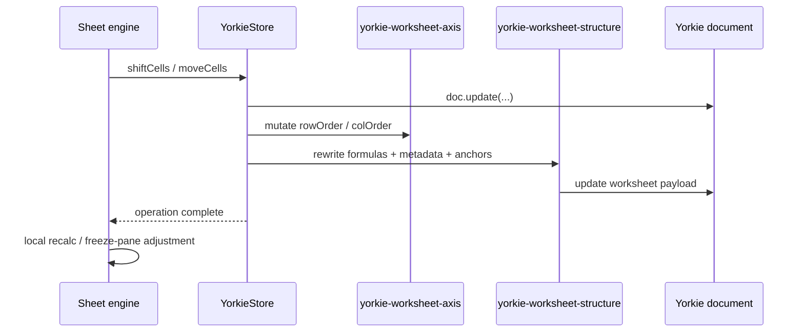

# Collaboration

## Summary

Wafflebase uses Yorkie CRDT documents for multi-user spreadsheet editing. The
collaboration model keeps cell identity stable across row and column structure
changes by storing worksheet cells against stable row/column ids instead of
visual `A1` coordinates.

This document covers:

- the canonical Yorkie worksheet shape
- why the old coordinate-key model failed under concurrent structure edits
- the ownership split between `@wafflebase/sheets` and the Yorkie adapter
- the two-layer concurrency test strategy
- the known residual gaps

### Goals

- Preserve logical cell identity through concurrent row/column insert and move
  operations.
- Keep the shared `@wafflebase/sheets` package collaboration-agnostic where
  possible.
- Make structural concurrency behavior executable through deterministic tests.
- Keep frontend and backend on a single worksheet/document schema.

### Non-Goals

- Solving concurrent `delete row N` vs `delete row N` / `delete column N` vs
  `delete column N` in this iteration.
- Making structural edits a single Yorkie history step.
- Moving every worksheet metadata class to stable row/column identity yet.

## Why the Old Model Failed

The previous Yorkie worksheet shape persisted cells directly by visual
coordinate:

```typescript
type Worksheet = {
  sheet: { [sref: Sref]: Cell }; // e.g. "A1" -> { v: "10" }
  // ...
};
```

That works for plain cell edits because both users usually touch the same
field. It fails for row/column insert or delete because those operations are
not editing a single logical structure node. They are rewriting a derived
coordinate projection.

Example:

1. User A inserts a row before visual row 2.
2. User B edits `A2`.
3. Under a coordinate-key model, Yorkie only sees writes to keys like `A2`,
   `A3`, `B2`, `B3`.
4. It does not know that old `A2` and new `A3` refer to the same logical cell.

The result is merge behavior that is closer to "bulk object rewrite collision"
than to "two users edited the same spreadsheet structure".

## Canonical Worksheet Shape

Each collaborative spreadsheet is a multi-tab Yorkie document:

```typescript
type Worksheet = {
  cells: { [stableCellKey: string]: Cell };
  rowOrder: string[];
  colOrder: string[];
  nextRowId: number;
  nextColId: number;
  rowHeights: { [index: string]: number };
  colWidths: { [index: string]: number };
  colStyles: { [index: string]: CellStyle };
  rowStyles: { [index: string]: CellStyle };
  sheetStyle?: CellStyle;
  rangeStyles?: RangeStylePatch[];
  conditionalFormats?: ConditionalFormatRule[];
  merges?: { [anchor: Sref]: MergeSpan };
  filter?: WorksheetFilterState;
  hiddenRows?: number[];
  hiddenColumns?: number[];
  charts?: { [id: string]: SheetChart };
  frozenRows: number;
  frozenCols: number;
  pivotTable?: PivotTableDefinition;
};

type SpreadsheetDocument = {
  tabs: { [id: string]: TabMeta };
  tabOrder: string[];
  sheets: { [tabId: string]: Worksheet };
};
```

### Cell Storage Semantics

- `rowOrder` and `colOrder` are the authoritative visual order lists.
- Each row/column gets a stable id (`r1`, `r2`, `c1`, `c2`, ...).
- `cells` is keyed by `rowId|colId`, not by `A1`.
- Visual coordinates are derived from the current `rowOrder` / `colOrder`.



A row insert edits the row-order list, not the cell map. Existing cells keep
the same stable key and survive merges cleanly.

## Ownership Split

| Layer | Responsibilities |
| --- | --- |
| `@wafflebase/sheets` | `Store` interface, `Sheet` engine, formula helpers, pure remap helpers, canonical worksheet/document types, worksheet cell read/write helpers |
| `packages/frontend/src/app/spreadsheet/yorkie-store.ts` | `Store` implementation for one tab, Yorkie `doc.update()` boundary, batch buffering, index invalidation, presence updates |
| `packages/frontend/src/app/spreadsheet/yorkie-worksheet-axis.ts` | Yorkie-local row/column order mutations (`insert`, `delete`, `move`) |
| `packages/frontend/src/app/spreadsheet/yorkie-worksheet-structure.ts` | Yorkie-local post-axis structure rewrites: formulas, indexed metadata, range styles, conditional formats, merges, chart anchors |

Two important points follow from this split:

1. The shared package does not export Yorkie-only axis mutation helpers.
2. The frontend owns collaboration-specific orchestration because Yorkie
   proxy mutation semantics are not a concern of the generic sheet engine.

## Structural Edit Flow

For `shiftCells` / `moveCells`, the Yorkie-backed path works like this:



What the stable-id model changed:

- Structural identity lives in `rowOrder` / `colOrder`.
- Cell persistence does not bulk-rewrite `A1` keys.
- Yorkie-specific structure transforms are local helper modules, not
  shared-package exports.

What has not changed yet:

- Row/column sizes and styles still remap by visual numeric index.
- `Sheet` still owns its own post-store recalculation and some local state
  adjustments.

## Concurrency Test Strategy

Concurrency coverage is split into two layers.

### 1. Fast Semantic Matrix

Files:

- `packages/sheets/test/helpers/concurrency-case-table.ts`
- `packages/sheets/test/helpers/concurrency-driver.ts`
- `packages/sheets/test/sheet/concurrency-matrix.test.ts`

Purpose:

- Encode the problem space as typed table-driven cases.
- Compute the serial-intent oracles (`A -> B`, `B -> A`).
- Keep the broad matrix cheap enough for the default test lane.

This layer does **not** prove CRDT merge behavior. It defines the expected
spreadsheet meaning.

### 2. Real Two-User Yorkie Slice

Files:

- `packages/frontend/tests/helpers/two-user-yorkie.ts`
- `packages/frontend/tests/app/spreadsheet/yorkie-concurrency.test.ts`
- `packages/frontend/tests/app/spreadsheet/yorkie-concurrency-repro.test.ts`

Purpose:

- Run the same case families against two real Yorkie clients.
- Prove convergence and serial-intent preservation for the fixed cases.
- Keep known gaps executable as characterization or deferred repro coverage.

The Yorkie-backed tests are opt-in (`YORKIE_RPC_ADDR=http://localhost:8080`).

### Case Coverage

Covered and expected to match a serial oracle:

- value edit vs row/column insert/delete
- formula chain vs row insert above referenced cell
- same-row different-column concurrent edits (commutative)
- same-column different-row concurrent edits (commutative)
- row insert vs row insert at same/adjacent indexes
- row insert vs row delete at same index
- row delete vs row insert at adjacent indexes
- column insert vs column insert at same index
- column insert vs column delete at same index
- value edit vs bulk row insert/delete (count=2)
- bulk insert vs bulk insert (count=2)
- row height vs row insert at same index (metadata + structure)
- column width vs column delete at same index (metadata + structure)

Characterization only (last-writer-wins non-determinism):

- same-cell concurrent value edit
- same-cell formula vs value edit
- concurrent row height edits on same row
- row delete vs row delete at same index
- column delete vs column delete at same index

## Worksheet Shape Migration

Older Yorkie documents using the legacy coordinate-key schema must be migrated
to the canonical shape before they can be edited.

The backend migration helper accepts:

- current canonical documents (no-op)
- empty Yorkie roots (`{}`), initialized to a default spreadsheet
- flat pre-tab worksheet roots
- tabbed legacy documents whose worksheets still use `sheet[A1]`

For legacy worksheets, the migration:

- creates a fresh canonical worksheet
- copies cell contents from legacy `sheet[A1]`
- derives `rowOrder` / `colOrder` extents from both cells and index-based
  metadata (row heights, column widths, filters, merges, range styles,
  conditional formats, frozen panes, chart anchors)
- preserves datasource tabs that do not own worksheet payloads

Usage:

```bash
pnpm --filter @wafflebase/backend migrate:yorkie:worksheet-shape --document <id>
pnpm --filter @wafflebase/backend migrate:yorkie:worksheet-shape --all
```

The command attaches Yorkie documents directly (no side-effect-free dry run).
Sample with `--document` first, then run `--all` during a maintenance window.

## Known Limits

### Same-Index Delete/Delete Is Not Yet Representable

Stable row/column identity fixes insert-heavy structure cases, but it does not
fully encode the intent of "delete the visible row at index N" when two users
issue the same delete concurrently.

Both users target the same stable row id, so a plain list CRDT sees one
logical delete, while the serial oracle expects two consecutive visible-index
deletions.

That remaining gap likely needs one of:

- delete markers / tombstone counts
- a structural op-log with transform/replay semantics

### Some Metadata Still Uses Visual Index Semantics

Cell persistence is identity-based, but several metadata classes still remap
through numeric indices:

- `rowHeights` / `colWidths`
- `rowStyles` / `colStyles`
- filter hidden-row state
- freeze panes

Those are simpler than the old cell model, but they are not yet stable-id
based.

### Structural Undo Is Still Split

Batching currently groups value edits and formula recalculation into single
history steps, but structural edits still span:

1. the persisted structural mutation
2. the follow-up recalculation/local state adjustment

See [batch-transactions.md](batch-transactions.md) for the current rationale.

## Risks and Mitigation

**Schema drift across packages** — Mitigated by sharing worksheet/document
types and factories from `@wafflebase/sheets`.

**Store boundary leakage** — Mitigated by keeping generic worksheet helpers in
the shared package and Yorkie-specific axis/structure orchestration in local
frontend helpers rather than spreading raw document mutations across the app.

**False confidence from semantic-only tests** — Mitigated by keeping a second,
real Yorkie integration slice in the frontend package.
