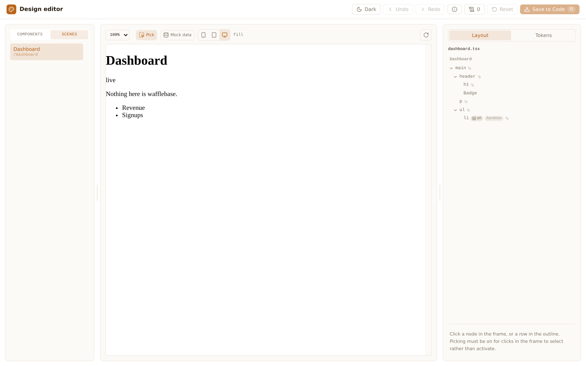

# Packaging: what an installed copy needs

## Summary

`@wafflebase/design-editor` had never been installed. Every gate ran it from the
source tree — including `verify-consumer.mjs`, whose whole premise is a project
that is not wafflebase, but which resolves the package through the workspace.

Packing it and running `npm install` into a project outside the monorepo found
**three defects, none of which any existing lane could see**, and each one made
the editor fail in a way that pointed somewhere else. This document is the
record of that test, the fixes, and the decision it forced.

The pivot's central claim — that the plugin works in someone else's project — is
verified for the first time here.



*The editor served by a project with no relationship to wafflebase: its own
`Dashboard` scene mounted from `app/pages/dashboard.tsx`, its own `Badge`
component in the outline, its own token vocabulary read from its own stylesheet.
`npm install`, no workspace, no source checkout.*

## Goals / Non-Goals

**Goals**

- An installed copy of the package works: the plugin loads, the shell serves, the
  frame mounts, and the consumer's own files are analysed.
- The smallest build that achieves it, so `src/` remains the thing people read.

**Non-Goals**

- Publishing to npm. Nothing here presses that button.
- Non-Vite hosts, non-React frameworks, or any change to what the editor can edit.
- A full library build with bundling and multiple output formats. Three of the
  four exports need no build at all, and building them would produce output
  nobody loads.

## Proposal Details

### 1. How it was tested

Reproducible in five commands:

```bash
pnpm --filter @wafflebase/design-editor pack     # prepack builds dist/
mkdir /tmp/foreign && cd /tmp/foreign
cp -r <repo>/packages/design-editor/fixtures/consumer/* .
npm install vite react react-dom @vitejs/plugin-react <repo>/…/wafflebase-design-editor-*.tgz
npx vite . --port 5294
```

The fixture is the existing foreign consumer: `app/` rather than
`packages/frontend/src/`, its own stylesheet, its own scene manifest, and a
`cssVariables` token adapter rather than wafflebase's. What is new is only
**where the package comes from** — `node_modules`, not the workspace.

### 2. What broke

**a. Node will not load TypeScript from `node_modules`.**

```
ERR_UNSUPPORTED_NODE_MODULES_TYPE_STRIPPING
Stripping types is currently unsupported for files under node_modules,
for ".../node_modules/@wafflebase/design-editor/src/plugin/index.ts"
```

`exports["."]` pointed at `src/plugin/index.ts`. A Vite plugin is imported by the
consumer's `vite.config`, which Vite bundles with esbuild while leaving bare
specifiers **external** — so Node resolves and loads the entry itself, and Node
refuses to strip types under `node_modules`.

*Control:* the same bytes copied out of `node_modules` and imported by relative
path boot fine. The failure is the location, not the content — which is exactly
why the workspace never showed it. pnpm links the package, so its real path is
the source tree.

**b. An unbounded peer range installed TypeScript 7.**

`peerDependencies.typescript` was `>=5.0.0`, so npm's peer auto-install pulled
**7.0.2**, the native-port rewrite. Its module shape is not the one the extractor
has:

| | `(await import('typescript')).default.ScriptTarget` |
| --- | --- |
| TypeScript 5.9.3 | `object` |
| TypeScript 7.0.2 | `undefined` |

So `ts.ScriptTarget.Latest` threw `Cannot read properties of undefined`, the
lazily-imported extractor failed, and `GET /metadata` answered `files: []` and
`scenes: []` **with no error anywhere**. A consumer would have seen an editor that
boots, serves, and analyses nothing.

**c. The frame's own dependencies were never discovered.**

```
SyntaxError: The requested module '/node_modules/react-dom/client.js'
does not provide an export named 'createRoot'
```

`scene-entry.tsx` is served by absolute path (`/@fs/…` into the consumer's
`node_modules`), so it sits outside the graph Vite scans to find dependencies —
and an undiscovered CJS dependency is served raw. `react/jsx-dev-runtime`
survived because the React plugin injects it everywhere and Vite auto-includes
it; `react-dom/client` did not, so the frame died while the shell around it
worked, which reads as a broken scene rather than a missing optimizer entry.

### 3. The decision: build the entry Node loads, and nothing else

Only `exports["."]` is loaded by **Node**. Everything else is reached by the
**browser through Vite**, which transforms TypeScript from anywhere — verified by
serving `scene-entry.tsx` out of an installed package.

| Export | Loaded by | Ships as |
| --- | --- | --- |
| `.` | Node, via the consumer's `vite.config` | **built** — `dist/plugin/index.js` + `.d.ts` |
| `./client` | the browser, through Vite | source |
| `./scenes` | the browser, through Vite | source |
| `./injector` | Node | already `.mjs` |

`src/` ships regardless, because the plugin serves `scene-entry.tsx` by path. So
"ship source" was never the alternative to "build a library" — the package always
ships both, and the only question was which entry Node has to be able to read.

`tsconfig.build.json` compiles `src/plugin/**` plus the two modules it imports at
runtime (`base.ts`, `tokens/adapter.ts`; everything else is type-only and erased).
`rewriteRelativeImportExtensions` turns the explicit `./options.ts` specifiers
into `./options.js`, which is what lets the source keep them.

`packageRoot()` already walks up to the nearest `package.json`, so moving the
entry from `src/plugin/` to `dist/plugin/` leaves `dist/shell` and the served
`scene-entry.tsx` resolving correctly. That was luck rather than design, and it
is worth not breaking.

### 4. What now guards each finding

- **a** — `publish-contract.test.ts` asserts `exports["."]` resolves to `.js` and
  its types to `.d.ts`. The `design-editor:check` lane builds **before** it tests,
  since the contract is about what a consumer installs and that only exists after
  a build.
- **b** — the same suite pins `peerDependencies.typescript` to `^5.0.0`. An upper
  bound is the honest declaration: this package is written against the TS 5 API,
  and 6/7 compatibility is untested rather than merely unsupported.
- **c** — the plugin declares `optimizeDeps.include` for its own frame entry in a
  `config()` hook. The plugin knows what its entry imports and the consumer does
  not, so it belongs here — one fewer line of §5's onboarding cliff.

## Risks and Mitigation

**The install test is not automated.** It needs `npm pack`, a directory outside
the repository, and a real install — minutes, and a network. `verify-consumer.mjs`
still runs against the source tree, so the *class* of defect found here can come
back. The three specific ones are pinned by unit tests; a fourth would need the
same manual pass. Worth a lane when there is somewhere to run it.

**TypeScript 7 will eventually matter.** The bound defers the question rather than
answering it. When it is answered, the extractor's `import ts from 'typescript'`
and the AST calls behind it are the surface to look at.

**Nothing here proves publishing works.** The tarball resolves and runs; the npm
registry, provenance and version policy are untouched. See
[`design-editor-local-plugin.md`](design-editor-local-plugin.md) §7 for where this
sits in the rollout.
