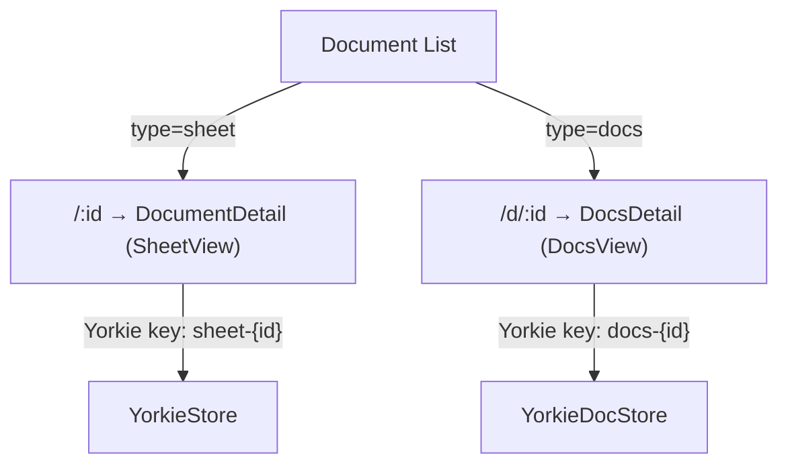

# Docs Editor Frontend Integration

## Summary

Integrate the `@wafflebase/docs` Canvas editor into the frontend application so
that users can create, list, open, and collaboratively edit rich-text documents
alongside spreadsheets. This requires adding a `type` field to the Document
model, updating the backend API and frontend API layer, and modifying the
document list UI to support both document types.

### Goals

- Allow users to create "docs" documents from the same document list UI that
  currently creates spreadsheets.
- Route users to the correct editor (`SheetView` or `DocsView`) based on the
  document's type.
- Display document type in the list so users can distinguish sheets from docs.
- Keep the change backward-compatible: existing documents default to `"sheet"`.

### Non-Goals

- Docs editor feature parity with sheets (toolbar, presence cursors, sharing) —
  deferred to follow-up work.
- Mixed document types (a single document containing both sheets and docs
  content).
- Docs-specific search, filtering, or sorting in the document list.

## Current State

The docs editor already works at the route level:

| Component | File | Status |
|-----------|------|--------|
| `DocsDetail` | `frontend/src/app/docs/docs-detail.tsx` | Done |
| `DocsView` | `frontend/src/app/docs/docs-view.tsx` | Done |
| `YorkieDocStore` | `frontend/src/app/docs/yorkie-doc-store.ts` | Done |
| Route `/d/:id` | `frontend/src/App.tsx` | Done |

**What's missing:** There is no way to create a docs document from the UI. The
Document model has no `type` field, so the list page cannot distinguish sheets
from docs or route to the correct editor.

## Proposal Details

### 1. Database Schema: Add `type` Field

Add a `type` column to the `Document` model in Prisma:

```prisma
model Document {
  id          String   @default(uuid()) @id
  title       String
  type        String   @default("sheet")   // "sheet" | "docs"
  authorID    Int?
  author      User?    @relation(fields: [authorID], references: [id])
  createdAt   DateTime @default(now())
  shareLinks  ShareLink[]
  workspaceId String
  workspace   Workspace @relation(fields: [workspaceId], references: [id], onDelete: Cascade)
}
```

A Prisma migration sets the default to `"sheet"` so all existing documents
remain valid without a data backfill.

### 2. Backend API Changes

#### Create endpoints

Both document creation endpoints accept an optional `type` parameter:

```typescript
// POST /documents
// POST /api/v1/workspaces/:wid/documents
{
  title: string;
  type?: "sheet" | "docs";  // default: "sheet"
}
```

The `DocumentService.create()` method passes `type` through to Prisma. The DTO
validates that `type` is one of the allowed values.

#### Read endpoints

All document query responses include the `type` field. No filtering by type is
added in this phase — the frontend shows all types in a single list.

### 3. Frontend Type and API Layer

Update the `Document` type:

```typescript
// types/documents.ts
export type DocumentType = "sheet" | "docs";

export type Document = {
  id: number;
  title: string;
  type: DocumentType;
  description: string;
  createdAt: string;
  updatedAt: string;
  workspaceId: string;
};
```

Update `createDocument()` and `createWorkspaceDocument()` to accept `type`:

```typescript
// api/documents.ts
export async function createDocument(payload: {
  title: string;
  type?: DocumentType;
}): Promise<Document> { ... }

// api/workspaces.ts
export async function createWorkspaceDocument(
  workspaceId: string,
  payload: { title: string; type?: DocumentType },
): Promise<Document> { ... }
```

### 4. Document List UI Changes

#### "New Document" button → dropdown menu

Replace the single "New Document" button with a dropdown that offers two
choices:

```
[+ New ▾]
  ├── New Sheet
  └── New Document
```

Each option calls `createDocumentMutation.mutate()` with the appropriate
`type`. The empty-state button follows the same pattern.

#### Type column in the table

Add an optional type indicator column (or icon in the title column) so users can
visually distinguish sheets from docs:

| Title | Type | Created At |
|-------|------|------------|
| Q1 Budget | Sheet | 2 hours ago |
| Meeting Notes | Docs | 5 min ago |

The `lucide-react` icons `Sheet` (or `Table`) and `FileText` serve as type
indicators.

#### Row click navigation

Currently, row click navigates to `/${doc.id}` (sheets editor). Change to:

```typescript
function getDocumentPath(doc: Document): string {
  return doc.type === "docs" ? `/d/${doc.id}` : `/${doc.id}`;
}
```

Apply this in:
- `createDocumentMutation.onSuccess` — redirect after creation
- `TableRow.onClick` — row click in list
- Any other place that builds document URLs

### 5. Routing Summary



### 6. File Map

| File | Action | Description |
|------|--------|-------------|
| `backend/prisma/schema.prisma` | Modify | Add `type` field to Document |
| `backend/src/document/document.service.ts` | Modify | Pass `type` to Prisma create |
| `backend/src/document/document.controller.ts` | Modify | Accept `type` in create DTO |
| `backend/src/api/v1/documents.controller.ts` | Modify | Accept `type` in v1 create |
| `frontend/src/types/documents.ts` | Modify | Add `type` field |
| `frontend/src/api/documents.ts` | Modify | Pass `type` to create |
| `frontend/src/api/workspaces.ts` | Modify | Pass `type` to workspace create |
| `frontend/src/app/documents/document-list.tsx` | Modify | Dropdown menu, type column, routing |

## Implementation Order

```
Phase 1: Backend (type field)
  1. Prisma schema + migration
  2. Document service + controller updates
  3. Backend tests

Phase 2: Frontend (type support)
  4. Document type definition update
  5. API layer update
  6. Document list UI (dropdown, type column, routing)

Phase 3: Verification
  7. pnpm verify:fast
  8. Manual smoke test (create sheet, create docs, list, open each)
```

## Risks and Mitigation

**Existing documents have no type** — The Prisma migration sets `@default("sheet")`,
so all existing rows get the correct default. No data backfill script needed.

**Yorkie document key collision** — Sheets use `sheet-{id}` and docs use
`docs-{id}` as Yorkie document keys, so there is no collision even if the same
UUID is reused.

**Yorkie SDK Tree re-export issue** — `@yorkie-js/react` currently bundles
`@yorkie-js/sdk` inline, causing `instanceof Tree` to fail. A workaround
imports `Tree` from `@yorkie-js/react` directly. This is tracked in
[yorkie-js-sdk#1190](https://github.com/yorkie-team/yorkie-js-sdk/pull/1190)
and does not block this integration.
