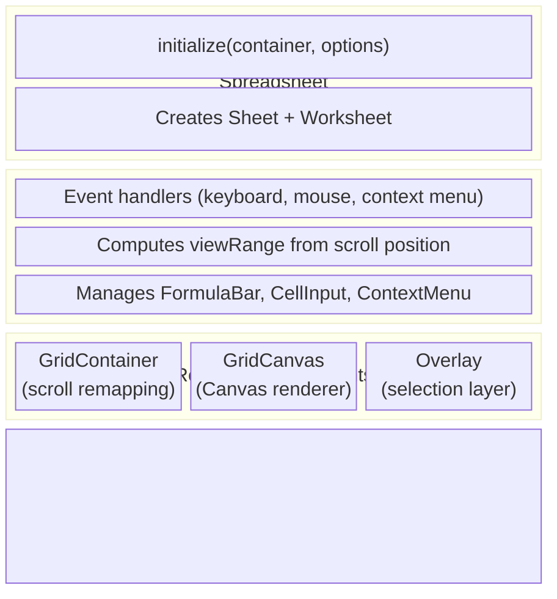

# Sheet Package

## Summary

The `@wafflebase/sheets` package is the core spreadsheet engine. It owns the data
model, formula evaluation, Canvas-based rendering, and the store abstraction that
decouples the engine from any specific persistence backend. The frontend package
depends on it and provides a `YorkieStore` for real-time collaboration.

### Goals

- Provide a self-contained spreadsheet engine that can run with any `Store`
  implementation (in-memory, CRDT-backed, server-backed, etc.).
- Support large grids (up to 1,000,000 rows x 18,278 columns) with
  viewport-only Canvas rendering.
- Evaluate formulas with correct dependency ordering and cycle detection.
- Handle row/column insert and delete with automatic formula reference shifting.

### Non-Goals

- Providing a UI framework — the engine renders on a raw `<canvas>` and
  `<div>` container; layout integration is the consumer's responsibility.
- Server-side execution — the engine runs entirely in the browser.

## Proposal Details

### Data Model

#### Core Types

```typescript
type Sref = string;                        // "A1"
type Srng = string;                        // "A1:B2"
type Reference = Sref | Srng;

type Ref = { r: number; c: number };       // 1-based numeric coordinate
type Range = [Ref, Ref];                   // [topLeft, bottomRight]
type MergeSpan = { rs: number; cs: number }; // merged block size from anchor
type FilterCondition = {
  op: 'contains' | 'notContains' | 'equals' | 'notEquals' | 'isEmpty' | 'isNotEmpty' | 'in';
  value?: string;
  values?: string[];
};
type FilterState = {
  range: Range;                            // header row + data rows
  columns: Record<string, FilterCondition>; // absolute col index as string
  hiddenRows: number[];                    // 1-based rows hidden by filter
};

type Cell = { v?: string; f?: string; s?: CellStyle }; // v = value, f = formula, s = style
type Grid = Map<Sref, Cell>;              // Sparse cell map

type Direction = 'up' | 'down' | 'left' | 'right';
type Axis = 'row' | 'column';
```

#### Sheet Class

`Sheet` is the central data model. It owns the `Store` reference and provides
all cell, selection, and navigation operations.

**Key responsibilities:**

- **Cell access** — `getCell`, `setCell`, `setData` (trims input, infers
  formula/boolean/number/date/text, normalizes value, and attaches inferred
  format metadata), `removeData`, `fetchGrid`
- **Formula recalculation** — When a cell is set via `setData`, the sheet
  builds a dependants map from the store and invokes the `Calculator` to
  recalculate all affected cells in topological order.
- **Selection** — `activeCell`, `range`, `selectStart`/`selectEnd`,
  `selectAll` (expands until empty border using value/formula cells;
  style-only cells are ignored)
- **Merged cells** — `mergeSelection`, `unmergeSelection`,
  `toggleMergeSelection` with top-left anchor semantics. Covered cells resolve
  to the anchor for read/write/formula lookups.
- **Navigation** — `move`, `moveToEdge` (Ctrl+Arrow), `moveInRange`
  (Tab/Enter within selection, wraps around)
- **Row/column operations** — `insertRows`, `deleteRows`, `insertColumns`,
  `deleteColumns`. These delegate to the store and then recalculate shifted
  formulas. `moveRows` and `moveColumns` reorder rows/columns by remapping
  all cell positions and formula references. Merge metadata is shifted/moved
  in lockstep with cells, and split-inducing move operations are blocked.
- **Selection model** — `selectRow`, `selectColumn`, `selectRowRange`,
  `selectColumnRange` support whole-row/column selection.
  `getSelectionType()` returns `'cell' | 'row' | 'column'`.
  `getSelectedIndices()` returns the selected range for row/column selections.
- **Copy/paste** — `copy` serializes the selection as a tab/newline string;
  `paste` parses it back and recalculates dependants from all changed refs
  (including plain-value pastes). External pastes (TSV/HTML) run through the
  same conservative input inference as `setData` before persistence.
  Merged blocks travel with an **internal** paste: `copy`/`cut` snapshot the
  blocks lying entirely inside the copied range, `paste` re-creates them at
  the destination (a cut also drops them at the source), drops the
  destination blocks the paste fully covers, and clears the cells the new
  blocks hide so nothing resurfaces as stale data on unmerge. The destination
  region is the copied *range* translated by the paste delta, not the pasted
  grid's bounding box — a merged block's covered cells hold nothing, so the
  box is smaller than the block being reproduced. A paste that would only
  partially overwrite a block is refused whole (`merge-paste-partial`,
  reported on the same `setOnRefusal` → `onNotice` channel as the drag-move
  refusals); a single-cell destination is exempt, since it writes through the
  merge anchor. A **cut's own blocks are exempt too** — the paste deletes them
  at the source whatever the destination clips, so they cannot be split by it,
  the exclusion `moveRangeTo` makes with `movedAnchors`. A paste that would
  land a block across a freeze boundary is refused as well
  (`merge-paste-frozen`), and so is the drag-move that would do the same
  (`merge-move-frozen`): merges may not straddle a frozen row or column, the
  rule `canMergeSelection` enforces for the merge button and the one the
  renderer assumes when it paints a frozen pane and the scrolling body from a
  single block.
  That invariant binds **every** path that can move a block or the boundary,
  not only the two that refuse. A row/column reorder (`moveCells`) is refused
  with the same `merge-move-frozen` when it would *newly* leave a block
  straddling — each block compared with its own position before the move
  (`moveStraddlingFreeze`), not the moved map read on its own. A block that
  already straddles is not the reorder's doing: `remapIndex` leaves anything
  outside the moved range and the shift window at the indices it already had,
  so reading the moved map alone would refuse *every* row and column reorder on
  such a document — including moves nowhere near the block — and the invariant
  being defended is that no writer creates one. Freezing, though, moves the line rather than a block, so it
  *snaps* instead of refusing: `setFreezePane` pushes the boundary to the far
  edge of any block it would cut in half (`snapFreezePastMerges`, one sweep per
  axis in start order), and the freeze adjustment inside `shiftCells` runs the same
  snap after the insert/delete has moved both the boundary and the merge map.
  The whole block ends up frozen — what the user asked for, plus the rows the
  layout makes inseparable from them — rather than a gesture silently
  declining. A straddling block loaded from outside the engine (an `.xlsx`
  import writing the freeze through the store) is healed by the first
  structural edit; refusing every move of such a block, with no way to create
  it in-app, would otherwise strand it.
  The **v1 worksheet API** is held to the same invariant, since it is the other
  writer of these fields: `POST .../move` refuses a reorder that would park a
  block across the freeze (409, beside the existing merge-split refusal),
  `PUT .../freeze` snaps past a block it would cut and answers with the
  boundary it actually stored, and `PUT .../merges` refuses a map that would
  straddle the tab's freeze. `POST .../insert` and `POST .../delete` neither
  refuse nor need to: the snap lives in `shiftWorksheetViewState`
  (`model/workbook/worksheet-structure.ts`), beside the freeze adjustment it
  repairs, so every caller of `applyWorksheetShift` — the API controller and
  the editor's `YorkieStore` alike — snaps without asking. `Sheet.shiftCells`
  snaps its own in-memory copy for the same reason it recomputes the rest of
  the view state: it is an absolute write of a value it derived itself, so
  applying it in both places lands on the same boundary. The snap itself is one
  implementation (`snapFreezePastMerges` in `model/worksheet/merging.ts`)
  shared by the engine and the controller, so the two cannot drift.
  The snap's *growth* is capped at `MaxSnappedFreeze` (1,000). A block may
  legally be 100,000 rows tall, and `GridCanvas` paints rows `1..frozenRows`
  for the frozen quadrants on every frame with no viewport clipping, so a snap
  to the bottom of such a block would not be a deep freeze — it would be a tab
  that stops painting, and therefore one whose freeze menu the user can no
  longer reach to undo it. When the sweep cannot settle inside the ceiling the
  axis is **released** (0) instead: a boundary that does not exist straddles
  nothing, so the invariant still holds and the user sees their freeze undone
  rather than a frozen grid. Only growth is bounded — a line the caller asked
  for passes through untouched, since bounding the request is the validator's
  job (`parseFreeze`).
  The merge map is also **bounded**, and bounded in one place for the same
  reason. `rebuildMergeCoverMap` puts one Map entry per covered cell on every
  load, so the quantity that has to stay affordable is the cells the whole map
  covers — which neither a per-span cap nor an entry count bounds on its own,
  since 10,000 anchors of 100,000 cells each satisfies both and still asks for
  1e9 entries. `model/worksheet/merging.ts` therefore holds all three ceilings
  (`MaxMergedCells`, `MaxMergeEntries`, `MaxMergeCoveredCells`) and one
  predicate, `mergeBudgetAdmits`, and **every** writer of the field spends
  against it: `canMergeSelection` for the toolbar gesture, `applyPasteMerges`
  per pasted block, the XLSX importer per `mergeCell`, `YorkieStore.setMerge`
  as the floor under the CRDT, and `parseMerges` for a whole `PUT merges` body.
  A cap the REST validator obeyed alone would be worse than none: the editor
  and the importer would keep growing a map the API could then no longer
  replace, since `PUT merges` is wholesale and has no per-anchor form. With the
  budget shared, a map that large cannot be created in the first place, and a
  legacy one can always be *shrunk* through the same endpoint, because the cap
  reads the body rather than what is stored.
  Every one of those is a **writer**, though, and two of them run in a browser,
  while `merges` is a plain CRDT object: the Yorkie auth webhook authorizes a
  write by (document, verb) and never inspects an op's content, so anyone
  holding `rw` on the document can put a map in it that no writer here would
  have created. So the cover-map build — the walk the budget exists to
  protect — spends the budget itself on the way in, dropping a span it cannot
  afford (a span that is not two positive integers, whose `rs * cs` is `NaN`
  and so passes every comparison; and a key that is not a plain cell reference,
  which `parseRef` would otherwise throw on) from the in-memory map and the
  cover map together. That build is `buildMergeCoverMap` in
  `model/worksheet/merging.ts` rather than a private of `Sheet`, because the
  engine is not the only **reader**: the frontend's cross-sheet formula resolver
  (`sheet-view.tsx`) folds covered refs onto their anchors by walking the same
  raw CRDT map, and a clamp only one reader applied is a clamp the other
  reader's tab hangs without. `Sheet.rebuildMergeCoverMap` is now that call plus
  the bookkeeping only it has (`Sheet.merges`, `mergeBudget`). Read
  defensively, a hostile map costs this client the merges it cannot afford;
  read trustingly, it costs every collaborator the tab, on every open,
  permanently. Nothing is written back: this is one client clamping what it
  will render, not a repair, and a repair issued from a load would race every
  other replica reading the same map.
  Because the store spends a budget of its own, `Store.setMerge` **returns
  whether the block was stored**, and the engine's three writers
  (`mergeSelection`, `applyPasteMerges`, `moveRangeTo`) record it in
  `Sheet.merges` only when it says yes. The two budgets can disagree — the
  engine's is spent against the map it last loaded, the store's against what
  the document holds now, which a collaborator may have grown in between — and
  a refusal the caller could not see would leave the sheet painting a merge
  nobody else has. `mergeSelection` therefore asks *before* clearing the cells
  the block would cover, so a refusal costs their contents nothing.
  A **single-cell** paste starts at the merge anchor: `paste` normalizes
  `activeCell` with `normalizeRefToAnchor`, because `selectRow` /
  `selectColumn` / `selectAllCells` leave the active cell at the head of the
  selection without normalizing, and a value written to a covered cell is
  invisible under the block until an unmerge brings it back. A multi-cell
  paste keeps `activeCell` as its top-left: it has a shape, and sliding the
  whole grid up or left to an anchor would land it off the cells the user
  selected and overwrite unrelated ones. Such a paste necessarily clips the
  block covering its head cell (the block's anchor is above or left of the
  destination's origin, so the block is not contained in it), and is refused
  as `merge-paste-partial` rather than misplaced.
  The **copy buffer outlives its paste**: the view clears it only through
  Escape, and `paste` itself drops a cut once consumed. Clearing it after
  every paste demoted the second paste of a copy to an external one — no
  formula relocation and no merge propagation — and discarded the buffer on a
  refusal, precisely when the user needs it to unmerge and retry. Because it
  now outlives the gesture, every edit that renumbers the cells it
  snapshotted invalidates it: `shiftCells` (row/column insert and delete),
  `moveCells` (row/column reorder), `sortFilterByColumn` (which rewrites cells
  to new row positions) and `undo` / `redo` (which replay any of them, and are
  not told which kind of step they replayed) all call `clearCopyBuffer`, so a
  later paste can never relocate — or re-create a merged block — from
  coordinates that have since moved. A **peer's** structural edit never calls
  any of them: it arrives as a reload (`Worksheet.reloadDimensions`), so the
  buffer additionally records the axis IDs of its source range's corners, and
  the reload runs `revalidateCopyBuffer` to drop it when those IDs no longer
  sit at the indices it recorded. Keying on axis IDs rather than on "a remote
  change happened" is what keeps a peer typing in a cell from emptying the
  user's clipboard.
  A reorder that is refused writes nothing, so `moveRows` / `moveColumns`
  return whether the rows actually moved — the drag-reorder handler re-selects
  the drop position only on `true`, rather than showing a selection at a
  destination the rows never reached.
  The copy buffer's merge snapshot is clipboard-at-copy-time,
  like its grid and styles: unmerging after the copy does not retro-edit it.
  That snapshot decides what is *re-created*, never what is *deleted* — a cut
  drops a recorded block at the source, and treats it as travelling, only
  while the live merge map still holds it unchanged, so a layout edited
  between the cut and the paste cannot make the paste delete a block it never
  copied.
  **External pastes deliberately leave the merge layout alone** — a foreign
  grid carries no merge metadata to propagate, and refusing one would trade
  writing hidden data for doing nothing silently on the most common paste
  there is.
- **Autofill (fill handle)** — dragging the selection handle repeats the source
  pattern across the expanded range. The fill is constrained to a single axis
  (vertical or horizontal) based on whichever direction the drag extends
  furthest from the source edge; ties favour vertical. Formula cells are
  relocated per target offset (same reference-shift semantics as internal
  paste), then dependants are recalculated from all changed destination refs.
  With freeze panes, the handle is hidden (and non-interactive) when the
  selection is in the unfrozen scrollable quadrant but the handle position
  would fall under frozen panes.
- **Cell drag-move** — hovering near the edges of a selected cell or range
  (excluding the bottom-right autofill handle corner) shows a `move` cursor.
  Dragging from the edge moves the entire selection to the drop position.
  Unlike copy-paste, formula text is preserved as-is (e.g. `=SUM(A10:I10)`
  stays `=SUM(A10:I10)` after the move), matching Google Sheets behavior.
  Other cells that referenced the moved cells are redirected to the new
  positions. Range styles are translated to the destination and the source
  area is cleared. Merged blocks propagate: a merge fully inside the source
  range is removed there and re-created at the destination, and any merge
  fully covered by the destination range is dropped (it is overwritten by the
  moved content). A move that would only partially cover a merged block —
  splitting one at the source, or overwriting part of one at the destination —
  is rejected rather than corrupting the merge state; the model reports a
  `RangeOpRefusal` reason through `Sheet.setOnRefusal`, which the view turns
  into a message on the host's `Spreadsheet.onNotice` channel so the drag
  explains itself instead of looking like a no-op (`autofill`'s refusal to
  fill across a merged block travels the same path). The overlay
  renders a dashed preview rectangle at the prospective drop location during
  the drag.
- **Filtering** — `createFilterFromSelection`, `setColumnFilter`, and
  `clearFilter` persist filter metadata and compute hidden row indices.
  If the selection is header-only (single row), filter creation auto-expands
  downward through contiguous data rows in the selected columns.
  On successful creation, the current selection is updated to the final filter
  range so users can see the table area that filtering applies to.
  Value-checklist filtering is represented as `{ op: 'in', values: [...] }`.
  Hidden
  rows are rendered as zero-height rows in `Worksheet` while preserving
  user-defined row heights for restore.
- **Dimensions** — `setRowHeight`, `setColumnWidth`, persisted to the store.

**Grid dimensions:** `1,000,000 rows x 18,278 columns` — authoritative
constants live in `packages/sheets/src/model/worksheet/sheet.ts`
(`Dimensions`). The `dimensionRange` property returns this as a
`Range`. All other docs in this directory must reference this value
rather than restating it.

### Store Interface

The `Store` interface is the abstraction boundary between the engine and
persistence. Every method is async to support both local and networked
implementations.

```typescript
interface Store {
  // Cell CRUD
  set(ref: Ref, value: Cell): Promise<void>;
  get(ref: Ref): Promise<Cell | undefined>;
  has(ref: Ref): Promise<boolean>;
  delete(ref: Ref): Promise<boolean>;

  // Bulk operations
  setGrid(grid: Grid): Promise<void>;
  getGrid(range: Range): Promise<Grid>;
  deleteRange(range: Range): Promise<Set<Sref>>;

  // Navigation
  findEdge(ref: Ref, direction: Direction, dimension: Range): Promise<Ref>;

  // Formula dependencies
  buildDependantsMap(srefs: Iterable<Sref>): Promise<Map<Sref, Set<Sref>>>;

  // Dimension management
  setDimensionSize(axis: Axis, index: number, size: number): Promise<void>;
  getDimensionSizes(axis: Axis): Promise<Map<number, number>>;

  // Row/column insert/delete
  shiftCells(axis: Axis, index: number, count: number): Promise<void>;

  // Row/column move
  moveCells(axis: Axis, srcIndex: number, count: number, dstIndex: number): Promise<void>;

  // Freeze panes
  setFreezePane(frozenRows: number, frozenCols: number): Promise<void>;
  getFreezePane(): Promise<{ frozenRows: number; frozenCols: number }>;

  // Merged cells
  setMerge(anchor: Ref, span: MergeSpan): Promise<boolean>;
  deleteMerge(anchor: Ref): Promise<boolean>;
  getMerges(): Promise<Map<Sref, MergeSpan>>;

  // Filter state
  setFilterState(state: FilterState | undefined): Promise<void>;
  getFilterState(): Promise<FilterState | undefined>;

  // Batch transactions
  beginBatch(): void;
  endBatch(): void;

  // Undo/Redo. `UndoResult` carries where the replayed step landed; see
  // "Selection after undo / redo" below.
  undo(): Promise<UndoResult>;
  redo(): Promise<UndoResult>;
  canUndo(): boolean;
  canRedo(): boolean;

  // Presence (sync, not async)
  getPresences(): Array<{ clientID: string; presence: { activeCell: string } }>;
  updateActiveCell(activeCell: Ref): void;
}
```

**Batch transactions** — `beginBatch()` / `endBatch()` group multiple store
mutations into a single undo step. The `Sheet` class wraps user-facing methods
(`setData`, `removeData`, `paste`, `setRangeStyle`, and the post-shift part of
`shiftCells`/`moveCells`) in batch calls. Filter mutations (`setFilterRange`,
`setColumnFilter`, `clearColumnFilter`, `setColumnIncludedValues`, `clearFilter`)
and filter-range sorting (`sortFilterByColumn`) are also wrapped so each action
is a single undo step. See
[batch-transactions.md](batch-transactions.md) for the full design.

**MemStore** is the built-in in-memory implementation. It stores cells in a
`Map<Sref, Cell>`, dimension overrides in separate maps, and implements
`buildDependantsMap` by scanning all formulas in the grid to extract
references. It maintains a `CellIndex` for efficient range queries and
navigation (see below).

**ReadOnlyStore** (`packages/sheets/src/store/readonly.ts`) is a read-only Store implementation
for displaying external data (e.g., SQL query results). Data is loaded via
`loadQueryResults(columns, rows)` which populates row 1 with bold column
headers and rows 2+ with data (1-based to match the sheet coordinate system). All write operations are no-ops.

### Merged Cell Model

Merged cells are stored as sheet-level metadata: `Map<Sref, MergeSpan>`,
where the key is the anchor cell (top-left of the merged block), and
`MergeSpan` stores `{ rs, cs }`.

- Covered cells are not persisted as merge metadata entries.
- Cell reads/writes normalize covered refs to anchor refs.
- Formula evaluation resolves covered references through this normalization.
- Rendering draws only anchor cells for merged blocks and skips covered cells.
- Merges that cross freeze pane boundaries are disallowed.

### Filter Model

Filter state is stored as worksheet-level metadata (`FilterState`):
- `range` is the table range (header row included).
- `columns` stores per-column criteria keyed by absolute column index.
- `hiddenRows` stores computed row indices hidden by current criteria.

`Sheet.recomputeFilterHiddenRows()` evaluates each data row (`range.startRow +
1` through `range.endRow`) and persists the result through `Store`. `Worksheet`
maps hidden rows to zero-height rows in `DimensionIndex` so rendering, hit
testing, and scrolling all stay consistent without deleting underlying data.

#### Filter-Range Sorting

`sortFilterByColumn(col, direction)` sorts the data rows within the filter
range by a single column's values. Sorting only affects cells **inside the
filter column range** — columns outside the filter boundaries are left
untouched (matching Google Sheets behavior).

**Algorithm:**

1. Read each data row's value in the sort column; build a sort key array with
   numeric-first, then locale-compared text, then empty-last ordering.
2. Compute a row mapping (`oldRow → newRow`) from the sorted order.
3. Use `store.getGrid()` to read all cells within the filter column range.
4. Remap each cell's row position, then `store.deleteRange()` the original
   range and `store.setGrid()` the remapped cells.
5. `recalculateAllFormulaCells()` and `recomputeFilterHiddenRows()` run
   afterward.

The entire operation is wrapped in a batch transaction for single-step undo.

#### CellIndex

`CellIndex` (`packages/sheets/src/store/cell-index.ts`) is a spatial index that tracks which
cells are populated using two `Map<number, Set<number>>`:

- **`rowIndex`**: row → set of occupied columns
- **`colIndex`**: col → set of occupied rows

This enables range queries and navigation that scale with the number of
populated cells rather than the total grid size.

**Key methods:**

| Method | Complexity | Description |
|--------|-----------|-------------|
| `add(row, col)` | O(1) | Register a cell |
| `remove(row, col)` | O(1) | Unregister a cell, clean up empty sets |
| `has(row, col)` | O(1) | Existence check |
| `cellsInRange(range)` | O(populated rows in range × cols per row) | Generator yielding `[row, col]` pairs |
| `getOccupiedColsInRow(row)` | O(1) | Returns the set of columns with data in a row |
| `getOccupiedRowsInCol(col)` | O(1) | Returns the set of rows with data in a column |
| `rebuild(entries)` | O(N) | Rebuild from an iterable of `[row, col]` pairs |

`cellsInRange` only iterates `rowIndex` entries (rows that have data), not
every row number in the range. On a 1M-row sheet with 50 populated cells,
this checks ~50 row entries, not 1M.

**Store integration:**

- **MemStore** — Maintains the index incrementally: `set` calls `add`,
  `delete` calls `remove`, `shiftCells`/`moveCells` call `rebuild` after
  grid replacement.
- **YorkieStore** — Uses a dirty flag with lazy rebuild. Remote changes set
  `dirty = true`; queries call `ensureIndex()` which rebuilds if dirty. Local
  mutations update the index incrementally when not dirty. Before persisting,
  cell payloads are compacted: empty-string values and empty style/formula
  fields are dropped, and cells with no remaining data are deleted.

#### findEdgeWithIndex

`findEdgeWithIndex` (`packages/sheets/src/store/find-edge.ts`) replaces the O(distance)
step-by-step `findEdge` algorithm with O(k) jumps using sorted occupied
positions from the `CellIndex`.

**Algorithm** (preserves standard Ctrl+Arrow behavior):

1. Get sorted occupied positions along the movement axis from the index.
2. If current and next cells are both occupied (inside a data block): walk to
   end of the consecutive run.
3. Otherwise (at edge of data or in empty space): jump to the start of the
   next data block, or to the boundary if there is no more data.

| Scenario | Before (step-by-step) | After (index) |
|----------|----------------------|---------------|
| Empty row/col | O(distance to boundary), up to 1M | O(1) |
| Sparse data | O(distance) | O(k) where k = cells in row/col |
| Dense block | O(block length) | O(block length) |

### Formula Engine

ANTLR-based parser, visitor-pattern evaluator, ~447 built-in
function entries (434 unique + aliases), and cross-sheet reference
resolution via pluggable
`GridResolver` / `FormulaResolver` callbacks. See
[formula.md](formula.md) for the engine and
[formula-coverage.md](formula-coverage.md) for the authoritative
function catalog (counts, categories, per-function status).

### Calculator

Topological-sort recalculation with single-sheet and cross-sheet cycle
detection. Cycled cells are marked `#REF!`. See [calculator.md](calculator.md)
for full details.

### Shifting (Insert/Delete Rows and Columns)

When rows or columns are inserted or deleted, all affected data must be
adjusted:

- **`shiftRef`** — Adjusts a `Ref` coordinate. On insert (count > 0), refs at
  or after the index shift forward. On delete (count < 0), refs in the deleted
  zone become `null`; refs after shift backward.
- **`shiftFormula`** — Tokenizes a formula, shifts each `REFERENCE` token
  using `shiftRef`, and replaces deleted refs with `#REF!`.
- **`shiftGrid`** — Shifts all cells and their formulas in a `Grid`.
- **`shiftDimensionMap`** — Shifts keys in the row-height or column-width map.

The `Sheet.shiftCells` method orchestrates: it calls `store.shiftCells` (which
handles the actual data movement), then shifts the local `DimensionIndex`,
and finally recalculates all formulas that contain shifted references.

### Moving (Reorder Rows and Columns)

When rows or columns are moved to a new position, all affected data is
remapped rather than shifted:

- **`remapIndex(i, src, count, dst)`** — Pure function mapping an old 1-based
  index to its new position after moving `count` items from `src` to before
  `dst`. Moving forward: source goes to `dst-count`, items between shift back.
  Moving backward: source goes to `dst`, items between shift forward.
- **`moveRef`** — Remaps a `Ref` using `remapIndex` for a given axis.
- **`moveFormula`** — Tokenizes a formula, remaps each `REFERENCE` token.
- **`moveGrid`** — Remaps all cell keys and their formulas.
- **`moveDimensionMap`** — Remaps dimension size map keys.

The `Sheet.moveCells` method orchestrates: it calls `store.moveCells`, then
moves the local `DimensionIndex`, remaps `activeCell` and `range`, and
recalculates all formulas.

### Selection Model

`SelectionType = 'cell' | 'row' | 'column'` tracks whether individual cells
or entire rows/columns are selected.

- **`selectRow(row)`** / **`selectColumn(col)`** — Selects a single row/column.
- **`selectRowRange(from, to)`** / **`selectColumnRange(from, to)`** — Extends
  to multi-row/column selection (for drag-select on headers).
- **`getSelectedIndices()`** — Returns `{ axis, from, to }` or `null` for cell
  selections.
- **`selectStart()`** — Resets `selectionType` to `'cell'`.

The view layer uses selection state for:
- Header highlighting (blue tint on selected row/column headers)
- Full-viewport-width/height selection rectangles in the overlay
- Drag-to-move interaction (grab cursor on selected headers, drop indicator line)

#### Selection after undo / redo

Undo selects what it changed and scrolls it into view, as Google Sheets
does — a change the user cannot see is a change they cannot check. A single
cell becomes the cursor, a multi-cell step becomes a range, and a row or
column insert/delete selects those **headers**, not the cells that moved.

The range comes from the operations the replay itself emitted, not from
diffing the document either side of it. `Store.undo()` returns an
`UndoSelection { tabId, otherTab, selectionType, range? }`;
`YorkieStore.replayHistory()` collects the `local-change` operations Yorkie
publishes synchronously from `doc.history.undo()` and hands them to
`resolveUndoSelection()` (`model/workbook/undo-selection.ts`), whose paths
name the tab, the field, and — for cells — the stable axis-id key:

```
$.sheets.<tabId>.cells          key "r3|c2"
$.sheets.<tabId>.cells.r3|c2    key "v"
$.sheets.<tabId>.colWidths      key "4"
```

State diffing cannot answer this, which is why it used to be wrong for most
edits: a cell overwritten with a new value leaves the cell-key set
identical, and a style or a column width never enters it at all. Reading
operations also costs the replayed step rather than the whole grid.

Two fields are written as CRDT array operations, which carry neither index
nor value, so `rowOrder` / `colOrder` and `rangeStyles` are snapshotted
either side of the replay and diffed. An axis diff confined to the **tail**
is not a structural edit but the axis growing to reach a cell — every
ordinary cell write carries one — so those fall through to the cell branch.

Yorkie's history is per *document* while a `Sheet` holds one tab, so a
replay can land where the user is not looking. `otherTab` says so, `Sheet`
reports it through `setOnUndoTabJump` instead of moving its own cursor, and
`DocumentLayout` switches tabs and hands the selection to the new mount via
`undoJumpTarget` — the same two-step the peer-cursor jump uses, since the
target tab's engine does not exist until the switch has rendered.

One step also reaches several tabs more often than it looks:
`shiftCrossTabDataRanges` rewrites every other tab's chart and pivot source
ranges inside the same change as the row insert that moved them. So each
touched tab is resolved on its own and ranked — *structural* (an axis was
inserted, deleted or reordered here) over *coordinates* (cells, a resized
axis, a style region) over *incidental* (touched with nothing to point at).
The highest rank wins and the open tab is preferred only within a rank: a
structural edit is the cause and the chart ranges it rewrote elsewhere are
its effects, so undo follows it out of a tab that merely absorbed one, while
two tabs that both changed substantively still leave you where you are.

A step with no coordinates at all (freeze pane, filter state) reports its
tab but no `range`, and the selection is left alone rather than guessed at.

Both hosts that can reach undo wire the jump: `DocumentLayout` and the
share-link view, which is read-only only for the `viewer` role. A host that
can undo but does not wire it puts cross-tab undo back where it started —
applied to the CRDT, invisible on screen.

**Known limits.** Every one of these leaves the selection where it was
rather than moving it somewhere wrong:

- Inserting or deleting at the **end** of an axis is indistinguishable from
  the axis growing to reach a cell, so it selects the affected cells rather
  than the row or column header. Every interior insert/delete is exact.
- `conditionalFormats` and `dataValidations` carry their ranges inside the
  rule values, which array operations do not report. Recoverable by the same
  before/after diff `rangeStyles` uses; not done.
- Undoing a tab add or remove writes `$.tabs` / `$.sheets` rather than a
  path below a worksheet, so it produces no jump.

### Rendering Pipeline

See also [scroll-and-rendering.md](scroll-and-rendering.md) for the scroll
remapping details.



For touch-first hosts, `Spreadsheet` exposes mobile-friendly imperative hooks:
`panBy(deltaX, deltaY)` to scroll the logical viewport and
`handleMobileDoubleTap(clientX, clientY)` to trigger edit-mode behavior at a
tapped point without wiring DOM-level double-click synthesis in the app layer.
It also exposes `focusCell(ref)` so host apps can programmatically move
selection (for example, jumping to a collaborator's active cell) while reusing
the same edit-commit and scroll-into-view behavior as native grid navigation.

Keyboard edit entry uses a "primed input" model for selected-cell idle state.
When a single cell is selected, focus is parked on an invisible in-cell editor
(`CellInput`) so first keystrokes (including IME composition) start inside a
real editable target immediately. Non-text/navigation keys still flow through
the grid keymap, while printable/composition input is handled natively by the
focused editor and promotes the primed editor into visible editing mode.
While composition is active, keyup-driven formula-bar/autocomplete sync is
skipped to avoid interrupting IME state.

In-cell newline accepts both `Alt+Enter` (Excel/Sheets cross-platform) and
`Cmd+Enter` / `Ctrl+Enter`. The mod-key alternative exists so macOS Korean-
IME users can insert a newline without `Option`, which the system reserves
for Hangul→Hanja conversion. The mod-key binding is scoped to the in-grid
`CellInput`; the single-line formula bar treats `Cmd+Enter` as commit so a
stray newline cannot be injected into a `nowrap` container.

**GridContainer** — Wraps a scrollable `<div>` with a dummy sized child. When
the logical grid size exceeds `MAX_SCROLL_SIZE` (10M px), scroll positions are
linearly remapped. All downstream code works in logical coordinates.

**GridCanvas** — Draws visible cells on a `<canvas>` sized to the viewport.
For each cell in `viewRange`, it computes pixel coordinates via
`DimensionIndex.getOffset` and renders borders, background, and text. Row and
column headers are drawn separately.
Rendering uses a two-pass cell pipeline (background/borders first, then text).
For single-line left-aligned text, the renderer extends clipping into adjacent
empty cells; when overflow happens, internal vertical boundaries in that span
are suppressed so glyphs are not visually cut by grid lines. This overflow span
logic is independent from persisted merge metadata.

**Overlay** — A second `<canvas>` (z-index: 1, pointer-events: none) that
draws:
- Active cell border (2px stroke)
- Selection range (semi-transparent fill + border; full-width for row
  selections, full-height for column selections)
- Peer cursors (colored borders, one per remote user)
- Resize hover indicator (line on header edge; suppressed while primary-button
  drag selection is active, and cleared on pointer leave)
- Resize drag UX:
  - Wider header-edge hit tolerance for easier grabbing
  - Live width/height tooltip during drag (includes multi-selection count)
  - `requestAnimationFrame`-coalesced worksheet rendering so scroll/resize
    bursts collapse to one frame and stale async grid fetch results are dropped
- Move drop indicator (bold blue line at drop position during row/column drag-to-move)
- Cell drag-move (dashed rectangle with translucent fill at drop target)

### DimensionIndex

`DimensionIndex` manages variable row heights or column widths. It stores only
non-default sizes in a `Map<number, number>` and provides:

- `getSize(index)` — Returns custom or default size.
- `getOffset(index)` — Pixel offset of the start of a 1-based row/column.
  Uses cached sorted custom indices plus prefix deltas to resolve in
  `O(log customCount)`.
- `findIndex(offset)` — Uses cached custom start offsets with binary search to
  find which row/column a pixel offset falls into.
- `shift(index, count)` — Adjusts keys when rows/columns are inserted or
  deleted.
- `move(src, count, dst)` — Remaps keys when rows/columns are moved.

Default sizes: **23px** row height, **100px** column width.

### Freeze Panes

Freeze panes lock header rows/columns in place while scrolling. The Sheet class
stores `frozenRows` and `frozenCols` (both default to 0). When enabled, the
viewport splits into four quadrants:

| Quadrant | Rows | Columns | Scrolls H | Scrolls V |
|----------|------|---------|-----------|-----------|
| A (top-left) | `1..frozenRows` | `1..frozenCols` | No | No |
| B (top-right) | `1..frozenRows` | `frozenCols+1..` | Yes | No |
| C (bottom-left) | `frozenRows+1..` | `1..frozenCols` | No | Yes |
| D (bottom-right) | `frozenRows+1..` | `frozenCols+1..` | Yes | Yes |

**Rendering**: Uses `ctx.save()`/`ctx.clip()`/`ctx.restore()` per quadrant on
the single GridCanvas and Overlay canvases. Draw order: D → B → C → A
(frozen regions overlay scrollable content). Freeze line separators drawn last.

**Scroll**: `scroll.left`/`scroll.top` are relative to the first unfrozen
row/column. The scroll container dummy size excludes the frozen region.

**Mouse events**: `toRefWithFreeze()` determines which quadrant a click is in
and applies scroll=0 for frozen axes, `scroll.left`/`scroll.top` for unfrozen.

**Insert/delete near boundary**: Inserting within frozen area expands the frozen
count. Deleting within frozen area shrinks it. Operations outside the frozen
area leave the freeze count unchanged. Matches Excel behavior.

**Store**: `setFreezePane(frozenRows, frozenCols)` and `getFreezePane()` on the
Store interface. Yorkie document stores `frozenRows` and `frozenCols` as
top-level fields with `?? 0` fallback for backward compatibility.

### Coordinate System

Cell coordinates are **1-based** (`A1` = `{r: 1, c: 1}`). Column labels use
base-26 encoding: A=1, Z=26, AA=27, up to ZZZ=18278.

Key functions in `packages/sheets/src/model/core/coordinates.ts`:

- `parseRef("A1")` → `{r: 1, c: 1}`
- `toSref({r: 1, c: 1})` → `"A1"`
- `toColumnLabel(1)` → `"A"`, `toColumnLabel(27)` → `"AA"`
- `toRefs(range)` — Generator yielding all `Ref`s in a range
- `inRange(ref, range)` — Check if a ref is within a range
- `toRange(ref1, ref2)` — Normalize two refs into a `[min, max]` range

### Cell Formatting (CellStyle)

Style logic was extracted to [`sheet-style.md`](sheet-style.md).

Key points:

- Style precedence: `sheet -> column -> row -> range patch -> cell`.
- Merge semantics: `undefined` means inherit/no-op, explicit `false/0/""`
  remain valid overrides.
- Cell-selection formatting uses `rangeStyles` patches with compaction/pruning
  to avoid style-only cell explosion in Yorkie.
- Default-style reset clears cell-level `s` payloads in range and only appends
  minimal default overrides when higher-priority style layers conflict.
- Structural operations remap range patches consistently; inserts inside a style
  range expand it.
- Internal copy/paste carries and relocates `rangeStyles` so empty-range
  formatting is preserved.
- Rendering resolves effective style from all layers.
- Conditional formatting rules (`conditionalFormats`) are stored per worksheet
  and evaluated at render time in list order; later matches override earlier
  ones for supported keys (`b`, `i`, `u`, `tc`, `bg`).

**Layout helpers for floating objects:** The `Spreadsheet` facade now exposes
`getSelectionType()`, `getSelectionRangeOrActiveCell()`,
`getGridViewportRect()`, `getScrollableGridViewportRect()`, and
`getCellRect(ref)`, `getCellRectInScrollableViewport(ref)` so frontend
features (such as floating chart cards) can align DOM overlays with
canvas-rendered cells while respecting scroll remapping and freeze panes.

## Risks and Mitigation

**Formula function coverage** — see
[formula-coverage.md](formula-coverage.md) for the authoritative
catalog of function entries, categories, and per-function status.

**Function discoverability UI** — The engine exposes a function browser dialog
backed by `packages/sheets/src/formula/function-catalog.ts` with search by
name/signature/description, grouped by Google Sheets-style categories.

**Large grid performance** — The rendering pipeline only draws visible cells,
and `DimensionIndex.findIndex` uses binary search, so performance is O(visible
cells) per frame regardless of total grid size. Scroll remapping handles
browser element-size limits. The `CellIndex` spatial index ensures that range
queries (`getGrid`, `deleteRange`) and navigation (`findEdge`) scale with the
number of populated cells, not the total grid size or query range span.

**Circular references** — The calculator detects cycles both within a single
sheet and across multiple sheets, marking affected cells with `#REF!`. See
[calculator.md](calculator.md) for details.

### Interactive Formula Range Selection

When editing a formula (value starts with `=`), clicking or dragging on the
grid inserts cell references at the cursor position instead of navigating. This
mirrors the behavior of Google Sheets and Excel.

**Entry conditions** — The system enters "formula range mode" when all of:
1. CellInput or FormulaBar is focused
2. The value starts with `=`
3. The cursor is at a valid insertion position (after `=`, `(`, `,`, an
   operator, or on an existing REFERENCE token)

**Mouse interaction** — Clicking a grid cell inserts a reference (e.g. `A1`).
Dragging expands it to a range (e.g. `A1:B5`). The insertion replaces any
existing reference at the cursor, or inserts at the cursor position.

**Arrow keys** — When in formula range mode and not in edit mode, arrow keys
insert/update a cell reference based on the last referenced cell rather than
moving the active cell. Viewport scrolling follows that referenced target so
Shift+Arrow range expansion stays visible while editing.

**Editor placement while ranging** — The in-cell editor keeps tracking the
active cell while the viewport scrolls to inspect formula references. If the
active cell is offscreen, the editor is pinned inside the viewport edge nearest
to that cell and shows the active cell address (for example `C12`).

**Autocomplete anchoring** — When the formula autocomplete popup is visible, its
anchor is repositioned together with the focused editor so suggestion/hint UI
stays aligned during scroll and keyboard-driven viewport movement.

**Range completion scroll restore** — After finishing a formula range drag, the
viewport scrolls back to the active cell so editing can continue in context.

**F4 absolute toggle** — Pressing F4 while the cursor is on a reference cycles
through absolute modes: `A1` → `$A$1` → `A$1` → `$A1` → `A1`. The ANTLR
grammar's `REF` rule supports optional `$` prefixes.

**State management** — `Worksheet` tracks `formulaRangeAnchor` (drag origin),
`activeFormulaInput`, `formulaRefInsertPos` (current insertion span for drag
updates), and `lastFormulaRefTarget` (for arrow key navigation). All state is
reset in `finishEditing()` and `focusGrid()`.

**Event lifecycle** — `Worksheet` centralizes DOM listener management in two
tiers: long-lived listeners (window resize, grid container events, document
key handlers) and interaction-scoped drag sessions (document mousemove/mouseup
bindings). Interaction sessions are registered through a shared helper and are
force-cleaned during `cleanup()` to avoid leaked handlers during unmount.
