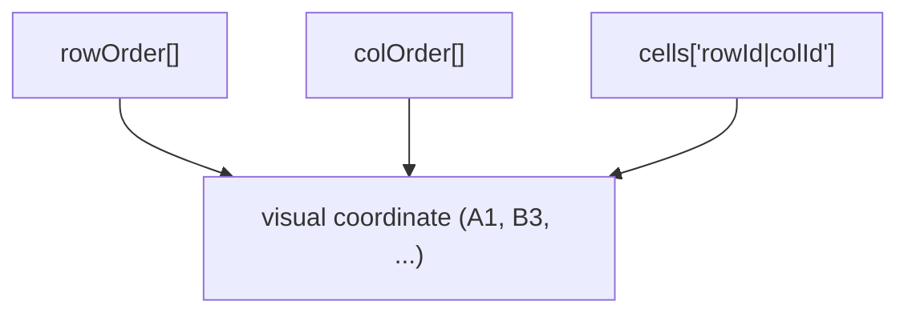
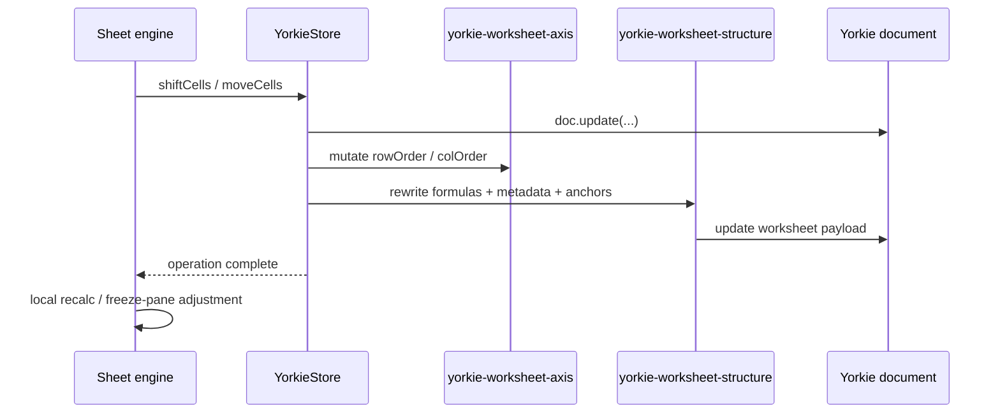

# Spreadsheet Collaboration

## Summary

Wafflebase uses Yorkie CRDT documents for multi-user spreadsheet editing. The
current collaboration model keeps cell identity stable across row and column
structure changes by storing worksheet cells against stable row/column ids
instead of visual `A1` coordinates.

This document covers:

- the canonical Yorkie worksheet shape
- why the old coordinate-key model failed under concurrent structure edits
- the current ownership split between `@wafflebase/sheet` and the Yorkie
  adapter
- the two-layer concurrency test strategy
- the known residual gaps

### Goals

- Preserve logical cell identity through concurrent row/column insert and move
  operations.
- Keep the shared `@wafflebase/sheet` package collaboration-agnostic where
  possible.
- Make structural concurrency behavior executable through deterministic tests.
- Keep frontend and backend on a single worksheet/document schema.

### Non-Goals

- Solving concurrent `delete row N` vs `delete row N` / `delete column N` vs
  `delete column N` in this iteration.
- Making structural edits a single Yorkie history step.
- Moving every worksheet metadata class to stable row/column identity yet.

## Why the Old Model Failed

The previous Yorkie worksheet shape persisted cells directly by visual
coordinate:

```typescript
type Worksheet = {
  sheet: { [sref: Sref]: Cell }; // e.g. "A1" -> { v: "10" }
  // ...
};
```

That works for plain cell edits because both users usually touch the same
field. It fails for row/column insert or delete because those operations are
not editing a single logical structure node. They are rewriting a derived
coordinate projection.

Example:

1. User A inserts a row before visual row 2.
2. User B edits `A2`.
3. Under a coordinate-key model, Yorkie only sees writes to keys like `A2`,
   `A3`, `B2`, `B3`.
4. It does not know that old `A2` and new `A3` refer to the same logical cell.

The result is merge behavior that is closer to "bulk object rewrite collision"
than to "two users edited the same spreadsheet structure".

## Canonical Worksheet Shape

Each collaborative spreadsheet is a multi-tab Yorkie document:

```typescript
type Worksheet = {
  cells: { [stableCellKey: string]: Cell };
  rowOrder: string[];
  colOrder: string[];
  nextRowId: number;
  nextColId: number;
  rowHeights: { [index: string]: number };
  colWidths: { [index: string]: number };
  colStyles: { [index: string]: CellStyle };
  rowStyles: { [index: string]: CellStyle };
  sheetStyle?: CellStyle;
  rangeStyles?: RangeStylePatch[];
  conditionalFormats?: ConditionalFormatRule[];
  merges?: { [anchor: Sref]: MergeSpan };
  filter?: WorksheetFilterState;
  hiddenRows?: number[];
  hiddenColumns?: number[];
  charts?: { [id: string]: SheetChart };
  frozenRows: number;
  frozenCols: number;
  pivotTable?: PivotTableDefinition;
};

type SpreadsheetDocument = {
  tabs: { [id: string]: TabMeta };
  tabOrder: string[];
  sheets: { [tabId: string]: Worksheet };
};
```

### Cell Storage Semantics

- `rowOrder` and `colOrder` are the authoritative visual order lists.
- Each row/column gets a stable id (`r1`, `r2`, `c1`, `c2`, ...).
- `cells` is keyed by `rowId|colId`, not by `A1`.
- Visual coordinates are derived from the current `rowOrder` / `colOrder`.



This means a row insert usually edits the row-order list, not the entire cell
map. Existing cells keep the same stable key and therefore survive merges much
better.

### Current Naming State

- `cells` is neutralized.
- `rowOrder` / `colOrder` still expose the storage-oriented vocabulary of
  ordered axis ids.
- New documents are created directly in this shape.
- Runtime compatibility for older pre-tab / `worksheet.sheet` shapes has been
  removed.

## Ownership Split

The collaboration model now has a clearer boundary.

| Layer | Responsibilities |
| --- | --- |
| `@wafflebase/sheet` | `Store` interface, `Sheet` engine, formula helpers, pure remap helpers, canonical worksheet/document types, worksheet cell read/write helpers |
| `packages/frontend/src/app/spreadsheet/yorkie-store.ts` | `Store` implementation for one tab, Yorkie `doc.update()` boundary, batch buffering, index invalidation, presence updates |
| `packages/frontend/src/app/spreadsheet/yorkie-worksheet-axis.ts` | Yorkie-local row/column order mutations (`insert`, `delete`, `move`) |
| `packages/frontend/src/app/spreadsheet/yorkie-worksheet-structure.ts` | Yorkie-local post-axis structure rewrites: formulas, indexed metadata, range styles, conditional formats, merges, chart anchors |

Two important points follow from this split:

1. The shared package no longer exports Yorkie-only axis mutation helpers.
2. The frontend still owns collaboration-specific orchestration because Yorkie
   proxy mutation semantics are not a concern of the generic sheet engine.

## Structural Edit Flow

For `shiftCells` / `moveCells`, the Yorkie-backed path now works like this:



What changed relative to the old model:

- structural identity now lives in `rowOrder` / `colOrder`
- cell persistence does not bulk-rewrite `A1` keys
- Yorkie-specific structure transforms are local helper modules instead of
  shared-package exports

What did not change yet:

- row/column sizes and styles still remap by visual numeric index
- `Sheet` still owns its own post-store recalculation and some local state
  adjustments

## Concurrency Test Strategy

Concurrency coverage is intentionally split into two layers.

### 1. Fast Semantic Matrix

Files:

- `packages/sheet/test/helpers/concurrency-case-table.ts`
- `packages/sheet/test/helpers/concurrency-driver.ts`
- `packages/sheet/test/sheet/concurrency-matrix.test.ts`

Purpose:

- encode the problem space as typed table-driven cases
- compute the serial-intent oracles (`A -> B`, `B -> A`)
- keep the broad matrix cheap enough for the default test lane

This layer does **not** prove CRDT merge behavior. It defines the expected
spreadsheet meaning.

### 2. Real Two-User Yorkie Slice

Files:

- `packages/frontend/tests/helpers/two-user-yorkie.ts`
- `packages/frontend/tests/app/spreadsheet/yorkie-concurrency.test.ts`
- `packages/frontend/tests/app/spreadsheet/yorkie-concurrency-repro.test.ts`

Purpose:

- run the same case families against two real Yorkie clients
- prove convergence and serial-intent preservation for the fixed cases
- keep known gaps executable as characterization or deferred repro coverage

The Yorkie-backed tests are opt-in and use:

- `YORKIE_RPC_ADDR=http://localhost:8080`
- optional `YORKIE_RUN_KNOWN_FAILURES=1` for explicit repro slices

## Worksheet Shape Migration

The current collaboration runtime assumes the canonical multi-tab Yorkie
document shape:

- top level `tabs`, `tabOrder`, `sheets`
- worksheet-local `cells`, `rowOrder`, `colOrder`, `nextRowId`, `nextColId`

Older Yorkie documents must therefore be migrated before the runtime fallback
paths can be removed safely.

### Supported Input Shapes

The backend migration helper accepts:

- current canonical documents
- empty Yorkie roots (`{}`), which are initialized to a default spreadsheet
- flat pre-tab worksheet roots
- tabbed legacy documents whose individual worksheets still use `sheet[A1]`

### Migration Script

Use the backend admin CLI:

```bash
pnpm --filter @wafflebase/backend migrate:yorkie:worksheet-shape --document <id>
pnpm --filter @wafflebase/backend migrate:yorkie:worksheet-shape --all
```

Important operational note:

- the command attaches Yorkie documents directly, so there is no truly
  side-effect-free dry run
- sample with `--document` first
- run `--all` only during the migration window

## Deployment Runbook

This is the recommended production rollout sequence for the worksheet shape
migration and the collaboration runtime that assumes the canonical `cells`
schema.

### 1. Pre-Deployment Checks

Before touching production:

1. Confirm the new backend migration helper and fast verification gate pass:
   `pnpm verify:fast`
2. Confirm Yorkie is reachable from the backend runtime:
   `YORKIE_RPC_ADDR=<rpc> pnpm --filter @wafflebase/backend migrate:yorkie:worksheet-shape --help`
3. Take a production PostgreSQL backup.
4. Record the Yorkie project/public key and the backend environment values
   needed by the migration command.

### 2. Rehearse On Local Restored Data

The local rehearsal path used during this work was:

1. Restore PostgreSQL into a separate local database.
2. Copy Yorkie document roots into the local Yorkie server.
3. Sample a few documents with:
   `DATABASE_URL=<local-restore-db> YORKIE_RPC_ADDR=http://localhost:8080 pnpm --filter @wafflebase/backend migrate:yorkie:worksheet-shape --document <id>`
4. Run the full local rehearsal:
   `DATABASE_URL=<local-restore-db> YORKIE_RPC_ADDR=http://localhost:8080 pnpm --filter @wafflebase/backend migrate:yorkie:worksheet-shape --all`
5. Re-run the same command to confirm idempotency.

Observed rehearsal result on the restored dataset:

- `17` documents processed
- one real legacy edge case (`"Yorkie Task"`) required detector hardening
- final rerun result: `changed: 0`, `unchanged: 17`, `current=17`

### 3. Maintenance Window

Use a short maintenance window for production.

Recommended sequence:

1. Put the app into read-only or maintenance mode.
2. Ensure no old application instances are still writing worksheet documents.
3. Keep PostgreSQL and Yorkie available.

### 4. Sample In Production

Before bulk execution, sample one or more known documents:

```bash
YORKIE_RPC_ADDR=<prod-yorkie-rpc> \
YORKIE_API_KEY=<prod-yorkie-api-key> \
pnpm --filter @wafflebase/backend migrate:yorkie:worksheet-shape --document <id>
```

Check for:

- expected sheet counts
- no unsupported-shape errors
- no unexpectedly empty `cells` counts

### 5. Bulk Migration

Run the bulk migration only after the sampled documents look correct:

```bash
YORKIE_RPC_ADDR=<prod-yorkie-rpc> \
YORKIE_API_KEY=<prod-yorkie-api-key> \
pnpm --filter @wafflebase/backend migrate:yorkie:worksheet-shape --all
```

Success criteria:

- command exits `0`
- no failures reported
- `processed` count matches the expected production document count

### 6. Deploy The New Collaboration Runtime

After the migration succeeds:

1. Deploy the backend/frontend build that assumes the canonical worksheet
   shape.
2. Bring the app out of maintenance mode.
3. Smoke test:
   - open a few migrated documents
   - edit cells
   - insert/delete rows and columns
   - verify datasource-backed tabs if present

### 7. Rollback Guidance

Rollback is operational, not runtime-fallback based.

- Do not reintroduce runtime legacy fallback as the primary rollback plan.
- If migration or app behavior is incorrect:
  1. return the app to maintenance mode
  2. restore PostgreSQL from backup if metadata was changed as part of the
     rollout
  3. restore or recopy Yorkie document roots from the source environment
  4. revert to the previous application version

### 8. Current Known Gap

This rollout does **not** change the residual concurrency non-goal:

- concurrent `delete row N` vs `delete row N`
- concurrent `delete column N` vs `delete column N`

Those cases still need a higher-level delete intent model and remain outside
this migration.

### Migration Semantics

For legacy worksheet roots, the migration helper:

- creates a fresh canonical worksheet
- copies cell contents from legacy `sheet[A1]`
- derives `rowOrder` / `colOrder` extents from both cells and index-based
  metadata such as row heights, column widths, filters, merges, range styles,
  conditional formats, frozen panes, and chart anchors
- preserves datasource tabs that do not own worksheet payloads

This keeps the collaboration runtime single-shaped after rollout, while still
protecting metadata that would be lost if axis extents were inferred from cell
coordinates alone.

### Case Coverage Status

Covered and now expected to match a serial oracle:

- value edit vs row insert/delete
- value edit vs column insert/delete
- row insert vs row insert at same index
- row insert vs row delete at same index
- column insert vs column insert at same index
- column insert vs column delete at same index
- row insert vs row insert at adjacent indexes
- row delete vs row insert at adjacent indexes

Still deferred / characterization only:

- row delete vs row delete at same index
- column delete vs column delete at same index
- formula-heavy structural concurrency in the frontend Node lane

## Known Limits

### Same-Index Delete/Delete Is Still Not Representable

Stable row/column identity fixes insert-heavy structure cases, but it does not
fully encode the intent of "delete the visible row at index N" when two users
issue the same delete concurrently.

Both users still target the same stable row id, so a plain list CRDT sees one
logical delete, while the serial oracle expects two consecutive visible-index
deletions.

That remaining gap likely needs one of:

- delete markers / tombstone counts
- a structural op-log with transform/replay semantics

### Some Metadata Still Uses Visual Index Semantics

Cell persistence is identity-based, but several metadata classes still remap
through numeric indices:

- `rowHeights`
- `colWidths`
- `rowStyles`
- `colStyles`
- filter hidden-row state
- freeze panes

Those are simpler than the old cell model, but they are not yet stable-id
based.

### Structural Undo Is Still Split

Batching currently groups value edits and formula recalculation into single
history steps, but structural edits still span:

1. the persisted structural mutation
2. the follow-up recalculation/local state adjustment

See [batch-transactions.md](batch-transactions.md) for the current rationale.

## Risks and Mitigation

**Schema drift across packages** — Mitigated by sharing worksheet/document
types and factories from `@wafflebase/sheet`.

**Store boundary leakage** — Mitigated by keeping generic worksheet helpers in
the shared package and Yorkie-specific axis/structure orchestration in local
frontend helpers rather than spreading raw document mutations across the app.

**False confidence from semantic-only tests** — Mitigated by keeping a second,
real Yorkie integration slice in the frontend package.
