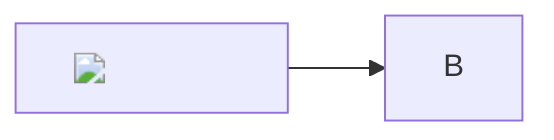

# Notes mermaid: close the label tracking-pixel vector (issue #721)

## Problem

A note author can plant a beacon that fires in every reader's browser:

```

```

Three measured vectors — `` in a node label, the same with `onerror`,
and a CSS `background:url(…)` on an inline `style` inside a label. Not script
execution (mermaid's strict-mode label sanitizer strips `on*`), but the author
learns the reader's IP, User-Agent, and the fact and time they opened the note.

`sanitizeSvg()` cannot reach it: mermaid lays the diagram out in the live
`document.body` to measure text *before* returning anything to the caller, so
our DOMPurify pass runs strictly downstream of the fetch. The final DOM contains
zero `` elements and the requests have already gone out.

Secondary: `stripConfigDirectives()` removes only the **first** front-matter
block, so a second `---` block is *promoted* to leading front matter that
mermaid then parses — the strip manufactures a carrier the source did not have.

## Approach

Option 1 from the issue: **`htmlLabels: false`** in `mermaid.initialize()`.
Measured in the issue to fix it completely (0 beacons, all test diagrams still
render, the payload shows as literal escaped text). Cost: no HTML rendering
inside node labels — no rich text, no `<br/>`, no markdown in a label.

Not option 2 (a CSP) — app-wide and far larger than this feature; not option 3
(accept) — that is what shipped and is what the issue reopens.

`htmlLabels` is already pinned in `SECURE_KEYS`, and `stripConfigDirectives()`
removes both config carriers, so a note cannot turn it back on.

Plus: strip config carriers to a **fixpoint** rather than one pass, so removing
one carrier can never promote the next into a position mermaid reads.

## Checklist

- [x] `mermaid.initialize({ …, htmlLabels: false })` in `renderPass()`
- [x] `stripConfigDirectives()` loops until the source stops changing
- [x] Tests: `initialize` carries `htmlLabels: false`; a second front-matter
      block is stripped too; a directive followed by front matter strips both
- [x] Module SECURITY note in `mermaid.ts` updated (the layout window is now
      the engine's own text measurement, with no HTML label subtree in it)
- [x] `docs/design/notes/notes.md` mermaid section updated

## Deliberately not done

The issue notes that with no HTML in the diagram "DOMPurify can use the SVG
profile alone". Left as is: several diagram types (venn text nodes,
architecture icons, kanban, sequence) append a `foreignObject` regardless of
`htmlLabels`, so dropping the HTML profile / `foreignobject` would silently
blank those labels. Keeping layer 3 as it is costs nothing — `img`/`image` and
the other fetch carriers are already in `FORBID_TAGS`.
