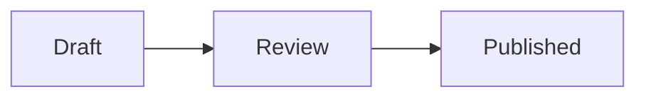

# Writing a Note

Notes are lightweight **Markdown** documents in Wafflebase. Unlike the
word-processor Docs editor, a note is written as Markdown *source* on one side
with a live rendered *preview* on the other — a fast way to jot down meeting
notes, drafts, and technical documentation, with the same real-time
collaboration as every other document type.

## Create a Note

1. Open your workspace
2. Click the **New** dropdown button
3. Select **New Note**

A blank note opens with the editor and preview side by side.

## The Editor

The left pane is a Markdown source editor. Type standard Markdown and watch the
right pane render it live as you go.

```markdown
# Project Kickoff

## Agenda
- Introductions
- Timeline review
- **Next steps**

See the [design doc](https://example.com) for details.
```

### Choose Your View

Use the **view** dropdown at the right of the toolbar to switch between three
modes:

- **Split** — source editor and preview side by side (the default)
- **Editor** — Markdown source only, full width
- **Preview** — rendered output only

Your choice is remembered per browser, so the note opens the same way next time.

### See Who Wrote What

The same **view** dropdown has a **Show authors** switch at the bottom. Turn it
on and a narrow column appears to the left of the line numbers, naming whoever
most recently edited each line. A run of consecutive lines by the same person is
labelled once, at the top, so the column stays quiet. Hover a name to see it in
full if it's been cut short.

Some lines are blank in that column: text written before this feature existed
carries no authorship, and an editor who had no display name shows as
**Anonymous**.

Like the view mode, the switch is remembered per browser. It isn't available in
a note opened through a share link, which has no view menu.

::: warning Your name is recorded whether or not you switch this on
**Show authors** only decides what *you* see — it does not decide what you leave
behind. Every editor's client stamps their display name onto the text they type,
always, and that name is stored in the note's content rather than in the
temporary presence data behind cursor labels.

That means it is permanent and public to the note: it stays for the life of the
note, it is readable by anyone who can read the note at all — including someone
opening a read-only share link anonymously — and turning the switch off later
doesn't remove what's already recorded. Nothing rewrites a name out of the text
after the fact.

Names are also **self-reported**: they come from whichever browser wrote the
text, and no server verifies them, which is why the tooltip on a name says so.
Read the column as a helpful hint about who wrote a line, not as proof.
:::

## Formatting Toolbar

When the editor is visible, a toolbar gives you one-click Markdown for the most
common styles — you never have to remember the syntax.

**Undo / Redo** step through your own edits, and are greyed out when there is
nothing left to undo or redo.

### Text

Select some text first, then click a button to wrap it:

| Button | Inserts | Result |
|--------|---------|--------|
| **B** | `**text**` | **Bold** |
| *I* | `*text*` | *Italic* |
| ~~S~~ | `~~text~~` | ~~Strikethrough~~ |
| Link | `[text](url)` | A hyperlink |

Bold, italic, strikethrough and link are **toggles**: they light up when the
caret sits in text that already has that style, and clicking again removes it.

### Lists

| Button | Inserts | Result |
|--------|---------|--------|
| Bullet list | `- item` | An unordered list |
| Numbered list | `1. item` | An ordered list |
| Checkbox | `- [ ] item` | A task-list item |
| Indent | Adds a level of nesting | A nested item |
| Outdent | Removes a level of nesting | A less nested item |

The three list buttons are toggles — clicking the one that is already lit turns
the lines back into plain paragraphs, and clicking a different one converts
between kinds (a numbered list becomes a checklist, and so on). **Indent** and
**Outdent** are greyed out when the item cannot nest any further in that
direction: the first item of a list has no sibling to nest under, and a
top-level item has nothing to come out of.

::: tip
Select several lines and any of these five buttons applies to all of them at
once, as a single undo step. They work inside a blockquote too, marking the
lines up within the quote rather than pulling them out of it.
:::

### Blocks

| Button | Inserts |
|--------|---------|
| Quote | `> ` in front of every selected line |
| Code block | A ``` fence around the selection |
| Foldout | A `<details>` / `<summary>` collapsible section |
| Table | A GFM table skeleton |
| Image | Uploads a picture and links it |

::: tip
The **Insert table** button shows a small grid — hover to choose the number of
rows and columns, then click to drop in a ready-to-fill table. You can also
paste or drag an image straight into the editor instead of using the **Insert
image** button.
:::

## What the Preview Renders

The preview supports **GitHub-Flavored Markdown** plus a few extras:

- **Tables** — standard `| col | col |` GFM tables
- **Task lists** — `- [ ]` and `- [x]` render as checkboxes. Typing just
  `[ ]` (or `[x]`) at the start of a line and pressing space adds the `- ` for
  you. In the preview, clicking anywhere on a task — the box or the text
  beside it — ticks and unticks it, and the change is written back into the
  Markdown source. A read-only view (a share link without edit rights) shows
  the boxes but leaves them fixed.
- **Code blocks** — fenced ``` blocks get syntax highlighting and a **Copy**
  button in the corner
- **Math** — inline `$…$` and block `$$…$$` render with KaTeX
- **Diagrams** — a ` ```mermaid ` fence renders as a diagram instead of a code
  block (see [Diagrams](#diagrams) below)
- **Links, headings, lists, blockquotes, images** — as you'd expect

### Single Newlines Are Line Breaks

One thing differs from standard Markdown: pressing **Enter** once breaks the
line. In most Markdown, two lines separated by a single newline join into one
paragraph and you need a blank line — or two trailing spaces — to force a break.
Here, what you see in the source is what you get in the preview.

```markdown
Roses are red
Violets are blue
```

renders as two lines, not one.

### Diagrams

Open a fence with `mermaid` instead of a language name and the block renders as
a live [Mermaid](https://mermaid.js.org/) diagram — flowcharts, sequence
diagrams, class diagrams, and the rest:

````markdown

````

The diagram follows the editor's light or dark theme, and updates as you type.
The rendering engine is fetched the first time a note needs it, so the first
diagram on a page can take a moment to appear — until it does, you see the
diagram's source.

A diagram that doesn't parse keeps its source on screen with the error printed
above it, so a half-typed diagram never leaves a blank hole in the preview.

A few things are deliberately turned off, and say so on the block if you use
them:

- **Nothing may load an external URL.** Image shapes (`@{ img: … }`), sequence
  actor icons, `url(…)` and `@import` in diagram styling, and any HTML tag that
  fetches something are all refused
- **Per-diagram configuration is ignored** — `%%{init: …}%%` directives and
  YAML front matter inside the fence (including its `title:`) are stripped
  before the diagram is drawn
- **Labels are plain text.** Bold, italic and other HTML formatting inside a
  node label won't apply, though `<br/>` still breaks the line
- A single fence is capped at 50,000 characters

### Raw HTML

The preview does not render arbitrary HTML. Paste a `<div>`, a `<script>`, or a
`style=` attribute into a note and it appears in the preview as the literal text
you typed, escaped rather than executed. That's deliberate: a note is shared,
and HTML written by one collaborator would otherwise run in everyone else's
browser.

Two tags are allowlisted as exceptions, because Markdown has no syntax of its
own for what they do:

- **`<details>` / `<summary>`** — the collapsible section the **Foldout**
  toolbar button inserts. Put each tag on its own line, keep the summary on a
  single line, and use `<details open>` to have it start expanded. Everything
  between the tags is ordinary Markdown, so lists, fences, and nested foldouts
  all work
- **``** — the sized-image snippet people copy from GitHub, e.g.
  ``. Only `src`, `alt`,
  `width` and `height` are accepted, and the dimensions must be a plain number
  or a percentage

Anything outside that — an extra attribute on the image, `width="400px"`, a
`style=`, a different tag — makes the whole snippet fall back to being shown as
literal text. It's refused visibly rather than silently ignored, so you can see
that it didn't take.

## Keyboard Mode

Prefer modal editing? Open the **keyboard** dropdown in the toolbar and switch
from **Default** to **Vim**. Vim keybindings then apply inside the source
editor. Like the view mode, this is remembered per browser.

Standard editing shortcuts work in Default mode:

| Action | Shortcut |
|--------|----------|
| Undo | ⌘+Z / Ctrl+Z |
| Redo | ⌘+Shift+Z / Ctrl+Shift+Z |
| Select all | ⌘+A / Ctrl+A |
| Copy / Cut / Paste | ⌘+C·X·V / Ctrl+C·X·V |

## Collaborate in Real Time

Notes sync live through Wafflebase's CRDT engine, just like sheets, docs, and
slides. When a teammate opens the same note:

- Their edits appear instantly as they type
- You see their **cursor and text selection** in their own color
- No saving, refreshing, or merge step is ever needed

Share a note the same way as any document — click **Share** in the header to
create a view or edit link. See
[Collaboration & Sharing](/guide/collaboration) for the full sharing flow.

## Rename a Note

Click the note's title in the header to rename it. The new title appears in your
workspace document list immediately.

::: tip
Notes are ideal for content you'd otherwise keep in a `README` or a Markdown
scratchpad — release notes, runbooks, and specs — kept in sync with your team
without leaving Wafflebase.
:::
